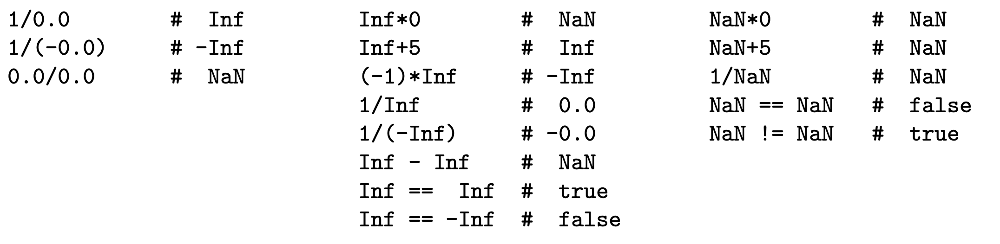

# Linear Algebra and Numerical Methods - Concise
{: .no_toc }
## MATH50003
{: .no_toc}
**Term 1 Content**

<details closed markdown="block">
  <summary>
    <span style="color: RoyalBlue;">PDFs</span>
  </summary>  
  
- <a href="/notes/pdfs/year2/LAGN-Concise.pdf" target="_blank" style="color:#801fff;">**Open Linear Algebra Concise - Complete**</a> - <a href="/notes/pdfs/year2/LAGN-Concise.pdf" download>**Download**</a>
- <a href="/notes/pdfs/year2/LagLec.pdf" target="_blank" style="color:#801fff;">**Open Linear Algebra Lecturer - Term 1**</a> - <a href="/notes/pdfs/year2/LagLec.pdf" download>**Download**</a>

<details closed markdown="block">
  <summary>
    <span style="color: #00ba47;">Problem Sheets - Term 1</span>
  </summary>
  
  - <a href="/notes/pdfs/year2/problemsheets/linalgSheets/term1/LAGPS1.pdf" target="_blank" style="color:#00ba47;">**Problem Sheet 1**</a> - <a href="/notes/pdfs/year2/problemsheets/linalgSheets/term1/LAGPS1-Sol.pdf" target="_blank">**Solutions**</a>
  
  - <a href="/notes/pdfs/year2/problemsheets/linalgSheets/term1/LAGPS2.pdf" target="_blank" style="color:#00ba47;">**Problem Sheet 2**</a> - <a href="/notes/pdfs/year2/problemsheets/linalgSheets/term1/LAGPS2-Sol.pdf" target="_blank">**Solutions**</a>
  
  - <a href="/notes/pdfs/year2/problemsheets/linalgSheets/term1/LAGPS3.pdf" target="_blank" style="color:#00ba47;">**Problem Sheet 3**</a> - <a href="/notes/pdfs/year2/problemsheets/linalgSheets/term1/LAGPS3-Sol.pdf" target="_blank">**Solutions**</a>
  
  - <a href="/notes/pdfs/year2/problemsheets/linalgSheets/term1/LAGPS4.pdf" target="_blank" style="color:#00ba47;">**Problem Sheet 4**</a> - <a href="/notes/pdfs/year2/problemsheets/linalgSheets/term1/LAGPS4-Sol.pdf" target="_blank">**Solutions**</a>
  
  - <a href="/notes/pdfs/year2/problemsheets/linalgSheets/term1/LAGPS5.pdf" target="_blank" style="color:#00ba47;">**Problem Sheet 5**</a> - <a href="/notes/pdfs/year2/problemsheets/linalgSheets/term1/LAGPS5-Sol.pdf" target="_blank">**Solutions**</a>
  
  - <a href="/notes/pdfs/year2/problemsheets/linalgSheets/term1/LAGPS6.pdf" target="_blank" style="color:#00ba47;">**Problem Sheet 6**</a> - <a href="/notes/pdfs/year2/problemsheets/linalgSheets/term1/LAGPS6-Sol.pdf" target="_blank">**Solutions**</a>
  
  - <a href="/notes/pdfs/year2/problemsheets/linalgSheets/term1/LAGPS7.pdf" target="_blank" style="color:#00ba47;">**Problem Sheet 7**</a> - <a href="/notes/pdfs/year2/problemsheets/linalgSheets/term1/LAGPS7-Sol.pdf" target="_blank">**Solutions**</a>
  
  - <a href="/notes/pdfs/year2/problemsheets/linalgSheets/term1/LAGPS8.pdf" target="_blank" style="color:#00ba47;">**Problem Sheet 8**</a> - <a href="/notes/pdfs/year2/problemsheets/linalgSheets/term1/LAGPS8-Sol.pdf" target="_blank">**Solutions**</a>
  
  - <a href="/notes/pdfs/year2/problemsheets/linalgSheets/term1/LAGPS9.pdf" target="_blank" style="color:#00ba47;">**Problem Sheet 9**</a> - <a href="/notes/pdfs/year2/problemsheets/linalgSheets/term1/LAGPS9-Sol.pdf" target="_blank">**Solutions**</a>
  
  - <a href="/notes/pdfs/year2/problemsheets/linalgSheets/term1/LAGPS10.pdf" target="_blank" style="color:#00ba47;">**Problem Sheet 10**</a> - <a href="/notes/pdfs/year2/problemsheets/linalgSheets/term1/LAGPS10-Sol.pdf" target="_blank">**Solutions**</a>
  
</details>

<details closed markdown="block">
  <summary>
    <span style="color: #00ba47;">Problem Sheets - Term 2</span>
  </summary>
  
  - <a href="/notes/pdfs/year2/problemsheets/linalgSheets/term2/LAGPS1.pdf" target="_blank" style="color:#00ba47;">**Problem Sheet 1**</a> - <a href="/notes/pdfs/year2/problemsheets/linalgSheets/term2/LAGPS1-Sol.pdf" target="_blank">**Solutions**</a>
  
</details>
</details>


<details closed markdown="block">
  <summary>
    Table of contents
  </summary>
<!--   {: .text-delta } -->
* TOC
{:toc}
</details>

---

**Colour Code** - <span style="color: green;">**Definition**</span> are
<span style="color: green;">**green**</span> in these notes,
<span style="color: red;">**Consequences**</span> are <span style="color: red;">**red**</span>
and <span style="color: RoyalBlue;">**Causes**</span> are <span style="color: blue-000;">**blue**</span>

*Content from MATH40003 assumed to be known.*

# <span style="color: white;">1</span> Prelim

**Definition** - <span style="color: green;">**Similair Matrices**</span>

$A,B \in M_{n}(F)$ similair $(A \sim B)$ if $\exists$ invertible $P \in M_{n}(F)$ s.t $P^{-1}AP = B$\
$\sim$ is an equivalence relation.

*Properties of Similair Matrices*

-   Same Determinant

-   Same Char. Poly.

-   Same eigenvalues

-   Same rank Same Trace

**Definition** - <span style="color: green;">**Companion Matrix**</span>

Let $p(x)$ a monic polynomial of degree $r$;
$p(x) = x^{r} + a_{r-1}x^{r-1} + \dots + a_{0}$.\
Companion matrix of $p(x)$;

<center>
$$C(p(x)) =
\begin{pmatrix}
0 & 0 & 0 & \dots & 0 & -a_{0}\\
1 & 0 & 0 & \dots & 0 & -a_{1}\\
0 & 1 & 0 & \dots & 0 & -a_{2}\\
 & & & \dots & &\\
 0 & 0 & 0 & \dots & 1 & -a_{r-1}
\end{pmatrix}$$
  </center>

***Geometry***\
**Definition** - <span style="color: green;">**Dot Product**</span>
$u = (u_{1},\dots,u_{n})$ and $v = (v_{1},\dots,v{n})$\
<center>
$$u\cdot v = \sum_{i=1}^{n}u_{i}v_{i}$$
  </center>
Length of $u, ||u|| = \sqrt{u\cdot u}$\

Distance between $u$ and $v = \lvert\lvert u-v\rvert\rvert$

-   $P$ orthogonal if $P^{T}P = I, (Pu\cdot Pv) = u\cdot v)$

-   $A$ symmetric if $A^{T} = A, (Au\cdot v  = u\cdot Av)$

*Properties of dot product*

-   linear in $u,v$

-   symmetric; $u\cdot v = v\cdot u$

-   $u \cdot v > 0, \forall u,v$

# <span style="color: white;">3</span> Algebraic and Geometric multiplicities of eigenvalues

**Definition** - <span style="color: green;">**Multiplicity of eigenvalues**</span>

For $T:V \to V$ a linear map with char. poly. $p(x)$ with roots
$\lambda$, Then $\exists$ **$a(\lambda)$** $\in \mathbb{N}$ the **algebraic multiplicity** of $\lambda$ s.t
<center>
$$ p(x) = (x-\lambda)^{a(\lambda)}q(x) $$
</center>

where $\lambda$ not a root of $q(x)$\
<span style="color: green;">**Geometric multiplicity $g(\lambda) = dimE_{\lambda}$**</span>, for $E_{\lambda}$ the eigenspace of $T$

**Theorem 3.2**\
$dim V = n$, Let $T: V\to V$ a linear map with finite distinct eigenvalues $\{\lambda_{i}\}_{i=1}^{r}$\
Characteristic polynomial of $T$ is
<center>
$$p(x) = \prod_{i=1}^{r}(x-\lambda_{i})^{a(\lambda_{i}}$$
</center>
so $(\sum_{i=1}^{r}a(\lambda_{i}) = n$. Following are equivalent

-   $T$ diagonalisable

-   $(\sum_{i=1}^{r}g(\lambda_{i}) = n$

-   $g(\lambda_{i}) = a(\lambda_{i}) \forall i$ (This can be used to
    test for diagonalisability.)

# <span style="color: white;">4</span> Direct Sums

**Define**
For $ \{U_{i}\}_{i=1,\dots,k} $ subspaces of vector space $V$. Sum of these subspaces is:

<center>
$$U_{1} + \dots + U_{k} = \{u_{1}+\dots+u_{k}:u_{i} \in U_{i}, \forall i\}$$
</center>

**Definition** - <span style="color: green;">**Direct Sums**</span>

$V$ a vector space, $\{V_{i}\}_{i=1,\dots,k}$ subspaces of vector space $V$. **$V$ a direct sum of $\{V_{i}\}$** if: 
<center>
$$V = V_{1} \oplus \dots \oplus V_{k}$$
</center>
If $\forall v \in V$ can be expressed as $v = v_{1} + \dots + v_{k}$ for unique vectors $v_{i} \in V_{i}$

*Corollary*
<center>
$V = V_{1} \oplus \dots \oplus V_{k} \iff  dimV = \sum_{i=1}^{k}dimV_{i}$ and if $B_{i}$ a basis for $V_{i}$}, $B = \bigcup_{i}B_{i}$ is a basis for V$
</center>

**Definition** - <span style="color: green;">**Invariant subspaces**</span>

$T: V\to V$ a linear map, $W$ a subspace of $V$.

<center>
$W$ is $T$-invariant if $T(W) \subseteq W, T(W) = \{T(w) : w \in W\}$
</center>

Write $T_{W}: W \to W$ for the restriction of $T$ to $W$\

**Notation - Direct sums of matrices**

$$A_{1} \oplus \dots \oplus A_{k} = \begin{pmatrix}
A_{1} & &\\
 & \ddots & \\
 & & A_{k}
\end{pmatrix}$$


# <span style="color: white;">5</span> Quotient Spaces

**Definition** - <span style="color: green;">**Cosets**</span>

$V$ a vector space over $F$, with $W \leq V$ a subspace.

<center>
Cosets $W + v$ for $v\in V$ $W + v:= \{w+v:w \in W\}$
</center>

<span style="color: green;">**Quotient Space**</span>

Define $V/W$ as a vector space of vectors $W + v$ over $F$

-   Addition; $(W +v_{1}) + (W+ v_{2}) = W+v_{1}+v_{2}$

-   Scalar Multiplication; $\lambda(W+v) = W + \lambda v$

Can verify this using vector space axioms.

*Dimension of $V/W$*
<center>
$$dimV/W = dimV - dim W$$
</center>

**Definition -** <span style="color: green;">**Quotient Map**</span>

$T: V \to V$ a linear map, $W$ a $T$-invariant subspace of V. Quotient map: $\bar{T}: V/W: \to V/W$ such that
<center>
$$\bar{T}(W+v) = W + T(v), \qquad \forall v \in V$$
</center>


# <span style="color: white;">6</span> Triangularisation

*Lemma - Diagonal Matrices*\
<center>
$$A = 
\begin{pmatrix}
\lambda_{1} &  & & & \\
0 & \lambda_{2} & & * & \\
& & \cdot & &\\
0 & & & \cdot &\\
0 & 0 & & & \lambda_{n}
\end{pmatrix},
B = 
\begin{pmatrix}
\mu_{1} &  & & & \\
0 & \mu_{2} & & * & \\
& & \cdot & &\\
0 & & & \cdot &\\
0 & 0 & & & \mu_{n}
\end{pmatrix}$$
</center>

-   Characteristic polynomial of $A$ = $\prod_{i=1}^{n}(x-\lambda_{i})$,
    eigenvalues $=\{\lambda_{i}\}$

-   $detA = \prod_{i=1}^{n}\lambda_{i}$

-   $AB$ also upper triangular, with
    $diag(AB) = \lambda_{1}\mu_{1},\dots,\lambda_{n}\mu_{n}$

**Theorem 6.2 - Triangularisation Theorem**\
$V$ an $n$ dimensional vector space over $F$, $T:V \to V$ a linear map,\
Where $\chi(T) = \prod_{i=1}^{n}(x-\lambda_{i})$, where $\lambda_{i} \in F \ \forall i$ $\implies \exists$ basis $B$ of $V$ s.t $[T]_{B}$ upper triangular

# <span style="color: white;">7</span> The Cayley-Hamilton Theorem

**Theorem. 7.1 - *(Cayley-Hamilton Theorem)***\
$V$ a finite dimensional vector space over $F$. $T: V \to V$ a linear map with char. poly. $p(x)$ 
<center>
$$p(T) = 0$$
</center>

# <span style="color: white;">8</span> Polynomials

**Definition -** <span style="color: green;">**Polynomials over a field**</span>

$F$ a field,$p(x)$ over $F$, for
$p(x) = \sum_{i}a_{i}x^{i}, F[x] = \{ p(x) : a_{i} \in F\}$

<span style="color: green;">**Degree of polynomial**</span>

$deg(p(x)) =$ the highest power of $x$ in $p(x)$

<span style="color: green;">**Euclidean Algori**</span>
$f,g \in F[x]$ with $deg(g) \geq 1$, Then $\exists q,r \in F[x] s.t$
<center>
$$f = gq +r$$ for either $r = 0$ or $deg(r) < deg(g)$
</center>
  
**Definition -** <span style="color: green;">**Greatest Common Divisor (GCD) of polynomials**</span>
  
$f,g \in F[x] \backslash \{0\}$, <span style="color: red;">**Say $d\in F[x]$ the gcd of $f,g$ if:**</span>

1.  <span style="color: RoyalBlue;">**$d\lvert f$ and $d\lvert g$**</span>

2.  <span style="color: RoyalBlue;">**if $e(x) \in F[x]$ and $e\lvert f$ and $e\lvert g$ Then $e\lvert d$**</span>

Say $f,g$ are co-prime if $gcd(f,g) = 1$
  
***Corollary***\
$d = gcd(f,g) \implies \exists r,s \in F[x] \text{ s.t } d = rf + sg$
  
**Definiton -** <span style="color: green;">**Irreducible polynomials**</span>
$p(x) \in F[x]$ irreducible over $F$ if $deg(p) \geq 1$ and $p$ not factorisable over $F$ as a product of $\{f_{i}\} \in F$ s.t $deg(f_{i}) \leq deg(p)$
  
***Corollary***\
$p(x) \in F[x]$ irreducible, $\{g_{i}\} \in F[x]$, if $p|g_{1}\dots g_{r} \implies p|g_{i} \text{ for some } i$
  
**Theorem 8.7 - *(Unique Factorization Theorem)***\
$f(x) \in F[x]$ s.t $deg(f) \geq 1$ $$f = p_{1}\dots p_{r}$$ where each
$p_{i} \in F[x]$ irreducible. **Factorisation of $f$ is unique up to
scalar multiplication**

# <span style="color: white;">9</span> The minimal polynomial of a linear map

**Definition -** <span style="color: green;">**Minimal polynomial**</span>
Say $m(x) \in F[x]$ a minimal polynomial for $T: V \to V$ if

1.  $m(T) = 0$

2.  $m(x)$ monic

3.  $deg(m)$ is as small as possible s.t (i) and (ii)

***Properties of the minimal polynomial***

-   For $T$ a linear map, its minimal polynomial $m_{T}(x)$ is unique

-   $p(x) \in F[x], p(T) = 0 \iff m_{T}(x)\lvert p(x)$

-   $m_{T}(x)\lvert c_{T}(x)$ the char. poly. of $T$

-   $\lambda \in F$ a root of $c_{T}(x) \implies \lambda$ a root of
    $m_{T}(x)$

-   $A,B \in M_{n}(F)$ s.t $A \sim B \implies m_{A}(x) = m_{B}(x)$

**Theorem 9.3**\
$p(x) \in F[x]$ an irreducible factor of
$c_{T}(x) \implies p(x)|m_{T}(x)$
  
**Corollaries**

-   $c_{T}(x) = c_{T_{W}}(x)c_{\bar{T}}(x)$

-   $m_{T_{W}}(x)$ and $m_{\bar{T}}(x)$ both divide $m_{T}(x)$

# <span style="color: white;">10</span> Primary Decomposition

**Theorem 10.1 - *(Primary Decomposition Theorem)***\
$V$ a finite dimensional vector space over $F$, $T:V\to V$ a linear map with $m_{T}(x)$\
Let factorisation of $m_{T}(x)$ into irreducible polynomials be:
  <center>
$$m_{T}(x) = \prod_{i=1}^{k}f_{i}(x)^{n_{i}}$$
  </center>
Where $\{f_{i}(x)\}$ all distinct irreducible polynomials in $F[x]$\
For $1 \leq i \leq k$, define:
<center>
$$V_{i} = ker(f_{i}(T)^{n_{i}})$$
</center>
  
Then
  
1.  $V = V_{1} \oplus \dots \oplus V_{k}$ *(Call this the <span style="color: green;">**primary decomposition**</span> of $V$ w.r.t $T$*

2.  each $V_{i}$ is $T$-invariant

3.  each restriction $T_{V_{i}}$ has minimal polynomial
    $f_{i}(x)^{n_{i}}$

In the case where each $f_{i}(x) = (x-\lambda_{i})$
  <center>
$$\implies m_{T}(x) = \prod_{i=1}^{k}(x-\lambda_{i})^{n_{i}}$$
  </center>
With $\lambda_{i}$ distinct eigenvalues of $T$ and
$V_{i} = ker(T-\lambda_{i}I)^{n_{i}}$\
We call $V_{i}$ the <span style="color: green;">**generalised $\lambda_{i}$-eigenspace of T**</span>
  
***Corollary***\
A linear map $T:V \to V$ diagonalisable
$\iff m_{T}(x) = \prod_{i=1}^{k}(x-\lambda_{i})$ a product of distinct
linear factors\
***Corollary***\
For $T:V \to V$ a linear map, with $g_{1}(x),g_{2}(x) \in F[x]$ coprime
polynomials s.t $g_{1}(T)g_{2}(T) = 0$

1.  Then $V = V_{1} \oplus V_{2}$, where $V_{i} = ker g_{i}(T), i = 1,2$
    with each $V_{i}$ being $T$-invariant

2.  Suppose
    $m_{T}(x) = g_{1}(x)g_{2}(x) \implies m_{T_{V_{i}}}(x) = g_{i}(x), i = 1,2$

# <span style="color: white;">11</span> Jordan Canonical Form

**Definition -** <span style="color: green;">**Jordan Block**</span>\
$F$ a field and let $\lambda \in F$. Define $n\times n$ matrix:
<center>
$$J_{n}(\lambda) =
 \begin{pmatrix}
\lambda & 1 & 0 & \dots & 0 & 0 \\
0 & \lambda & 1 & \dots & 0 & 0 \\
0 & 0 & \lambda & \dots & 0 & 0 \\
 &  &  & \dots &  &  \\
0 & 0 & 0 & \dots & \lambda & 1 \\
0 & 0 & 0 & \dots & 0 & \lambda 
\end{pmatrix}$$
</center>
    
***Properties of the Jordan Blocks***

1.  characteristic and minimal polynomials of $J$, $= (x-\lambda)^{n})$

2.  $\lambda$ the only eigenvalue of $J$, with
    $a(\lambda) = n, g(\lambda) = 1$

3.  $J-\lambda I = J_{n}(0)$, multiplication by $J-\lambda I$ sends
    basis vectors as such:
    $$e_{n} \to e_{n-1} \to \dots \to e_{2} \to e_{1} \to 0$$

4.  $(J-\lambda I)^{n} = 0$, and for $i < n$,
    $rank((J-\lambda I)^{i}) = n-i$. And under multiplication:
    $$e_{n} \to e_{n-i}, e_{n-1} \to e_{n-i-1} \dots$$

***Lemma***
                                             
Let $A = A_{1} \oplus \dots \oplus A_{k}$ for each $i$ let $A_{i}$ have char. poly $c_{i}(x)$ and min. poly. $m_{i}(x)$.

-   $c_{A}(x) = \prod_{i=1}^{k}c_{i}(x)$

-   $m_{A}(x) = lcm(m_{1}(x),\dots,m_{k}(x))$

-   $\forall \lambda$ eigenvalues of A,
    $dim E_{\lambda}(A) = \sum_{i=1}^{k}dimE_{\lambda}(A_{i})$

-   $\forall q(x) \in F[x]$,
    $q(A) = q(A_{1}) \oplus \dots \oplus q(A_{k})$

**Theorem 11.3 - *(Jordan Canonical Form)***\
$A \in M_{n}(F)$, suppose $c_{A}(x)$ a product of linear factors over
$F$.\
Then

1.  $A$ similair to matrix of form
   
   <center>
    $$J = J_{n_{1}}(\lambda_{1}) \oplus \dots \oplus J_{n_{k}}(\lambda_{k})$$
    </center>
    
  <center>
    <span style="color: green;">**This is the Jordan Canonical Form (JCF) of $A$**</span>
   </center>

2.  Matrix $J$ from above, is uniquely determined by $A$ up to order of
    Jordan blocks

***Computing the JCF***

JCF theorem says $A \sim J$, a JCF matrix.\
$A \sim J \implies$ same characteristic polynomial, eigenvalues,
geometric multiplicities, minimal polynomial and $q(A) \sim q(J)$ for
any polynomial $q$.\
For each eigenvalue $\lambda$, collect all Jordan blocks as such;

<center>
$$J = \underbrace{(J_{n_{1}}(\lambda) \oplus \dots \oplus J_{n_{a}}(\lambda))}_{\lambda-\text{blocks of J}}\oplus\underbrace{(J_{m_{1}}(\mu) \oplus \dots \oplus J_{m_{b}}(\mu))}_{\mu-\text{blocks of J}}\oplus \dots$$
</center>

***Properties of JCF***\
$J$ as above, $\lambda$ an eigenvalue;

1.  $n_{1} + \dots + n_{a} = a(\lambda)$

2.  $a$ = number of $\lambda$-blocks = $g(\lambda)$

3.  max$(n_{1},\dots,n_{a}) = r$, where $(x-\lambda)^{r}$ the highest
    power of $(x-\lambda)$ dividing $m_{A}(x)$

**Theorem 11.6**.


$T: V \to V$ a linear map s.t $c_{T}(x)$ a product of linear factors
$\implies \exists$ basis $B$ of $V$ s.t $[T]_{B}$ a JCF matrix

**Definition** - <span style="color: green;">**Nilpotent Matrix**</span>

$A^{k} = 0$ for some $k \in \mathbb{N}$

**Theorem 11.7**.


$S:V \to V$ a nilpotent linear map $\implies \exists$ basis $B$ of $V$ s.t
<center>
$$[S]_{B} = J_{n_1}(0) \oplus \dots \oplus J_{n_k}(0)$$
</center>

***Computing a Jordan Basis***\
Finding the Jordan Basis $B$ as above.\
We have $V = V_{1} \oplus \dots \oplus V_{k}$ by Primary Decomposition
Theorem.\
Take each restriction $T_{V_i}$ each with $1$ eigenvalue.\
Let $S_{i} = T_{V_i} - \lambda_{i}I$ so each $S_{i}$ nilpotent.

-   **Step 1** - Compute subspaces\
    <center>
    $$V \supset S(V) \supset S^{2}(V) \supset \dots \supset S^{r}(V) \supset 0$$
    </center>
    
    $S^{r+1}(V) = 0$

-   **Step 2** - Find basis of $S^{r}(V)$, Using the following rules extend to basis
    of $S^{r-1}(V)$:

    Given basis $u_{1},S(u_{1}),\dots,S^{m_{1}-1}(u_{1}),\dots u_{r},S(u_{r}),\dots,S^{m_{r}-1}(u_{r})$

    1.  for each $i$ add vector $v_i \in V$ s.t $u_i = S({v_i})$

    2.  note $ker(S)$ contains linearly independent vectors
    
        <center>
        $$S^{m_{1}-1}(u_{1}),\dots,S^{m_{r}-1}(u_{r})$$
        </center>
        
        extend to basis of $ker(S)$ by adding vectors $w_{1},\dots,w_{s}$ with dim$ker(S) = r+s$\
        Yielding
        <center>
        $$v_{1},S(v_{1}),\dots,S^{m_{1}}(v_{1}),\dots,v_{r},S(v_{r}),\dots,S^{m_{r}}(v_{r}),w_{1},\dots,w_{s}$$
        </center>
        
-   **Step 3** - Repeat successively finding Jordan bases of $S^{r-2},\dots,S(V),V$

# <span style="color: white;">12</span> Cyclic Decomposition & Rational Canonical Form

**Definition** - <span style="color: green;">**Cyclic Subspaces**</span>

$V$ a finite dimensional vector space over $F$, and $T:V \to V$ a linear map.\
Let $0 \neq v \in V$ and define 
<center>
$$\begin{aligned}
    Z(v,T) &= \{f(T)(v)\ : \ f(x) \in F[x]\}\\
     &= \text{Sp}(v,T(v),T^{2}(v),\dots)\end{aligned}$$
</center>
Say $Z(v,T)$ the $T$-cyclic subspace of $V$ generated by $v$.\
$Z(v,T)$ is $T-$invariant. Write $T_{v}$

**Definition** - <span style="color: green;">**$T$-annihilator of $v$ and $Z(v,T)$**</span>

Considering, $v,T(v),T^{2}(V),\dots$ with $T^{k}(v)$ first vector in span of previous ones
<center>
$$\implies T^{k}(v) = -a_{0}v - a_{1}T(v) - \dots - a_{k-1}T(v)$$
</center>

$T-$annihilator of $v$ and $Z(v,T)$ is
<center>
$$m_{v}(x) = x^{k} + a_{k-1}x^{k} + \dots + a_{0} \in F[x]$$
</center>
This is monic polynomial of smallest degree s.t $m_{v}(T)(v) = 0$ also with $m_{v}(T)(w) = 0\ \forall w \in Z(v,T)$


**Theorem 12.2**. **(Cyclic Decomposition Theorem)**


$V$ a finite dimensional vector space over $F$

$T:V \to V$ a linear map. Suppose $m_{T}(x) = f(x)^{k}$ for irreducible
$f(x) \in F[x]$\
$\implies \exists v_{1},\dots,v_{r} \in V$ s.t
<center>
$$V + Z(v_1,T) \oplus \dots \oplus Z(v_r,T)$$
</center>
where

1.  each $Z(v_{i},T)$ has $T$-annihilator $f(x)^{k_i}$ for
    $1\leq i \leq r,\ k = k_{1} \geq k_{2} \geq \dots \geq k_{r}$

2.  $r$ and $k_{1},\dots,k_{r}$ uniquely determined by $T$

***Corollary 12.3***\
$T$ a finite dimensional vector space over $F$\
$\implies \exists$ basis $B$ of $V$ s.t
<center>
$$[T]_{B} = C(f(x)^{k_{1}}) \oplus \dots \oplus C(f(x)^{k_{r}})$$
</center>

***Corollary 12.3***\
$A \in M_{n}(F)$, with $m_A(x) = x^{k}$
<center>
$$\implies A \sim C(x^{k_1} \oplus \dots \oplus C(x^{k_r})$$
</center>


**Theorem 12.5**. **(Rational Canonical Form Theorem)**

$V$ be finite dimensional over field $F$ with $T:V \to V$ a linear map with
<center>
$$m_{T}(x) = \prod_{i=1}^{t}f_{i}(x)^{k_i}$$
  </center>
with $\{f_{i}(x)\}_{i=1}^{t} \in F[x]$ set of distinct irreducible polynomials $\implies \exists$ basis $B$ of $V$ s.t

<center>
$$\begin{aligned}
[T]_{B} &= C(f_{1}(x)^{k_{11}}) \oplus \dots \oplus C(f_{1}(x)^{k_{1r_1}}) \oplus \dots\\
    & \oplus C(f_{t}(x)^{k_{t1}}) \oplus \dots \oplus C(f_{t}(x)^{k_{tr_{t}}})\end{aligned}$$
</center>

where for each $i$
<center>
$$k_{i} = k_{i1} \geq \dots \geq k_{ir_{i}}$$
</center>
with $r_{i}$ and $k_{i1},\dots,k_{ir_{i}}$ uniquely determined by $T$

***Corollary 12.6***\
$A \in M_{n}(F)$ s.t $m_{A}(x) = \prod_{i=1}^{t}f_{i}(x)^{k_{i}}$ distinct irreducible polynomials.\
$\implies A \sim  C(f_{1}(x)^{k_{11}}) \oplus \dots \oplus C(f_{1}(x)^{k_{1r_1}}) \oplus \dots \oplus C(f_{t}(x)^{k_{t1}}) \oplus \dots \oplus C(f_{t}(x)^{k_{tr_{t}}})$

***Computing the RCF***

$T:V \to V$ we have
<center>
$$c_{T}(x) = \prod_{i=1}^{t}f_{i}(x)^{n_i},\quad m_{T}(x) = \prod-{i=1}^{t}f_{i}(x)^{k_i}$$
  </center>
  
$\{f_{i}(x)\}$ all distinct irreducible polynomials in $F[x]$\
enough to find; $rank(f_{i}(T)^{r}) \forall i \in \{1,\dots,t \}, 1\leq r \leq k_{i}$

# <span style="color: white;">13</span> The Dual Space

**Definition** - <span style="color: green;">**Linear functional**</span>
$V$ a vector space over $F$\
A <span style="color: green;">**linear functional**</span> on $V$ a linear map $\phi: V \to F$ s.t
<center>
$$\phi(\alpha v_{1} + \beta v_{2}) = \alpha\phi(v_1) + \beta\phi(v_2) \qquad \forall v_i \in V, \forall \alpha,\beta \in F$$
  </center>
  
*Operations of linear functionals*

1.  $(\phi_1 + \phi_2)(v) = \phi_1(v) + \phi_2(v), \qquad \forall v \in V$

2.  $(\lambda\phi)(v) = \lambda\phi(v),\qquad \forall \lambda \in F, \forall v \in V$

**Definition** - <span style="color: green;">**The Dual Space**</span>
<center>
$$V^{*} = \{ \phi | \phi: V\ to F \text{ a linear functional }\}$$
</center>
$V^{*}$ a vector space over $F$ w.r.t above multiplication and addition.

***Dimension***

$\ \{ v_i \}_{i} $ a basis of $V$ with eigenvalues $\ \{ \lambda \}_{i} $

$\exists! \phi \in V^*$ sending $v_i \to \lambda_i$
<center>
$$\phi(\sum \alpha_i v_i) = \sum \alpha_i \lambda_i$$
</center>

**Proposition 13.1**\
Let $n = dim V$ with $\{v_1,\dots,v_n\}$ a basis of $V$\

$\forall i$ define $\phi_{i} \in V^*$ by
<center>
$$\phi_i(v_{j}) = \delta_{ij} = 
    \begin{cases} 
        1 & i = j \\
        0 & i \neq j\\
   \end{cases}$$
</center>

$\implies \phi_i(\sum \alpha_{j}v_{j}) = \alpha_{i} \implies \{\phi_1,\dots,\phi_n\}$ a basis of $V^{*}$ the <span style="color: green;">**dual basis**</span> of
$B$\
$ dim V^{*} = n = dim V $

**Definition** - <span style="color: green;">**Annihilators**</span>

$V$ a finite dimensional vector space over $F$ and $V^*$ the dual space. $X \subset V.$ Say annihilator $X^0$ of $X:$
<center>
$$X^0 = \{ \phi \in V^* : \phi(x) = 0 \forall x\in X\}$$
</center>
$X^0$ a subspace of $V^*$

**Proposition 13.2.**\
$W$ subspace of $V \implies dim W^0 = dim V - dim W$

# <span style="color: white;">15</span> Inner Product Spaces

**Definition** - <span style="color: green;">**Inner Product**</span>

$F = \mathbb{R}$ or $\mathbb{C}$. $V$ a vector space over $F$\
Inner product on $V$ a map $(u,v): V \times V \to F$ satisfying

1.  $(\lambda_1v_1 + \lambda_2v_2, w) = \lambda_1(v_1,w) + \lambda(v_2,w)$

2.  $(w,v) = \bar{(w,v)}$

3.  $(v,v) > 0$ if $v \neq 0$

$\forall v_i,v,w \in V$ and $\lambda_{i} \in F$. Call such a vector space $V$ with inner product $(,)$ an <span style="color: green;">**inner product space**</span>

***Properties of Inner Product Space***

-   right-linear for $F = \mathbb{R}$;
    $(v, \lambda_1w_1+\lambda_2w_2) = \bar{\lambda_1}(v,w_1) + \bar{\lambda_2}(v,w_2)$

-   $(v,v) \in \mathbb{R}$

-   $(0,v) = 0\ \forall v \in V$

-   symmetry; $F = \mathbb{R}\implies (w,v) = (v,w)$

-   $(v,w) = (v,x) \forall v \in V \implies w=x$

***Matrix of an inner product***

$V$ a finite dimensional inner product space. $B = \{v_1,\dots,v_n\}$ a basis.\
Defining $a_{ij} = (v_i,v_j)$. So we have $a_{ji} = \bar{a_{ij}}$

1.  $\mathbb{R}\implies A$ symmetric

2.  $\mathbb{C}\implies A$ hermitian

$\ v,w \in V \implies (v,w) = [v]_{B}^{T} A[\bar{w}]_{B} $

**Definition** - <span style="color: green;">**Positive definite**</span>

Hermitian matrix $A$ positive-definite if

$x^TA\bar{x} > 0\ \forall$ non-zero  $x \in F^{n}$\

**Proposition 14.1**\
For $u,v,w \in V$ we have

1.  $\lvert(u,v)\rvert \leq \lvert\lvert u\rvert\rvert\lvert\lvert v\rvert\rvert$ *(Cauchy-Schwarz Inequality)*

2.  $\lvert\lvert u+v \rvert\rvert \leq \lvert\lvert u\rvert\rvert + \lvert\lvert v\rvert\rvert$

3.  $\lvert\lvert u-v\rvert\rvert \leq \lvert\lvert u-w\rvert\rvert + \lvert\lvert w-v\rvert\rvert$ *(Triangle inequalities)*

**Dual Space**\
Let $V$ an inner product space over
$F = \mathbb{R}\text{ or }\mathbb{C}$\
$v \in V$ define 
<center>
$$f_v: V \to F$$
</center>

<center>
$$f_v(w) = (w,v)$$ 
</center>

$\implies f_v$ linear functional $\in V*$

**Definition** - **$\bar{V}$** 
$\bar{V}$ has same vectors as $V$

-   Addition in $\bar{V}$ same as $V$

-   Scalar multiplication; $\lambda * v = \bar{\lambda}v$

**Proposition 14.2.**\
$V$ finite-dimensional. Define $\pi : \bar{V} \to V*$ as
<center>
$$\pi(v) = f_v \quad \forall v \in V$$
</center>

$\implies \pi$ a vector space isomorphism\

**Definition** - <span style="color: green;">**Orthogonality**</span>

$\{v_1,\dots,v_k\}$ orthogonal if $(v_i,v_j) = 0\ \forall i,j\ i\neq j$\
Orthonormal if also $||v_i|| = 1\ \forall i$\


**Definition -  <span style="color: green;">$W^\perp$ (W perp)</span>**

$W \subseteq V$ define
$$W^{\perp} = \{u \in V: (u,w) = 0\ \forall w \in W\}$$

**Proposition**

$V$ a finite dimensional inner product space. $W \leq V$
$$\implies V = W \oplus W^\perp$$

**Theorem 14.5**\
$V$ a finite dimensional inner product space

1.  $V$ has orthonormal basis

2.  Any orthonormal set of vectors $\{w_1,\dots,w_r\}$ can be extended
    to orthonormal basis of $V$

**Gram-Schmidt Process**

1.  Start with basis $\{v_1,\dots,v_n\}$ of $V$

2.  let $u_1 = \frac{v_1}{||v_1||}$ define $w_2 = v_2 - (v_2,u_1)u_1$\
    $\implies (w_2,u1) = 0, \quad$ let $u_{2} = \frac{w_2}{||w_2||}$\
    $\implies \{u_1,u_2\}$ orthonormal

3.  Let 
  <center>
    $$w_3 = v_3 - (v_3,u_1)u_1 - (v_3,u_2)u_2$$
  </center>
  With $u_3 = \frac{w_3}{||w_3||} \implies \{u_1,u_2,u_3\}$

4.  Continue, for $i^{\text{th}}$ step
    <center>
    $$u_i = \frac{w_i}{||w_i||}\quad w_i = v_i - (v_i,u_1)u_1 - \dots - (v_i,u_{i-1})u_{i-1}$$
    </center>
    Yielding after $n$ steps an orthonormal basis $\{u_{1},\dots,u_{n} \}$ with
    <center>
    $$\text{Sp}(u_1,\dots,u_i) = \text{Sp}(v_1,\dots,v_i) \quad \forall i \in \{1,\dots,n\}$$
    </center>
    
**Projections**\
$V$ an inner product space. $v,w \in V\backslash 0$\
 <span style="color: green;">**Projection of $v$ along $w$**</span> defined to be $\lambda w$ for $\lambda \frac{(v,w)}{(w,w}$.\
For $W \leq V, v\in V$\
define projection of $V$ along $W$ as follows:
<center>
$$V = W \oplus W^\perp$$
</center>

<center>
$$v = w + w'\quad \text{ for unique } w \in W, w' \in W^\perp$$
  </center>
  
Define  <span style="color: green;">**orthogonal projection**</span> map along $W$.
<center>
$$\pi_W: V \to W$$
</center>

<center>
$$\pi_W(v) = w$$
</center>
  
**Proposition 14.7.**\
$V$ an inner product space. $W \leq V$ with $\pi_W$ orthogonal projection map along $W$

1.  $v\in V \implies \pi_W$ vector in $W$ closest to $V$\
    i.e for $w \in W$, $||w-v||$ minimum for $w = \pi_W(v)$

2.  dist$(v,w)$ denotes shortest distance from $v$ to any vector in $W$\
    $\implies \text{dist}(v,w) = ||v - \pi_W(v)$

3.  $\{v_1,\dots,v_r\}$ orthonormal basis of $W$\
    $\implies \pi_W(v) = \sum_{j=1}^{r}(v,v_j)v_j$\

**Change of orthonormal basis**\
**Proposition 14.8**\
$V$ an inner product space. $E = \{e_1,\dots,e_n\}$,
$F = \{f_1,\dots,f_n\}$ orthonormal basis of $V$\
$P = (p_{ij})$ change of basis matrix.
$$f_i = \sum_{j=1}^{n}p_{ji}e_{j} \implies P^{T}\bar{P} = I$$

**Definition**

-   $P \in M_{n}(\mathbb{R}) : P^TP = I \implies$ orthogonal matrix

-   $P \in M_{n}(\mathbb{C}) : P^T\bar{P} = I \implies$ unitary matrix

***Properties of the above matrices***

1.  length-preserving maps of $\mathbb{R}^{n},\mathbb{C}^{n}$
    (isometries)\
    i.e $||Pv|| = ||v|| \quad \forall v$

2.  Set of all isometries form a group - *classical group*\

    **orthogonal group**; $O(n,\mathbb{R}) = \{P \in M_{n}(\mathbb{R}) : P^{T}P = I\}$
    
    **Unitary Group**; $U(n,\mathbb{C}) = \{P \in M_{n}(\mathbb{C}) : P^{T}\bar{P} = I$

# <span style="color: white;">15</span> Linear maps on inner product spaces

**Proposition 15.1.**\
$V$ a finite dimensional inner product space. $T: V\to V$ a linear map\
$\implies \exists!$ linear map $T^*:V \to V$ s.t $\forall u,v \in V$
<center>
$$(T(u),v) = (u,T^*(v))$$
</center>

Say $T^*$ -  <span style="color: green;">**adjoint of $T$**</span>

$T$  <span style="color: green;">**self-adjoint**</span> if $T = T^*$

**Proposition 15.2.**\
$V$ an inner product space with orthonormal basis $E = \{v_1,\dots,v_n\}$\
$T:V \to V$ a linear map, $A = [T]_{E}$

$\implies [T^*]_{E} = \bar{A}^T$ if field $\mathbb{R}\implies A$ symmetric, if field $\mathbb{C}\implies A$ hermitian

**Theorem 15.3.**  <span style="color: red;">**Spectral Theorem**</span>

$V$ an inner product space. $T: V \to V$ a self-adjoint linear map $\implies V$ has orthonormal basis of $T$-eigenvectors.

**Corollary 15.4.**

-   $A \in M_n(\mathbb{R}) \implies \exists$ orthogonal $P$ s.t
    $P^{-1}AP$ diagonal

-   $A \in M_n(\mathbb{C}) \implies \exists$ unitary $P$ s.t $P^{-1}AP$
    diagonal

**Lemma 15.5.**\
$T: V\to V$ self-adjoint

1.  eigenvalues of $T$ real

2.  eigenvectors for distinct eigenvalues, orthogonal to each other

3.  If $W \subseteq V$, $T-$invariant $\implies W^\perp$ is also
    $T-$invariant

# <span style="color: white;">16</span> Bilinear & Quadratic Forms

**Definition. -  <span style="color: green;">Bi-linear form</span>**

$V$ a vector space over $F$\
 <span style="color: green;">**Bi-linear form**</span> on $V$ a map;
$(,): V\times V \to  F$ which is both right and left-linear.\
i.e $\forall \alpha,\beta \in F$

-   $(\alpha v_1 + \beta v_2, w) = \alpha(v_1,w) + \beta(v_2,w)$

-   $(v,\alpha w_1 + \beta w_2) = \alpha(v,w_1) + \beta(v,w_2)$

***General example***\
$F$ a field, $V = F^n$ with $A \in M_n(F)$\
$\implies (u,v) = u^TAv \quad \forall u,v \in V$ a bilinear form on $V$

***Matrices***\
$(,)$ a bilinear form on finited dimensional vector space $V$. With $B = \{ v_1,\dots,v_n \}$

$A$ matrix of $(,)$ w.r.t $B$, So $(a_{ij}) = (v_i,v_j) \implies \forall u,v \in V\ (u,v) = [u]_{B}^{T}A[v]_B$


**Definition -  <span style="color: green;">Symmetric & Skew-symmetric</span>**\
Bilinear form $(,)$ on V is

-    <span style="color: green;">**Symmetric**</span> if $(u,v) = (v,u)\ \forall u,v \in V$

-    <span style="color: green;">**Skew symmetric**</span> if $(v,u) = -(u,v)\ \forall u,v \in V$


**Definition** -  <span style="color: green;">**Characteristic of Field $F$**</span>

$char$ of field $F$ is the smallest $n \in \mathbb{N}_+$ s.t $n = 0$. if no such $n$ exists say $char(F) = 0$

**Lemma 16.1.**\
$V$ a vector space over $F$ with $char(F) \neq 2$\
$(,)$ skew-symmetric bilinear form on $V \implies (v,v) = 0\ \forall v \in V$
<center>
$$(v,v) = -(v,v) \implies 2(v,v) = 0 \iff 2 = 0 \text{ or } (v,v) = 0$$
</center>

***Orthogonality***\
**Theorem 16.2**\
bilinear form $(,)$ has property that
<center>
$$(v,w) = 0 \iff (w,v) = 0$$
</center>

<center>
$$\iff$$
</center>
  
<center>  
  $(,)$  skew-symmetric or symmetric
</center>

**Definition -  <span style="color: green;">Non-degenerate</span>**

$(,)$ on $V$  <span style="color: green;">**non-degenerate**</span> if $V^\perp = \{0\}$. Where $V^\perp$ defined analogously w.r.t bilinear forms.
<center>
$$\forall u \in V,\ (u,v) = 0 \forall v \in V \implies u = 0$$
</center>

$V^\perp = \{0\} \iff$ matrix of $(,)$ w.r.t a basis is invertible.


***Dual Space***\
**Proposition 16.3.**\
Suppose $(,)$ non-degenerate bilinear form on a finite dimensional vector space $V$.

1.  $v\in V$ define $f_v \in V^{\ast}$

    $f_v(u) = (v,u)\quad \forall u \in V$
    
    $\implies \phi: V \to V^{\ast}$ mapping $v \mapsto f_v \ (v \in V)$ an isomorphism

2.  $\forall W \leq V$ we have $dim(W^\perp) = dim(V)-dim(W)$

***Bases***

**Definition**\
$A,B \in M_n(F)$  <span style="color: green;">**congruent**</span> if $\exists$ invertible $P \in M_n(F)$ s.t
<center>
$$B = P^TAP$$
</center>
$A,B$ congruent $\implies$ bilinear forms $\ (u,v)_{1} = u^{T}Av$ and $(u,v)_{2} = u^{T}Bv $ are  <span style="color: green;">**equivalent**</span>

**Skew-symmetric bilinear forms**\
**Theorem 16.4.**\
$V$ a finite dimensional vector space over $F$ where $char(F) \neq 2$\
$(,)$ non-degenerate skew-symmetric bilinear form on $V$. Then

1.  $dim(V)$ even

2.  $\exists$ basis $B = \{e_1,f_1,\dots,e_m,f_m\}$ of $V$\
    s.t matrix of $(,)$ w.r.t $B$ is a block-diagonal matrix
    <center>
    $$J_m = \underbrace{\begin{pmatrix} 0 & 1\\ -1 & 0\end{pmatrix} \oplus \dots \oplus \begin{pmatrix} 0 & 1\\ -1 & 0\end{pmatrix}}_{m \text{ blocks }}$$
    </center>
    
    So that $(e_i,f_i) = -(f_i,e_i) = 1$\
    $(e_i,e_j) = (f_i,f_j) = (e_i,f_j)=(f_j,e_i) = 0\quad \forall i \neq j$

**Corollary 16.5.**\
If $A$ invertible skew-symmetric $n \times n$ matrix over $F$ where $char(F) \neq 2 \implies n$ even and $A$ congruent to $J_m$

**Symmetric bilinear forms**\
**Theorem 16.6.**\
$V$ a finite dimensional vector space over $F$ where $char(F) \neq 2$\
$(,)$ a non-degenerate symmetric bilinear form on $V$\
$\implies V$ has orthogonal basis $B = \{v_1,\dots,v_n\}$

<center>
$$(v_i,v_j) = 0 \quad \text{ for } i \neq j$$
</center> 
  
<center>
$$(v_i,v_i) = \alpha_i \neq 0 \quad \forall i$$
</center>

Matrix of $(,)$ w.r.t $B$ $=diag(\alpha_1,\dots,\alpha_n)$

**Corollary 16.7.**\
$A$ invertible symmetric matrix over $F, char(F) \neq 2$\
$\implies A$ congruent to diagonal matrix

***Computing orthogonal basis for 16.6***

1.  find $v_1$ s.t $(v_1,v_1) \neq 0$

2.  Compute $v_{1}^{\perp}$ and find $v_2 \in v_{1}^{\perp}$ s.t
    $(v_2,v_2) \neq 0$

3.  Compute $Sp(v_1,v_2)^\perp$ and find $v_3 \in Sp(v_1,v_2)^\perp$ s.t
    $(v_3,v_3) \neq 0$

4.  Continue until you get orthogonal basis

***Quadratic Form***\
Assume from now $F$ s.t $char(F) \neq 2$, $V$ a finite dimensional vector space over $F$

**Definition -  <span style="color: green;">Quadratic form</span>**

Quadratic form on $V$ a map $Q: V \to F$ of form
<center>
$$Q(v) = (v,v)\qquad \forall v\in V$$
</center>
$(,)$ a symmetric bilinear form on $V$\
$Q$ non-degenerate if $(,)$ non-degenerate.

***Remarks***

1.  given $Q$ we find $(u,v) = \frac{1}{2}[Q(u+v)-Q(u)-Q(v)]$

2.  $V = F^{n}$ every symmetric bilinear forms s.t
    <center>
    $$(x,y) = x^TAy \qquad \text{for } A = A^T, (x,y \in V)$$
    </center>
  For $\mathbf{x} = (x_1,\dots,x_n)^T$ 

  $$
  \begin{aligned}
            Q(x) &= x^TAx\\
            &= \sum_{i,j} a_{ij}x_{i}x_{j}\\
            &= \sum_{i=1}^{n}a_{ii}x_{i}^{2} + 2\sum{i<j}a_{ij}x_{i}x_{j}
  \end{aligned}
  $$


A general homogeneous quadratic polynomial in $x_1,\dots,x_n$ ( all terms of degree 2)

***Change of variables***\
**Definition -  <span style="color: green;">Equivalent Quadratic Forms</span>**\
$V = F^{n},\ Q: V \to F$\
$Q(x) = x^TAx\ \forall x \in V, A$ symmetric\
Take $y = (y_1,\dots,y_n)^T$ s.t $x = Py$ for $P$ invertible\
$\implies Q(x) = y^TP^TAPy = Q'(y)$\
If such a $P$ exists we say $Q,Q'$  <span style="color: green;">**equivalent**</span>

  
***note:***\
Congruent matrices $A, P^TAP$\
$A \sim P^TAP \iff P$ orthogonal\
  
**Theorem 16.8.**

$V = F^{n}$, $Q:V\to F$ non-degenerate quadratic form

1.  if $F = \mathbb{C}\implies Q$ equivalent to form\
  <center>
    $$Q_{0}(x) = x_{1}^{2} + \dots + x_{n}^{2} \quad (x\in \mathbb{C}^{n})$$
  </center>
  Has matrix $I_{n}$

2.  if $F = \mathbb{R}\implies Q$ equivalent to unique $Q_{p,q}; p+q = n$
    <center>
    $$Q_{p,q}(x) = x_{1}^{2} + \dots + x_{p}^{2} - (x_{p+1}^{2} + \dots + x_{p+q}^{2})\quad (x \in \mathbb{C}^{n})$$
    </center>
  Has matrix $I_{p,q} = \begin{pmatrix} I_{p} & 0\\ 0 & -I_{q}\end{pmatrix}$

3.  if $F = \mathbb{Q}\implies \exists$ infinitely many inequivalent non-degenerate quadratic forms on $\mathbb{Q}^{n}$

**Definition -  <span style="color: green;">Isometry</span>**
  
$f = (,)$ a non-degenerate symmetric/skew-symmetric bilinear form on finite dimensional vector space $V$\
<span style="color: green;">**Isometry**</span> of $f$ a linear map $T:V\to V$ s.t
  <center>
  $$(T(u),T(v)) = (u,v)\quad \forall u,v \in V$$
  </center>
$T$ invertible since $f$ non-degenerate.

**Definition -  <span style="color: green;">Isometry Group</span>**
  <center>
$$I(V,f) = \{T: T \text{ an isometry }\}$$
  </center>
  
forms a subgroup of general linear group $GL(V)$
  
***Equivalently;***
  
fix basis $B$ of $V$, $A$ matrix of $f$ w.r.t $B$ if $[T]_{B} = X \implies T \in I(V,f) \iff X^TAX = A$

$$\implies I(v,f) \cong \{X \in GL(n,F) : X^TAX = A\}$$


-   $f$ skew-symmetric $\implies$ there is only one form (up to
    equivalence) so we get one isometry group; Classical  <span style="color: green;">***symplectic
  group***</span> Sp$(V,f)$

-   $f$ symmetric $\implies$ there are many forms, forming the isometry
    groups; the classical  <span style="color: green;">***orthogonal groups***</span> $O(V,f)$

---------
# NUMERICAL ANALYSIS


# Computing with Numbers

### Numbers

#### Binary Representation

 
**Definition 1**.


$B_0,\dots,B_p \in {0,1}$ denote $x\in \mathbb{N}_{0}$ in <span style="color: green;">**binary
format**</span>

$$(B_p\ldots B_1B_0)_2 := 2^pB_p + \cdots + 2B_1 + B_0$$

For $b_1,b_2,\ldots \in \{0,1\}$, Denote $x\in\mathbb{R}^{+}$ in binary
format by:

$$(B_p \ldots B_0.b_1b_2b_3\ldots)_2 = (B_p \ldots B_0)_2 + {b_1 \over 2} + {b_2 \over 2^2} + {b_3 \over 2^3} + \cdots$$

#### Integers

 
**Definition 2**. *<span style="color: green;">**Ring of integers modulo
$m$**</span>*


$${\mathbb Z}_{m} := \{0 \ ({\rm mod}\ m), 1 \ ({\rm mod}\ m), \ldots, m-1 \ ({\rm mod}\ m) \}$$
Integers with $p-$ bits represent elements in $\mathbb{Z}_{2^p}$\
Integer arietic equivalent to arietic module $2^p$

##### Signed Integer

Use **Two's complement** convention.

$$
\text{Integer is}
\begin{cases}
\text{negative}, & \text{if 1st bit} = 1\\
\text{positive}, & \text{if 1st bit} = 0\\
\end{cases}
$$


$2^p - y$ interpreted as $-y$\
e.g

     11001001 = -55      01001001 = 73 

\
*Overflow*\
Given arietic is modulo $2^p$ we often get overflow errors

    typemax(Int8) + Int8(1)# returns typemin(Int8)               
    127 + 1 = -128

    01111111
    00000001+ 
    --------
    =10000000

##### Variable bit representation

Can represent integers using a variable number of bits, hence avoiding
overflow.\
In Julia we have `BigInt`s created by `big()`

##### Division

We have $2$ types of division

1.  Integer division $(\div)$\
    $5 \div 2$ equivalent to `div(5,2)` rounds down returning `2`

2.  Standard Division $(/)$\
    Returns floating-point number\
    `5 / 2`\
    Can also create rationals using $(//)$\
    `(1//2) + (3//4)`

Rational arietic often leads to overflow so combine it with `big()`
often.

#### Floating Point numbers

Subset of real numbers representable using a fixed number of bits.

 
**Definition 3**. *<span style="color: green;">**Floating-point numbers**</span>*


Given integers
- $\sigma$ - (Exponential shift)
- $Q$ - (Number of exponent bits)
- $S$ - (The precision)

Define set of floating-point numbers as

$$F_{\sigma,Q,S} := F^{normal}_{\sigma,Q,S} \cup F^{sub-normal}_{\sigma,Q,S} \cup F^{special}$$

With each component as such

$$\begin{aligned}
F^{normal}_{\sigma,Q,S} &= \{ \pm 2^{q-\sigma} \times (1.b_1b_2\dots b_S)_2 : 1 \leq q < 2^Q -1 \}\\
F^{sub-normal}_{\sigma,Q,S} &= \{\pm 2^{1-\sigma} \times (0.b_1b_2b_3\ldots b_S)_2\}.\\
F^{special} &= \{-\infty,\infty,\texttt{NaN}\}\end{aligned}$$

Floating point numbers stored in $1+ Q +S$ total bits as such
$$\textcolor{cyan}{s}\textcolor{orange}{q_{Q-1}\ldots q_0}\textcolor{magenta}{b_1 \ldots b_S}$$

With first bit the <span style="color: cyan;">**sign bit**</span> 0 positive, 1
negative\
Bits $q_{Q-1}\ldots q_0$ the <span style="color: orange;">**exponent bits**</span> -
binary digits of unsigned integer $q$\
Bits $b_1 \ldots b_S$ the <span style="color: magenta;">**significand bits**</span>.\
For $q = (q_{Q-1}\ldots q_0)_2$

1.  $1 \leq q < 2^Q-1$ - Bits represent normal number

    $$x = \pm 2^{q-\sigma} \times (1.b_1b_2b_3\ldots b_S)_2$$

2.  $q = 0$. (All bits are $0$) - Bits represent sub-normal number.
    $$x = \pm 2^{1-\sigma} \times (0.b_1b_2b_3\ldots b_S)_2.$$

3.  $q = 2^Q -1$ (All bits are $1$) - Bits represent special number.
    $\pm \infty$


##### IEEE Floating-point numbers

 
**Definition 4**. *<span style="color: green;">**IEEE Floating-point numbers**</span>*


IEEE has $3$ standard floating-point formats defined as such with
corresponding types in Julia $$\begin{aligned}
    F_{16} &:= F_{15,5,10} &    \texttt{Float16}-\text{Double-precision}\\
    F_{32} &:= F_{127,8,23} &   \texttt{Float32}-\text{Single-precision}\\
    F_{64} &:= F_{1023,11,52} & \texttt{Float64}-\text{Half-precision}\end{aligned}$$
`Float64` - created by using decimals. e.g `1.0`\
`Float32` - created by using `f0` e.g `1f0`

##### Special normal numbers


**Definition 5**. *<span style="color: green;">**Machine epsilon** </span>*


Denoted:

$$\epsilon_{m,S} := 2^{-S}$$

$$\min |F_{\sigma,Q,S}^{\rm normal}| = 2^{1-\sigma}$$

Largest (postive) normal number is
$$\max F_{\sigma,Q,S}^{\rm normal} = 2^{2^Q-2-\sigma} (1.11\ldots1)_2 = 2^{2^Q-2-\sigma} (2-\epsilon_{\rm m})$$

##### Special Numbers

 
**Definition 6**. *<span style="color: green;">**Not a Number**</span>*


We have `NaN` represent \"not a number\"

#### Arietic

Arietic on floating-points exact up to rounding.

 
**Definition 7**. *<span style="color: green;">**Rounding**</span>*


$$\begin{aligned}
    \rm fl^{\rm UP}_{\sigma_Q,S}: \mathbb{R}\to \rm F_{\sigma,Q,S} & \text{ rounds up}\\
    \rm fl^{\rm DOWN}_{\sigma_Q,S}: \mathbb{R}\to F_{\sigma,Q,S} & \text{ rounds down}\\
    \rm fl^{\rm Nearest}_{\sigma_Q,S}: \mathbb{R}\to F_{\sigma,Q,S} & \text{ rounds nearest}\end{aligned}$$
In case of tie, returns floating-point number whose least significand
bit is equal to 0

$fl^{nearest}$ the default rounding mode. Exempt excess notation when
implied by context.

Rounding modes in Julia we are going to use:
`RoundUp, RoundDown, RoundNearest`\
Use `setrounding(Float__, roundingmode`) to change mode in a chunk of
code.

$$\begin{aligned}
x\oplus y &:= {\rm fl}(x+y) \\
x\ominus y &:= {\rm fl}(x - y) \\
x\otimes y &:= {\rm fl}(x * y) \\
x\oslash y &:= {\rm fl}(x / y)\end{aligned}$$

Each of the above defined in IEEE arietic.\
*Warning* These operations are not **associative**
$(x \oplus y) \oplus z \neq x \oplus (y \oplus z)$

#### Bounding errors in floating-point arietic

 
**Definition 8**. *<span style="color: green;">**Absolute/relative error**</span>*


if $\tilde{x} = x + \delta_{rma} = x(1+\delta_r)$

1.  $\lvert\delta_a\rvert$ - <span style="color: green;">**absolute error**</span>

2.  $\delta_r$ - <span style="color: green;">**relative error**</span>

 
**Definition 9**. *<span style="color: green;">**Normalised Range**</span>*


Normalised range ${\cal N}_{\sigma,Q,S} \subset {\mathbb R}$ - subset of
reals, that lies between smallest and largest normal floating-point
number:

$${\cal N}_{\sigma,Q,S} := \{x : \min |F_{\sigma,Q,S}| \leq |x| \leq \max F_{\sigma,Q,S} \}$$

**Proposition.** - *Rounding arietic*\
if $x \in \cal{N} \implies$

$${\rm fl}^{\rm mode}(x) = x (1 + \delta_x^{\rm mode})$$

With relative error: 

$$\begin{aligned}
|\delta_x^{\rm nearest}| &\leq {\epsilon_{\rm m} \over 2} \\
|\delta_x^{\rm up/down}| &< {\epsilon_{\rm m}}.\end{aligned}$$

##### Arietic and Special numbers

We have the following identiites




##### Special functions

Functions such as `cos, sin, exp` designed to have *relative accuracy*\
e.g for `s = sin(x)` we satisfy

$$s = sin(x)(1+\delta) \quad \lvert\delta\rvert < c\epsilon_m$$

for reasonable small $c > 0$ given $x \in F^{\rm normal}$

#### High-precision floating-point numbers

Possible to set precision using `BigFloat` type created using `big()`\
Use to find rigorous bound on a number.\
e.g

    setprecision(4_000) # 4000 bit precision
    setrounding(BigFloat, RoundDown) do
      big(1)/3
    end, setrounding(BigFloat, RoundUp) do
      big(1)/3
    end

    (0.3333333333333333333333333333333333333333333333333333333333333333333333333333305,
     0.3333333333333333333333333333333333333333333333333333333333333333333333333333348)

### Differentiation

Considering functions:

1.  *Black-box function*
    $f^{\rm FP}: D \to F,\ D \subset F \equiv F_{\sigma,Q,S}$\
    Only know function pointwise, $F$ discrete $\implies f^{\rm FP}$ not
    differentiable rigorously.\
    Assume $f^{\rm RP}$ approximates a differentiable function $f$ with
    controlled error.

2.  *Generic function*\
    A formula that can be evaluated on arbitrary types. e.g polynomial
    $p(x) = p_0 + p_1 x + \dots + p_{n}x^{n}$\
    Consider both differentiable
    $f:D \to \mathbb{R},\ D \subset \mathbb{R}$ and floating point
    evaluated $f^{\rm FP}: D \cap F \to F$, which is actually computed.

3.  *Graph Function*\
    Function built by composition of basic \"kernels\" with known
    differentiability properties.

#### Finite-differences

$$f'(x) = \lim_{h \rightarrow 0} {f(x+h) - f(x) \over h} \implies f'(x) \approx {f(x+h) - f(x) \over h}$$
for sufficiently small $h$\
Approximation uses only *black-box* notion of function.

**Proposition.** - Bounding the derivative
$$\left|f'(x) - {f(x+h) - f(x) \over h}\right| \leq {M \over 2} h$$
where $M = \sup_{x \leq t \leq x+h} |f''(t)|$. Given by Taylor's
theorem.\
Can also use left-side and central differences to compute derivatives.

-   $f'(x) \approx {f(x) - f(x-h) \over h}$

-   $f'(x) \approx {f(x + h) - f(x - h) \over 2h}$

##### Bounding the error

 
**Theorem 1**. *(Finite differences error bound)*


$f$ twice-differentiable in neighbourhood of $x$\
Assume $f^{\rm FP} = f(x) + \delta_{x}^{f}$ has uniform absolute
accuracy in that neighbourhood i.e
$|\delta_x^f| \leq c \epsilon_{\rm m}$ for fixed constant $c$.\
Take $h = 2^{-n}$ for $n \leq S$ (no. of Significand bits) and $|x|<1$\
Finite difference approximation then satisfies
$$(f^{\rm FP}(x + h) \ominus f^{\rm FP}(x)) \oslash h = f'(x) + \delta_{x,h}^{\rm FD}$$
Where
$$|\delta_{x,h}^{\rm FD}| \leq {|f'(x)| \over 2} \epsilon_{\rm m} + M h +  {4c \epsilon_{\rm m} \over h}$$
for $M = \sup_{x \leq t \leq x+h} |f''(t)|$.\
3 terms in bound tell us behaviour.

**Heuristic** - (finite differences with floating point step.)
Choose $h$ proportional to $\sqrt{\epsilon_m}$

#### Dual numbers

 
**Definition 10**. *<span style="color: green;">**Dual numbers**</span>*


Dual numbers, $\mathbb{D}$ Commutative ring over reals generated by 1
and $\epsilon$ with $\epsilon^2 = 0$, written $a + b \epsilon$

##### Connection with differentiation

Dual numbers not prone to growth due to round-off errors.

 
**Theorem 2**. *(Polynomials on dual numbers)*


$p$ a polynomial

$$p(a+b\epsilon) = p(a) + bp'(a)\epsilon$$

 
**Definition 11**. *<span style="color: green;">**Dual extension**</span>*


$f$ real-valued function differentiable at $a$, a dual extension at $a$
if

$$f(a + b \epsilon) = f(a) + b f'(a) \epsilon$$

**Lemma** - (Product and Chain rule)\
$f$ a dual extension at $g(a)$, $g$ a dual extension at $a$

$$\begin{aligned}
\implies q(x) := f(g(x)) & \text{ a dual extension at a}\end{aligned}$$

$f,g$ dual extensions at $a$

$$\begin{aligned}
\implies r(x) := f(x)g(x) & \text{ a dual extension at a}\end{aligned}$$

# Computing with Matrices

### Structured Matrices

Consider the following structures

1.  *Dense*\
    Considered unstructured, need to store all entries in vector or
    Matrix.\
    Reduces directly to standard algebraic operations

2.  *Triangular*\
    A matrix upper of lower triangular, can invert immediately with
    back-substitution\
    Store as dense and ignore upper/lower entries in practice.

3.  *Banded*\
    A matrix zero, appart from entries a fixed distance from diagonal.\
    Have diagonal, bidiagonal and tridiagonal matrices.

4.  *Permutation*\
    Permutation matrix permutes rows of a vector

5.  *Orthogonal*\
    $Q$ orthogonal satisfies $Q^T Q = I$, hence easily inverted

#### Dense vectors and matrices

*Storage in memory*

-   `Matrix` stored consecutively in memory\
    going down column-by column. (column-major format)

-   `Vector` of primitive type\
    stored consecutively in memory.

```
    A = [1 2;       vec(A) = 1
         3 4;                3
         5 6]                5
                             2
                             4
                             6
```

Transposing `A` done lazily, `A'` stores entries by row

**Matrix multiplication** done as expected `A*x`\
*Implemented 2 ways*

 
**Using Traditional definition**
$$\begin{bmatrix} \sum_{j=1}^n a_{1,j} x_j \\ \vdots \\ \sum_{j=1}^n a_{m,j} x_j \end{bmatrix}$$

Or going **column-by-column**\

$$x_1 \mathbf{a}_1  + \cdots + x_n \mathbf{a}_n$$


Both are $O(mn)$ operations, but column-by-column faster due to more
efficient memory accessing.

**Solving a linear system** done by `\`

    A = [1 2 3;         returns # 41.000000000000036
         1 2 4;                  -17.000000000000014
         3 7 8]                   1.0
    b = [10; 11; 12]
    A \ b

#### Triangular Matrices

Represented as dense square matrices, where we ignore entries
above/below diagonal.

    A = [1 2 3;
         4 5 6;
         7 8 9]

    U = UpperTriangular(A)
    #  1  2  3
          5  6
             9

    L = LowerTriangular(A)
    # 1  
      4  5  
      7  8  9


We have `U,L` both storing all the data of `A`\
**Solving upper-triangular system**

$$\begin{bmatrix}
u_{11} & \cdots & u_{1n} \\ & \ddots & \vdots \\ && u_{nn}
\end{bmatrix} \begin{bmatrix} x_1 \\ \vdots \\ x_n \end{bmatrix} = 
\begin{bmatrix} b_1 \\ \vdots \\ b_n \end{bmatrix}$$

by computing
$x_n, x_{n-1}, \ldots, x_1$ by the *back-substitution* formula:

$$x_k = {b_k - \sum_{j=k+1}^n u_{kj} x_j \over u_{kk}}$$

Multiplication and solving linear system $O(n^2)$ for a triangular
matrix.

*Forward substituion formula*

For the case when we have a lower triangular system of equations.

$$x_{k} = \frac{b_k - \sum_{j=1}^{n-1} u_{kj}x_{j} }{u_{kk}}$$


#### Banded Matrices

 
**Definition 12**. *<span style="color: green;">**Bandwidths**</span>*


Matrix $A$ has

-   **<span style="color: green;">lower-bandwidth, $l$</span>** if
    $A[k,j] = 0 \forall k-j>l$

-   <span style="color: green;">**upper-bandwidth, $u$**</span> if
    $A[k,j] = 0 \forall j-k>u$

-   <span style="color: green;">**strictly lower-bandwidth**</span> if it has lower-bandwidth $l$ and $\exists j$ such that $A[j+l,j] \neq 0$

-   <span style="color: green;">**strictly upper-bandwidth**</span> if it has upper-bandwidth $u$ and $\exists k$ such that $A[k,k+u] \neq 0$

 
**Definition 13**. *<span style="color: green;">**Diagonal**</span>*


Matrix diagonal if square and $l=u=0$ the bandwidths.\
Stored as `Vector`s in Julia.\
Perform multiplication and solving linear systems in $O(n)$ operations.

 
**Definition 14**. *<span style="color: green;">**Bidiagonal**</span>*


Matrix bidiagonal if square and has bandwidths

-   $(l,u) = (1,0)$ $\implies$ lower-bidiagonal

-   $(l,u) = (0,1)$ $\implies$ upper-bidiagonal

```
    Bidiagonal([1,2,3], [4,5], :L)
    # 1  ⋅  ⋅
      4  2  ⋅ 
         5  3

    Bidiagonal([1,2,3], [4,5], :U)
    # 1  4   
         2  5
            3
```

Multiplication and solving linear systems still $O(n)$ operations.


**Definition 15**. *<span style="color: green;">**Tridiagonal**</span>*


Matrix tridiagonal if square and has bandwidths $l=u=1$

    Tridiagonal([1,2], [3,4,5], [6,7])
    #  3  6  ⋅
       1  4  7
          2  5    


#### Permutation Matrices

Matrix representation of the symmetric group $S_n$ acting on
$\mathbb{R}^n$\
$\forall \sigma \in S_n$ a bijection between $\{1,2,\dots,n\}$ and
itself.\
*Cauchy Notation*

$$\begin{pmatrix}
 1 & 2 & 3 & \cdots & n \cr
 \sigma_1 & \sigma_2 & \sigma_3 & \cdots & \sigma_n
 \end{pmatrix}$$
 
Where
$\{\sigma_1,\ldots,\sigma_n\} = \{1,2,\ldots,n\}$\
Inverse permutation given by $\sigma^{-1}$, found by swapping rows of
cauchy notation and reordering.

*Permuting a vector*\
$\mathbf{\sigma} = [\sigma_1,\dots,\sigma_n]^T$

$$\mathbf{v}[\mathbf{\sigma}] = \begin{bmatrix}v_{\sigma}\\ \vdots \\ v_{\sigma_n} \end{bmatrix}$$

Obviously $\mathbf{v[\sigma][\sigma^{-1}] = v}$

 
**Definition 16**. *<span style="color: green;">**Permutation Matrix**</span>*


Entries of $P_{\sigma}$ given by

$$P_{\sigma}[k,j] = e^{T}_{k} P_\sigma e_{j} = e_{k}^{T} e_{\sigma^{-1}_j} = \delta_{k,\sigma^{-1}_j} = \delta_{\sigma_k,j}$$

where $\delta_{k,j}$ is the Kronecker delta\
Permutation matrix equal to identity matrix with rows permuted.

**Proposition** - Inverse of Permutation Matrix

$$P^{T}_{\sigma} = P_{\sigma^{-1}} = P_{\sigma}^{-1} \implies P_{\sigma} \text{ orthogonal }$$

#### Orthogonal Matrices

 
**Definition 17**. *<span style="color: green;">**Orthogonal Matrix**</span>*


Square matrix orthogonal if $Q^T Q = Q Q^T = I$

Special cases

##### Simple Roations

 
**Definition 18**. *<span style="color: green;">**Simple Rotation**</span>*


$2\times2$ rotation matrix through angle $\theta$

$$Q_{\theta} := \begin{bmatrix} \cos \theta & -\sin \theta \cr \sin \theta & \cos \theta \end{bmatrix}$$

 
**Definition 19**. *<span style="color: green;">**two-arg arctan**</span>*


two-argument arctan function gives angle $\theta$ through point
$[a,b]^T$
$${\rm atan}(b,a) := \begin{cases} {\rm atan}{b \over a} & a > 0 \\
                            {\rm atan}{b \over a} + \pi & a < 0\hbox{ and }b >0 \\
                            {\rm atan}{b \over a} + \pi & a < 0\hbox{ and }b < 0 \\
                            \pi/2 & a = 0\hbox{ and }b >0 \\
                            -\pi/2 & a = 0\hbox{ and }b < 0 
                            \end{cases}$$
`atan(-1,-2) # angle through [-2,-1]`

**Proposition** - *Rotating vector to unit axis*

$$Q = {1 \over \sqrt{a^2 + b^2}}\begin{bmatrix}
 a & b \cr -b & a
\end{bmatrix}$$

Satisfies
$Q \begin{bmatrix} a \\ b \end{bmatrix} = \sqrt{a^2 + b^2} \begin{bmatrix} 1 \\ 0 \end{bmatrix}$

##### Reflections

 
**Definition 20**. *[**Reflection Matrix**]*


Given vector $\mathbf{v}$ satisfying $||v|| = 1$, reflection matrix is
orthogonal matrix.

$$Q_\mathbf{v} := I - 2 \mathbf{v}\mathbf{v}^T$$

Reflections in direction of $\mathbf{v}$

**Proposition** - *Properties of reflection matrix*

1.  1\. Symmetry: $Q_v = Q_{v}^{T}$

2.  2\. Orthogonality: $Q_{v}^{⊤} Q_{v} = I$

3.  2\. ${v}$ is an eigenvector of $Q_{v}$ with eigenvalue $-1$

4.  4\. $Q_{v}$ is a rank -1 perturbation of $I$

5.  3\. $\det Q_{v} = -1$

 
**Definition 21**. *[**Householder
reflection**]*


Given vector $\mathbf{x}$ define Householder reflection.

$$Q_{\mathbf{x}}^{\pm,H} := Q_{\mathbf{w}}$$

For
$\mathbf{y} = \mp ||\mathbf{x}|| e_1 + x$,
$\mathbf{w = \frac{y}{||y||}}$\
Default choice in sign is

$$Q_{x}^{H} := Q_{x}^{-sign(x_1),H}$$

**Lemma** 

$$Q_{x}^{\pm,H}\mathbf{x} = \pm ||\mathbf{x}||e_1$$

### Decompositions and Least Squares

Consider decompositions of matrix into products of structured matrices.

1.  *$QR$ Decomposition* (For square or rectangular matrix
    $A\in \mathbb{R}^{m\times n},\ m \geq n$)

    $$A = QR = \underbrace{\begin{bmatrix} \mathbf{q}_1 | \cdots | \mathbf{q}_m \end{bmatrix}}_{m \times m} \underbrace{\begin{bmatrix} \times & \cdots & \times \\ & \ddots & \vdots \\ && \times \\ &&0 \\ &&\vdots \\ && 0 \end{bmatrix}}_{m \times n}$$

    $Q$ orthogonal and $R$ right/upper-triangular

2.  *Reduced $QR$ Decomposition*

    $$A = \hat{Q}\hat{R} = \underbrace{\begin{bmatrix} \mathbf{q}_1 | \cdots | \mathbf{q}_m \end{bmatrix}}_{m \times m}\begin{bmatrix} \times & \cdots & \times\\ & \ddots & \vdots\\ & & \times \end{bmatrix}$$

    $Q$ has orthogonal columns, and $\hat{R}$ upper-triangular.

3.  *PLU Decomposition* (For square Matrix) 
    $$A = P^T LU$$

    $P$ a permutation matrix, $L$ lower triangular and $U$ upper triangular

4.  *Cholesky Decomposition* (For square, symmetric positive definite
    matrix ($x^T Ax > 0 \forall x \in \mathbb{R}^n, x \neq 0$))

    $$A = LL^T$$

Useful as component pieces easily inverted on a computer.

$$\begin{aligned}
A = P^{T}LU &\implies\ A^{-1}\mathbf{b} = U^{-1} L^{-1} P \mathbf{b}\\
A = QR &\implies\ A^{-1}\mathbf{b} = R^{-1} Q^\top \mathbf{b} \\
A = L L^⊤ &\implies\ A^{-1}\mathbf{b} = L^{-⊤} L^{-1} \mathbf{b}\end{aligned}$$

#### QR and least squares

Consider matrices with more rows than columns.\
QR decomposition contains reduced QR decomposition within it

$$A = QR = \begin{bmatrix} \hat{Q} |\mathbf{q}_{n+1} | \cdots | \mathbf{q}_m \end{bmatrix} \begin{bmatrix} \hat{R} \\  \mathbf{0}_{m-n \times n} \end{bmatrix} = \hat{Q}\hat{R}.$$

*Least squares problem*\
Find $\vec{x} \in \mathbb{R}^n$ s.t $||A\vec{x} - \vec{b}||$ is
minimised\
For $m=n$ and $A$ invertible we simply have $\vec{x} = A^{-1}\vec{b}$.

$$\| A\mathbf{x} - \mathbf{b} \| = \| Q R\mathbf{x} - \mathbf{b} \| = \| R \mathbf{x} - Q^{\top} \mathbf{b} \| = \left \| 
\begin{bmatrix} \hat{R} \\ \mathbf{0}_{m-n \times n} \end{bmatrix} \mathbf{x} - \begin{bmatrix} \hat{Q}^{\top} \\ \mathbf{q}_{n+1}^{\top} \\ \vdots \\ \mathbf{q}_{m}^{\top} \end{bmatrix} \mathbf{b} \right \|$$

To minimise this norm, suffices to minimise

$$\| \hat{R}\mathbf{x} - \hat{Q}^{\top}\mathbf{b}\| \implies \mathbf{x} = \hat{R}^{-1}\hat{Q}^{\top}\mathbf{b}$$

Provided column rank of $A$ is full, we have $\hat{R}$ invertible

#### Reduced QR and Gram-Schmidt

##### Computing QR decomposition

1.  Write
    $A = \begin{bmatrix} \mathbf{a}_1 | \dots | \mathbf{a}_n \end{bmatrix}$,
    $a_k \in \mathbb{R}^m$\
    Assume $A$ has full column rank, $a_k$ all linearly independent.\
    Column span of first $j$ columns in $A$ same as first $j$ columns in
    $\hat{Q}$
    $$span(\mathbf{a}_1,\dots,\mathbf{a}_n) = span(\mathbf{q}_1,\dots,\mathbf{q}_n)$$

2.  if
    $\mathbf{v} \in span(\mathbf{a}_1,\dots,\mathbf{a}_n) \implies \forall \mathbf{c} \in \mathbb{R}^j$

    $$\begin{aligned}
        \mathbf{v} &= \begin{bmatrix} \mathbf{a}_1 | \dots | \mathbf{a}_j \end{bmatrix} \mathbf{c}\\
                   &= \begin{bmatrix} \mathbf{q}_1 | \dots | \mathbf{q}_j\end{bmatrix}\hat{R}[1:j,1:j]\mathbf{c}\\
                   &\in span(\mathbf{q}_1,\dots,\mathbf{q}_n)
        \end{aligned}$$

3.  if $\mathbf{w} \in span(\mathbf{q}_1,\dots,\mathbf{q}_n)$, we have
    for $\mathbf{d} \in \mathbb{R}^j$ 
    
    $$\begin{aligned}
            \mathbf{w} &= \begin{bmatrix} \mathbf{q}_1 | \dots | \mathbf{q}_j \end{bmatrix}\mathbf{d}\\
                       &= \begin{bmatrix} \mathbf{a}_1 | \dots | \mathbf{a}_j\end{bmatrix}\hat{R}[1:j,1:j]^{-1}\mathbf{d}\\
                       &\in span(\mathbf{a}_1,\dots,\mathbf{a}_j)
        \end{aligned}$$

We can find an orthogonal basis using Gram-Schmidt.

1.  By assumption of full rank of $A$

    $$span(\mathbf{a}_1,\dots,\mathbf{a}_n) = span(\mathbf{q}_1,\dots,\mathbf{q}_n)$$

2.  $\mathbf{q}_1,\dots,\mathbf{q}_n$ orthogonal

    $$\mathbf{q}^{T}_{k}\mathbf{q}_{l} = \delta_{kl}$$

3.  For $k,l < j$. Define

    $$\mathbf{v}_j := \mathbf{a}_{j} - \sum_{k=1}^{j-1} \underbrace{\mathbf{q}^{T}_{k}\mathbf{a}_{j}}_{\mathbf{r}_{kj}}\mathbf{q}_k$$

4.  For $k < j$

    $$\mathbf{q}_k^\top \mathbf{v}_j = \mathbf{q}_k^\top \mathbf{a}_j - \sum_{k=1}^{j-1} \underbrace{\mathbf{q}_k^\top \mathbf{a}_j}_{\mathbf{r}_{kj}} \mathbf{q}_k^\top \mathbf{q}_k = 0.$$

5.  Define further

    $$\mathbf{q}_j = \frac{\mathbf{v}_j}{\|\mathbf{v}_j\|}$$
    
    Define
    $\mathbf{r}_{jj} := \|\mathbf{v}_j\|$, rearrange definition to have

    $$\mathbf{a}_{j} = \begin{bmatrix} \mathbf{q}_{1} | \dots | \mathbf{q}_{j} \end{bmatrix} \begin{bmatrix} r_{1j} \\ \vdots \\ r_{jj} \end{bmatrix}$$

    $$\begin{bmatrix} \mathbf{a}_1|\cdots|\mathbf{a}_j \end{bmatrix} 
        \begin{bmatrix} r_{11} & \cdots & r_{1j} \\ & \ddots & \vdots \\ && r_{jj} \end{bmatrix}$$

    Compute reduced QR decomposition column-by-column $\implies$ apply
    for $j=n$ to complete decomposition.

**Complexity and Stability**\
We have a total complexity of $O(mn^{2})$ operations,\
Gram-Schmidt algori is unstable, rounding errors in floating point
accumulate, $\implies$ lose orthogonality.

#### Householder reflections and QR

Consider multiplication by Householder reflection corresponding to first
column.

$$Q_1 := Q_{a_1}^{H}$$

$$Q_1 A = \begin{bmatrix}
            \times & \times & \cdots & \times \\
            & \times & \cdots & \times \\
            & \vdots & \ddots & \vdots \\
            & \times & \cdots & \times 
        \end{bmatrix}
        = 
        \begin{bmatrix}
            r_{11} & r_{12} & \cdots & r_{1n} \\
            & \mathbf{a}_2^1 & \cdots & \mathbf{a}_n^1   
        \end{bmatrix}
    \qquad
    r_{1j} := (Q_1 \mathbf{a}_j)[1] \quad \mathbf{a}_1^j := (Q_1 \mathbf{a}_j)[2:m]$$

Note that $r_{11} = -sign(a_11)\|a_1\|$ with all entries of
$\mathbf{a}^{1}_{1}$ zero.\
Now consider,

$$Q_2 := \begin{bmatrix} 1  \\ & Q_{\mathbf{a}_2^1}^{\rm H} \end{bmatrix} = Q_{\begin{bmatrix} 0 \\ \mathbf{a}_2^1 \end{bmatrix}}^H$$

to achieve the following

$$Q_2 Q_1A = \begin{bmatrix} 
                \times & \times & \times & \cdots & \times \\
                & \times & \times  & \cdots & \times \\
                && \vdots & \ddots & \vdots \\
                && \times & \cdots & \times
            \end{bmatrix}
            =  
            \begin{bmatrix}
                r_{11} & r_{12} & r_{13} & \cdots & r_{1n} \\ 
                & r_{22} & r_{23} & \cdots & r_{2n} \\
                && \mathbf{a}_3^2 & \cdots & \mathbf{a}_n^2   
            \end{bmatrix}
    \qquad
     r_{2j} := (Q_2 \mathbf{a}^{1}_j)[1] \quad \mathbf{a}^2_j := (Q_2 \mathbf{a}^{1}_j)[2:m-1]$$

**Inductively**, we get\
Defining $\mathbf{a}^{0}_{j} := \mathbf{a}_j$ we have 

$$\begin{aligned}
Q_j &:= \begin{bmatrix} I_{j-1 × j-1}  \\ & Q_{\mathbf{a}_j^j}^{±,\rm H} \end{bmatrix} \\
\mathbf{a}_j^k &:= (Q_k \mathbf{a}_j^{k-1})[2:m-k+1] \\
r_{kj} &:= (Q_k \mathbf{a}_j^{k-1})[1]\end{aligned}$$

Then

$$Q_n \cdots Q_1 A = \underbrace{\begin{bmatrix} 
                                    r_{11} & \cdots & r_{1n} \\ & \ddots & \vdots\\
                                    && r_{nn} \\&& 0 \\ && \vdots \\ && 0
                                \end{bmatrix}}_R$$

$$\implies A = \underbrace{Q_1 \cdots Q_n}_Q R.$$

#### PLU Decomposition

##### Special \"one-column\" Lower triangular matrices

Consider the following set of lower triangular matrices

$${\cal L}_j := \left\{I + \begin{bmatrix} \mathbf{0}_j \\ \mathbf{l}_j \end{bmatrix} \mathbf{l}_j^⊤ : \mathbf{l}_j ∈ ℝ^{n-j} \right\}$$

$$L_j = \begin{bmatrix}
        1 \\ & {\ddots} \\ && 1 \\
        && \ell_{j+1,j} & 1 \\
        && \vdots && \dots \\
        && \ell_{n,j} & & & 1 
      \end{bmatrix}$$
      
With the following properties:

- $$L_{j}^{-1} = I - \begin{bmatrix} \mathbf{0}_j\\
                                    \mathbf{l}_j
                    \end{bmatrix}\mathbf{e}_{j}^{T} = \begin{bmatrix}
            1 \\ & {\ddots} \\ && 1 \\
            && -\ell_{j+1,j} & 1 \\
            && \vdots && \dots \\
            && -\ell_{n,j} & & & 1 
          \end{bmatrix} \in {\cal L}_j$$

-   $$L_j L_k = I + \begin{bmatrix} \mathbf{0}_j \\ \mathbf{l}_j\end{bmatrix}\mathbf{e}_{j}^{T} + \begin{bmatrix} \mathbf{0}_k \\ \mathbf{l}_k\end{bmatrix}\mathbf{e}_{k}^{T}$$

-   $\sigma$ a permutation leaving first $j$ rows fixed
    ($\sigma_{\ell} = \ell\ \forall\ \ell \leq j)$ and
    $L_j \in \cal{L}_j$

    $$P_{\sigma}L_j = \tilde{L}_{j}P_{\sigma} \quad \tilde{L}_{j} \in \cal{L}_{j}$$

##### LU Decomposition

Similarly to QR decomposition we perform a triangularisation using
$L_j \in \cal{L}_j$.\
Taking the following definitions

$$L_j := I - \begin{bmatrix} \mathbf{0}_j \\ {\mathbf{a}_{j+1}^j[2:n-j] \over \mathbf{a}_{j+1}^j[1]} \end{bmatrix} \mathbf{e}_j^{T}$$

$$\mathbf{a}_j^k := (L_k \mathbf{a}_j^{k-1})[2:n-k+1]$$

$$u_{kj} := (L_k \mathbf{a}_j^{k-1})[1]$$

<br>
</br>

$$\implies L_{n-1}\dots L_{1} A = \underbrace{\begin{bmatrix} 
                                                u_{11} & \cdots & u_{1n} \\
                                                & \ddots & \vdots\\
                                                && u_{nn}
                                            \end{bmatrix}}_{U}$$

$$A = \underbrace{L_{1}^{-1}\dots L_{n-1}^{-1}}_{L} U 
\qquad L_{j} =
            I + \begin{bmatrix} 
                    \mathbf{0}_j \\
                    \ell_{j+1,j} \\ 
                    \vdots \\ 
                    \ell_{n,j} 
                \end{bmatrix} \mathbf{e}_j^\top
\implies L =
            \begin{bmatrix}
                1 \\ -\ell_{21} & 1 \\
                -\ell_{31} & -\ell_{32} & 1 \\
                \vdots & \vdots & \ddots & \ddots\\
                -\ell_{n1} & -\ell_{n2} & \cdots & -\ell_{n,n-1} & 1
            \end{bmatrix}$$

##### PLU Decomposition

Achieved by always pivoting when performing Gaussian elimination, swap
largest in magnitude entry on the diagonal.\
This gives us

$$L_{n-1}P_{n-1}\dots P_{2}L_{1}P_{1}A = U$$

for $P_{j}$
the permutation that leaves rows 1 $\to$ $j-1$ fixed, swapping row $j$
with row $k \geq j$ whose entry is maximal in magnitude.

$$L_{n-1}P_{n-1}\dots P_{2}L_{1}P_{1} =
\underbrace{L_{n-1} \tilde{L}_{n-2}\dots \tilde{L}_{1}}_{L^{-1}}
\underbrace{P_{n-1}\dots P_2 P_1}_{P}$$

Tilde denotes combined actions
of swapping permutations and lower-triangular matrices.

$$P_{n-1}\cdots P_{j+1} L_j = \tilde L_j P_{n-1}\cdots P_{j+1}
\implies \tilde{L}_{j} = I + \begin{bmatrix} 
                                \mathbf{0}_j \\
                                \tilde \ell_{j+1,j} \\
                                \vdots \\ \tilde \ell_{n,j}
                            \end{bmatrix} \mathbf{e}_j^\top
\implies L =\begin{bmatrix} 
                1 \\ 
                -\tilde \ell_{21} & 1 \\
                -\tilde \ell_{31} & -\tilde \ell_{32} & 1 \\
                \vdots & \vdots & \ddots & \ddots \\
                -\tilde \ell_{n-1,1} & -\tilde \ell_{n-1,2} & \cdots &  - \tilde \ell_{n-1,n-2} & 1 \\
                -\tilde \ell_{n1} & -\tilde \ell_{n2} & \cdots &  - \tilde \ell_{n,n-2} &  -\ell_{n,n-1} & 1
            \end{bmatrix}$$

#### Cholesky Decomposition

Form of Gaussian elimination (without pivoting) for **symmetric positive
definite matrices**\
Substantially faster.

 
**Definition 22**. *<span style="color: green;">Positive definite</span>*


A square matrix $A \in \mathbb{R}^{n\times n}$ [**positived
definite**] if
$\forall x \in \mathbb{R}^n, x \neq 0$ we have 

$$x^T A x > 0$$

**Proposition**\
$A \in \mathbb{R}^{n\times n}$ positive deifinite and
$V \in \mathbb{R}^{n\times n}$ non-singular

$$\implies V^T A V \text{ pos. definite}$$

**Proposition**\
$A \in \mathbb{R}^{n\times n}$ positive definite $\implies$ diagonal
entries $a_{ii} > 0$

 
**Theorem 3**. *(Subslice positive definite)*


$A \in \mathbb{R}^{n\times n}$ positive definite and
$k \in {1,\dots,n}^{m}$ a vector of $m$ integers, each integer appearing
only once

$$\implies A[k,k] \in \mathbb{R}^{m\times m} \text{ pos. definite}$$

 
**Theorem 4**. *(Cholesky and symmetric positive definite)*


Matrix $A$ symmetric positive definite $\iff$ has Cholesky Decomposition

$$A = LL^T$$

Where diagonals of $L$ positive.\
**Computing the Cholesky Decomposition**

Using the following definitions:

- $A_1 := A$

- $\alpha_k := A_k[1,1]$

- $\mathbf{v}_k := A_k[2:n-k+1,1]$

- $A_{k+1} := A_k[2:n-k+1,2:n-k+1] - \frac{\mathbf{v}_k \mathbf{v}_k^{\top}}{\alpha_k}$
  

$$\implies L = \begin{bmatrix}
                \sqrt{\alpha_1} \\
                {\mathbf{v}_1[1] \over \sqrt{\alpha_1}}  &  \sqrt{\alpha_2} \\
                {\mathbf{v}_1[2] \over \sqrt{\alpha_1}}  & {\mathbf{v}_2[1] \over \sqrt{\alpha_2}} &  \sqrt{\alpha_2} \\
                \vdots & \vdots & \ddots & \ddots \\
                {\mathbf{v}_1[n-1] \over \sqrt{\alpha_1}} &{\mathbf{v}_2[n-2] \over \sqrt{\alpha_2}} & \dots & {\mathbf{v}_{n-1}[1] \over \sqrt{\alpha_{n-1}}} & \sqrt{\alpha_{n}}
    \end{bmatrix}$$

#### Timings

Different decompositions have trade-offs between stability and speed.

    n = 100
    A = Symmetric(rand(n,n)) + 100I 
    @btime cholesky(A);
    @btime lu(A);
    @btime qr(A);

    # returns

    82.313 μs 
    127.977 μs 
    255.111 μs


*Stability* 

| Stable                          | Unstable                                      |
|---------------------------------|-----------------------------------------------|
| QR with Householder reflections | LU usually, unless diagonally dominant matrix |
| Cholesky for pos. def.          | PLU rarely unstable                           |

Set of Matrices for which `PLU` unstable extremely small, often one
doesn't run into them.

### Singular Values and Conditioning

#### Vector Norms

 
**Definition 23**. *<span style="color: green;">Vector-norm</span>*


Norm on $\|\cdot\|$ on $\mathbb{R}^n$ a function satisfying the
following, $\forall x,y\in \mathbb{R}^n,\ c\in \mathbb{R}$:

1.  Triangle inequality: $\lvert x+y\rvert \leq \lvert x\rvert + \lvert y\rvert$

2.  Homogeneity: $\lvert\lvert cx\rvert\rvert = \lvert c\rvert\lvert\lvert x\rvert\rvert $

3.  Positive-definiteness: $\lvert\lvert x\rvert\rvert = 0 \iff x = 0$

 
**Definition 24**. *<span style="color: green;">p-norm</span>*


For $1 \leq p < \infty,\ x \in \mathbb{R}^n$

$$\|x\|_{p} := (\sum_{k=1}^{n} |x_k|^p)^{1/p}$$

$x_k$ $k$-th entry of
$x$.\
$p = \infty$ we define

$$\|x\|_{\infty} := \max_{k}|x_k|$$

#### Matrix Norms

 
**Definition 25**. *<span style="color: green;">Fröbenius norm</span>*


$A$ a $m\times n$ matrix

$$\|A\|_F := \sqrt{\sum_{k=1}^{m}\sum_{j=1]^{n}} A^{2}_{kj}}$$

Given by
`norm(A)` in Julia.\
`norm(A) == norm(vec(A))`

 
**Definition 26**. *(Matrix-norm)*


$A \in \mathbb{R}^{n\times m}$ for 2 norms $\|\cdot\|_{X}$ on
$\mathbb{R}^n$ and $\|\cdot\|_{Y}$ on $\mathbb{R}^{n}$\
We have the <span style="color: green;">**induced matrix norm**</span>

$$\|A \|_{X \to Y} := \sup_{\mathbf{v} : \|\mathbf{v}\|_X=1} \|A \mathbf{v}\|_Y = \sup_{x \in \mathbb{R}^n, x\neq 0}\frac{\|Ax\|_{Y}}{\|x\|_{X}}$$

$$\|A\|_{X} := \|A\|_{X\to X}$$

$$\|A\|_{1} = \max_{j}\|\mathbf{a}\|_{1} \qquad \|A\|_{\infty} = \max_{k}\|A[k, :\|_{1}$$

Given by `opnorm(A,1),opnorm(A,Inf)` in Julia

#### Singular Value Decomposition

 
**Definition 27**. *<span style="color: green;">Singular Value Decomposition</span>*


For $A \in \mathbb{R}^{n\times n}$ with $rank, r>0$\
Reduced singular value decomposition (SVD) is

$$A = U\Sigma V^T$$

$U \in \mathbb{R}^{m\times r}, V \in \mathbb{R}^{r\times n}$ that have
orthonormal columns\
$\Sigma \in \mathbb{R}^{r\times r}$ diagonal of singular values, all
positive and decreasing $\sigma_1 \leq \dots \leq \sigma_{r} > 0$\
Full singular value decomposition (SVD) is

$$A = \tilde{U}\tilde{\Sigma}\tilde{V}^{T}x$$

$\tilde{U} \in \mathbb{R}^{m\times m}, V \in \mathbb{R}^{n\times n}$
orthogonal matrices,\
$\tilde{\Sigma} \in \mathbb{R}^{m\times n}$ has only diagonal entries.\
For $\sigma_{k} = 0$ if $k>r$

| if $m>n$                                                                                                          | if $m <n$                                                                                            |
|-------------------------------------------------------------------------------------------------------------------|------------------------------------------------------------------------------------------------------|
| $\tilde{\Sigma} = \begin{bmatrix} \sigma_1 \\ & \ddots \\ && \sigma_n \\ && 0 \\ && \vdots \\ && 0 \end{bmatrix}$ | $\tilde{\Sigma} = \begin{bmatrix} \sigma_1 \\ & \ddots \\ && \sigma_m & 0 & \dots & 0 \end{bmatrix}$ |

**Proposition** - *Gram matrix kernel*\
[**Gram-matrix**]: $A^T A$ Kernel of $A$
also kernel of $A^A$\
**Proposition** - *Gram matrix diagonalisation*\
Gram-matrix satisfies

$$A^T A =Q \Lambda Q^T$$

$Q$ orthogonal and
eigenvalues $\lambda_k$ non-negative

 
**Theorem 5**. *(SVD existence)*


$\forall A \in \mathbb{R}^{m\times n}$ has a SVD.\
**Corollary**\
$A \in \mathbb{R}^{n\times n}$ invertible

$$\implies \|A\|_{2} = \sigma_1, \quad \lvert \lvert A^{-1}\rvert\rvert_{2} = \sigma_{n}^{-1}$$

 
**Theorem 6**. *(Best low rank approximation)*


$$
A_k :=  \begin{bmatrix} 
            \mathbf{u}_1 | \dots | \mathbf{u}_k
        \end{bmatrix}
        \begin{bmatrix}
            \sigma_1 \\
            & \ddots\\
            && \sigma_k
        \end{bmatrix}
        \begin{bmatrix} 
            \mathbf{v}_1 | ⋯ | \mathbf{v}_k 
        \end{bmatrix}^{T}
$$
        
The best 2-norm approximation of $A$ by a
rank $k$ matrix.\
We have $\forall$ matrices $B$ of rank $k$,
$\|A-A_k\|_{2} \leq \|A-B\|_{2}$

#### Condition numbers

**Proposition**\
$|\epsilon_i| \leq \epsilon$ and $n\epsilon < 1$, then

$$\prod_{k=1}^{n} ( 1 + \epsilon_i) = 1 + \theta_n$$

for constant
$\theta_n$ s.t $|\theta_n| \leq \frac{n\epsilon}{1-n\epsilon}$

**Lemma.** - *Dot product backward error*\
$\mathbf{x,y} \in \mathbb{R}^n$

$$dot(\mathbf{x,y}) = (\mathbf{x} + \delta\mathbf{x})^T\mathbf{y}$$

Where we have
$|\delta\mathbf{x}| \leq \frac{n\epsilon_m}{2-n\epsilon_m}|\mathbf{x}|$,
$|\mathbf{x}|$ absolute value of each entry.

 
**Theorem 7**. *(Matrix-vector backward error)*


$A\in \mathbb{R}^{m\times n}, \mathbf{x} \in \mathbb{R}^n$

$$mul(A,\mathbf{x}) = (A + \delta A)\mathbf{x}$$
Where

$\lvert\delta A\rvert \leq \frac{n\epsilon_m}{2- n\epsilon_m}\lvert\lvert A\rvert\rvert$ $\implies$

$$\begin{aligned}
    \lvert\lvert \delta A\rvert\rvert_1 &\leq \frac{n\epsilon_m}{2- n\epsilon_m)}\lvert\lvert  A\rvert\rvert_1\\
    \lvert\lvert \delta A\rvert\rvert_{2} &\leq \frac{\sqrt{\min(m,n)}n\epsilon_m}{2-n\epsilon_m}\lvert\lvert A\rvert\rvert_2\\
    \lvert\lvert \delta A\rvert\rvert_\infty &\leq \frac{n\epsilon_m}{2- n\epsilon_m)}\lvert\lvert A\rvert\rvert_\infty\\\end{aligned}$$

 
**Definition 28**. *<span style="color: green;">Condition number</span>*


$A$ a square matrix.\
<span style="color: green;">**Condition number**</span> (in $p$-norm)

$$\kappa_p(A) := \lvert\lvert A\rvert\rvert_p \lvert\lvert A^{-1}\rvert\rvert_p$$

Under the 2-norm:

$$\kappa_2(A) = \frac{\sigma_1}{\sigma_n}$$

 
**Theorem 8**. *(relative-error for matrix-vector)*


Worst-case relative error in
$A\mathbf{x} \approx (A + \delta A)\mathbf{x}$

$$\frac{\| \delta A \mathbf{x}\|}{\|A \mathbf{x}\|} \leq \kappa(A)\epsilon$$

if we have relative perturbation error $\|\delta A \| = \|A\|\epsilon$\
We know for floating point arietic the error is bounded by

$$\kappa(A)\frac{n\epsilon_m}{2-n\epsilon_m}$$

### Differential equations via Finite differences

#### Indefinite integration

For simple differential equation on interval $[a,b]$

$$
\begin{aligned}
    u(a) &= c\\
    u'(x) &= f(x)
  \end{aligned}
$$
    
We have, for
$u_k \approx u(x_k), k \neq 1,\dots,n-1$

$$f(x_k) = u'(x_k) \approx \frac{u_{k+1} - u_{k}}{h} = f(x_k)$$

As a linear system
 
$$\underbrace{\frac{1}{h}\begin{bmatrix}
                -1 & 1\\
                & \ddots & \ddots\\
                && -1 & 1\\
            \end{bmatrix}}_{D_h \in \mathbb{R}^{n-1 \times n}} \mathbf{u}^f 
            =
            \underbrace{\begin{bmatrix}
                f(x_1)\\
                \vdots\\
                f(x_{n-1})
            \end{bmatrix}}_{\mathbf{f}^f}$$
            
Super-script $^{f}$ denotes forward differences.

$D_h$ not square $\implies$ need to add extra row from the initial
condition $\mathbf{e}^T\mathbf{u}^f = c$

$$\begin{bmatrix}
    \mathbf{e}_{1}^{T}\\
    D_h
\end{bmatrix}\mathbf{u}^{f} 
=
\underbrace{\begin{bmatrix}
    1\\
    -1/h & 1/h\\
    && \ddots & \ddots\\
    && -1/h & 1/h\\
\end{bmatrix}}_{L_h} \mathbf{u}^{f}
=
\begin{bmatrix}
    c\\
    \mathbf{f}^f
\end{bmatrix}$$

Lower-triangular bidiagonal system $\implies$ solved using forward substitution in $O(n)$\
Can choose either central or backwards-difference formulae too.

*Central differences*\
Take
$m_k = \frac{x_{k+1}- x_k}{2} \implies u'(m_k) \approx \frac{u_{k+1} - u_k}{h} = f(m_k)$

$$\underbrace{\frac{1}{h}\begin{bmatrix}
                -1 & 1\\
                & \ddots & \ddots\\
                && -1 & 1\\
            \end{bmatrix}}_{D_h} \mathbf{u}^m
            =
            \underbrace{\begin{bmatrix}
                f(m_1)\\
                \vdots\\
                f(m_{n-1})
            \end{bmatrix}}_{\mathbf{f}^m}$$

*Convergence*\
We see experimentally that the error for solutions from forward
differences is $O(n^{-1})$ while for central differences it is a faster
$O(n^{-2})$ convergence.\
Both appearing to be stable.

#### Forward Euler

Consider scalar linear time-evolution for $0\leq t\leq T$

$$\begin{aligned}
    u(0) &= c\\
    u'(t) - a(t)u(t) &= f(t)\end{aligned}$$

Label $n$-point gird as $t_k = (k-1)h,\ h = \frac{T}{n-1}$

 
**Definition 29**. *<span style="color: green;">Restriction Matrices</span>*


Define $n-1 \times n$ <span style="color: green;">**restriction matrices as**</span>

$$
\begin{aligned}
    I_n^{\rm f} &:= \begin{bmatrix} 1 \\ &\ddots \\ &&1 & 0 \end{bmatrix}\\
    I_n^{\rm b} &:= \begin{bmatrix} 0 & 1 \\ &&\ddots \\ &&& 1  \end{bmatrix} \\
\end{aligned}
$$

Can replace discretisation using finite differences.
$\frac{u_{k+1}-u_{k}}{h} - a(t_k)u_k = f(u_k)$\
Giving us the linear system

$$\begin{bmatrix}
\mathbf{e}_1^{T} \\
D_h -  I_n^{\rm f}  A_n
\end{bmatrix} \mathbf{u}^{\rm f} = \underbrace{ \begin{bmatrix}
1 \\
-a(t_1)-1/h & 1/h\\
& \ddots & \ddots \\
&& -a(t_{n-1})-1/h & 1/h
\end{bmatrix}}_L \mathbf{u}^{\rm f} = \begin{bmatrix} c \\ I_n^{\rm f} \mathbf{f} \end{bmatrix}$$

Where we have

$$A_n = \begin{bmatrix} a(t_1) \\ &\ddots \\ && a(t_n) \end{bmatrix}\quad
\mathbf{f} = \begin{bmatrix} f(t_1) \\ \vdots \\ f(t_n) \end{bmatrix}$$

#### Backward Euler

Simply replace forward-difference with backward-difference
$\frac{u_{k}-u_{k-1}}{h} - a(t_k)u_k = f(u_k)$\
Giving us our system:

$$\begin{bmatrix}
\mathbf{e}_1^{T} \\
D_h -  I_n^{\rm b}  A_n
\end{bmatrix} \mathbf{u}^{\rm f} = \underbrace{ \begin{bmatrix}
1 \\
-1/h & 1/h - a(t_2)\\
& \ddots & \ddots \\
&& -1/h & 1/h - a(t_n)
\end{bmatrix}}_L \mathbf{u}^{\rm b} = \begin{bmatrix} c \\ I_n^{\rm b} \mathbf{f} \end{bmatrix}$$

Still bidiagonal forward-substitution 

$$\begin{aligned}
    u_1 &= c\\
    (1 - ha(t_{k+1}))u_{k+1} &= u_k + hf(t_{k+1})\\
    u_{k+1} &= (1-ha(t_{k+1}))^{-1} (u_{k} + hf(t_{k+1})\end{aligned}$$

#### Systems of equations

Solving systems of the form

$$\begin{aligned}
    \mathbf{u}(0) &= c\\
    \mathbf{u}'(t) - A(t)\mathbf{u}(t) &= f(t)\end{aligned}$$
    
For
$\mathbf{u,f}: [0,T] \to \mathbb{R}^{d}$ and $A: [0,T] \to \mathbb{R}^{d\times d}$

Once again discretise at the grid $t_k$ approximating
$\mathbf{u}(t_k) \approx \mathbf{u}_k \in \mathbb{R}^d$

*Forward-Euler*
$$\begin{aligned}
    \mathbf{u}_1 & = c\\
    \mathbf{u}_{k+1} &= (I-hA(t_{k+1}))^{-1}(\mathbf{u}_k + h\mathbf{f}(t_{k+1}))\end{aligned}$$

#### Nonlinear problems

Forward-euler extends naturally to nonlinear equations.

$$\mathbf{u}' = f(t,\mathbf{u}(t))$$

Becomes:

$$\mathbf{u}_{k+1} = \mathbf{u}_k + hf(t_k, \mathbf{u}_k)$$

#### Two-point boundary value problem

Consider one discretisation, since symmetric

$$u''(x) \approx \frac{u_{k-1} = 2u_k + u_{k+1}}{h^2}$$

So we use the $n -1 \times n + 1$ matrix

$$D^{2}h := \frac{1}{h^2}
\begin{bmatrix}
    1 & -2 & 1\\
    & \ddots & \ddots & \ddots\\
    && 1 & -2 & 1
\end{bmatrix}$$

#### Convergence

 
**Definition 30**. *(Toeplitz)*


<span style="color: green;">**Toeplitz matrix**</span> has constant diagonals

$$T[k,j] = a_{k-j}$$

**Proposition.** - *(Bidiagonal Toeplitz inverse)*

Inverse of $n\times n$ bidiagonal Toeplitz matrix is

$$\begin{bmatrix}
    1\\
    -\ell & 1\\
    & -\ell & 1\\
    && \ddots & \ddots\\
    &&&& -\ell & 1\\
\end{bmatrix}^{-1} = 
\begin{bmatrix}
    1\\
    \ell & 1\\
    \ell^{2} & \ell & 1\\
    \vdots & \ddots & \ddots & \ddots\\
    \ell^{n-1} & \cdots & \ell^{2} & \ell & 1
\end{bmatrix}$$

 
**Theorem 9**. *(Forward/Backward Euler Convergence)*


Consider equation 

$$u(0) = c, \quad u'(t) + au(t) = f(t)$$

Denote

$$\mathbf{u} := \begin{bmatrix}
                u(t_1)\\
                \vdots\\
                u(t_n)
             \end{bmatrix}$$
             
Assume $u$ twice differentiable with
uniformly bounded 2nd derivative.\
$\implies$ error for forwardEuler is

$$\| \mathbf{u}^{f} - \mathbf{u} \|_{\infty},\| \mathbf{u}^{b} - \mathbf{u} \|_{\infty} = O(n^{-1})$$

##### Poisson

For $2D$ problems consider Poisson. First stage is to row-reduce to get
a symmetric tridiagonal pos. def. matrix

$$\begin{bmatrix} 
1 \\
-1/h^2 & 1 \\
&& 1 \\ 
&&& \ddots\\
&&&& 1 & -1/h^2 \\
&&&&& 1
\end{bmatrix} 
\begin{bmatrix}
    1 \\
    1/h^2 & -2/h^2 & 1/h^2 \\
    & \ddots& \ddots& \ddots \\
    && 1/h^2 & -2/h^2 & 1/h^2 \\
    &&&& 1 
\end{bmatrix} = 
\begin{bmatrix}
    1 \\
    0 & -2/h^2 & 1/h^2 \\
    & \ddots& \ddots& \ddots\\
    && 1/h^2 & -2/h^2 & 0 \\
    &&&& 1
\end{bmatrix}$$

Consider right-hand side, aside from first and last row,
we have

$${1 \over h^2} \underbrace{\begin{bmatrix}
                            -2 & 1 \\
                            1 & -2 & \ddots\\
                            & \ddots&  \ddots& 1 \\
                            && 1 & -2  
                        \end{bmatrix}}_{\Delta} 
                        \begin{bmatrix}
                            u_2 \\
                            \vdots \\
                            u_{n-1} 
                        \end{bmatrix}
                        = \underbrace{\begin{bmatrix} 
                                f(x_2) - c_0/h^2 \\
                                f(x_3) \\
                                \vdots \\
                                f(x_{n-2}) \\
                                f(x_{n-1}) - c_1/h^2 
                            \end{bmatrix}}_{\mathbf{f}^{p}}$$

 
**Theorem 10**. *(Poisson Convergence)*


Suppose $u$ four-times differentiable with uniformly bounded
fourth-derivative\
$\implies$ finite difference approximation to Poisson convergence like
$O(n^2)$


# Fourier Series

 
**Definition 31**. *(Complex Fourier Series)*


$$f(\theta) = \sum_{n = -\infty}^{\infty}\hat{f}_k e^{ik\theta}$$

$$\hat{f}_k := \frac{1}{2\pi}\int_{0}^{2\pi}f(\theta)e^{-ik\theta} d\theta$$

Written as

$$f(\theta) = \underbrace{[\dots | { e}^{-2i\theta} |{ e}^{-i\theta} | \underline 1 | { e}^i\theta} | { e}^{2i\theta} | \dots]}_{F(\theta)}\underbrace{\begin{bmatrix} \vdots \\ \hat{f}_{-2} \\ \hat{f}_{-1} \\ \underline{\hat{f}_0} \\ \hat{f}_1 \\ \hat{f}_2 \\ \vdots \end{bmatrix}}_{\mathbf{\hat{f}}}$$

Build approximation using $n$ approximate coefficients
$\hat{f}^{n}_{k} \approx \hat{f}_k$\
Seperating into 3 cases:

1.  Odd: $n = 2m+1$ we approximate

     $$\begin{aligned}
            f(\theta) &\approx \sum_{k = -m}^{m} \hat{f}ₖ^n { e}^{ k \theta} \\
                 &= \underbrace{[ { e}^{-im\theta} | \dots | { e}^{-2i\theta} |{ e}^{-i\theta} | 1 | { e}^{i\theta} | { e}^{2i\theta} | \dots |  { e}^{i m \theta}]}_{F_{-m:m}(\theta)} \begin{bmatrix} \hat{f}_{-m}^n \\ \vdots \\ \hat{f}_m^n \end{bmatrix}
        \end{aligned}$$

2.  Even: $n = 2m$ we approximate 

    $$\begin{aligned}
        f(\theta) &\approx \sum_{k = -m}^{m-1} \hat{f}ₖ^n { e}^{i k \theta} \\
             &= \underbrace{[ { e}^{-im\theta} | \dots | { e}^{-2i\theta} |{ e}^{-i\theta} | 1 | { e}^{i\theta} | { e}^{2i\theta} | \dots |  { e}^{i (m-1) \theta}]}_{F_{-m:m-1}(\theta)} \begin{bmatrix} \hat{f}_{-m}^n \\ \vdots \\ \hat{f}_{m-1}^n \end{bmatrix}
        \end{aligned}$$

3.  Taylor: if we know negative coefficients vanish
    $(0 = \hat{f}_{-1} = \hat{f}_{-2} = \dots$ we approximate:

    $$\begin{aligned}
        f(\theta) &\approx \sum_{k = 0}^{n-1} \hat{f}ₖ^n { e}^{i k \theta} \\
             &= \underbrace{[ 1 | { e}^{i\theta} | { e}^{2i\theta} | \dots |  { e}^{i (n-1) \theta}]}_{F_{0:n-1}(\theta)} \begin{bmatrix} \hat{f}_0^n \\ \vdots \\ \hat{f}_{n-1}^n \end{bmatrix}
        \end{aligned}$$ 
    
    Can be thought of as approximate Taylor expansion using change of var $z = e^{i\theta}$

## Basics of Fourier series

Focus on case where $\hat{f}_k$ absolutely convergent (1-norm of
$\mathbf{f}$ bounded)
$$\|\mathbf{\hat{f}}\|_1 = \sum_{k=-\infty}^\infty \lvert \hat{f}_k \rvert < \infty$$

 
**Theorem 15**. *(Convergence)*


if Fourier coefficients absolutely convergent
$$\implies f(\theta) = \sum_{k = -\infty}^\infty\hat{f}_{k} { e}^{i k \theta},\quad \text{Converges Uniformly}$$

**Remark**\
Also have convergence for continuous version of 2-norm

$$\| f \|_2 := \sqrt{\int_0^{2\pi} |f(\theta)|^2 { d} \theta},$$ 

for any function s.t $\|f\|_{2} < \infty$

**Proposition -** *(Differentiability and absolutely convergence)*\
if $f:\mathbb{R}\to\mathbb{C}$ and $f'$ periodic, with $f'$ uniformly bounded\
$\implies$ fourier coefficients satisfy:

$$\|\mathbf{\hat{f}}\|_1 < \infty$$

**Remark**\
More times differentiabel a function $\implies$ faster the coeff. decay
$\implies$ faster Fourier series converges.

If function smooth,$2\pi$ periodic $\implies$ fourier coeffs. decay
faster than algebraically; decay like $O(k^{-2})\ \forall \lambda$

**Remark**\
Let $z = e^{i\theta}$ then if $f(z)$ analytic in a neighbourhood of unit
circle
$\implies$ fourier coeff. decay exponentially fast\
$f(z)$ entire $\implies$ decay faster than exponentially fast.

## Trapezium rule + discrete Fourier coefficients

$$\theta_{j} = \frac{2\pi j}{n},\ j = 0,1,\dots,n$$ 

Gives $n+1$ evenly spaced points over $[0,2\pi]$

 
**Definition 32**. *(Trapezium rule)*


Trapezium rule over $[0,2\pi]$

$$\int_{0}^{2\pi} f(\theta) { d}\theta \approx {2 \pi \over n} \left[{f(0) \over 2} + \sum_{j=1}^{n-1} f(\theta_j) + {f(2 \pi) \over 2} \right]$$

$f$ periodic; $f(0) = f(2\pi)$

$$\implies \int_{0}^{2\pi} f(\theta) { d}\theta \approx 2 \pi\underbrace{{1 \over n} \sum_{j=0}^{n-1} f(\theta_j)}_{\sum_{n}[f]}$$

Define Trapezium rule approximation to Fourier coeffs by

$$\hat{f}_k^n := \sum_n[f(\theta) { e}^{-i k \theta}]  = {1 \over n} \sum_{j=0}^{n-1} f(\theta_j) { e}^{-i k \theta_j}$$

**Lemma.** *(Discrete Orthogonality*\
We have:

$$\sum_{j=0}^{n-1} { e}^{i k \theta_j} = \begin{cases} n & k = \ldots,-2n,-n,0,n,2n,\ldots  \cr
0 & \hbox{otherwise}
\end{cases}$$

In other words,

$$\sum_n[{ e}^{i (k-j) \theta_j}] = \begin{cases} 1 & k-j = \ldots,-2n,-n,0,n,2n,\ldots  \cr
0 & \hbox{otherwise}
\end{cases}.$$

 
**Theorem 16**. *(Discrete Fourier coefficients)*

$f$ absolutely convergent

$$\implies\hat{f}_k^n = \dots +\hat{f}_{k-2n} +\hat{f}_{k-n} +\hat{f}_k +\hat{f}_{k+n} +\hat{f}_{k+2n} + \dots$$

**Corollary.** *(Aliasing)*\
$\forall p \in \mathbb{Z},\hat{f}_k^n =\hat{f}_{k+pn}^n$.\
If we know $\hat{f}_{0}^{n},\dots,\hat{f}_{n-1}^{n} \implies$ we know
$\hat{f}^{n}_{k}$ $\forall k$ via permutations.\
e.g $n = 2m+1$ 

$$\begin{bmatrix}
\hat{f}_{-m}^n \\
\vdots\\
\hat{f}_m^n
\end{bmatrix} = \underbrace{\begin{bmatrix} &&& 1 \\ &&& \ddots \\ &&&& 1 \\
    1 \\ & \ddots \\ && 1 \end{bmatrix}}_{P_\sigma}
\begin{bmatrix}
\hat{f}_0^n \\
\vdots\\
\hat{f}_{n-1}^n
\end{bmatrix}$$

$$\sigma = \begin{pmatrix}
1 & 2 & \dots & m & m+1 & m+2 & \dots & n  \\
m+2 & m+3 & \dots & n & 1 & 2 & \dots & m+1
\end{pmatrix}.$$

Take Case: Taylor (all neg. coeffs = 0)\
Let $z = e^{i\theta}$ 

$$f(z) = \sum_{k = 0}^{\infty}\hat{f}_{k}z^{k}$$

$\hat{f}_{0}^{n},\dots,\hat{f}_{n-1}^{n}$ approx. of Taylor series
coeffs. by evalueating on the boundary.

 
**Theorem 17**. *(Taylor series converge)*


$0 = \hat{f}_{-1} = \hat{f}_{-2} = \dots$ and $\mathbf{\hat{f}}$
absolutely convergent

$$\implies f_n(\theta) = \sum_{k=0}^{n-1} \hat{f}_k^n {e}^{ i k \theta} \quad \text{ converges uniformly to } f(\theta)$$

#### Discrete Fourier Transform and Interpolation

 
**Definition 33**. *(DFT)*


Defined as: 

$$\begin{aligned}
Q_n &:= \frac{1}{\sqrt{n}}\begin{bmatrix} 1 & 1 & 1&  \dots & 1 \\
                            1 & { e}^{-i \theta_1} & { e}^{-i \theta_2} & \dots & { e}^{-i \theta_{n-1}} \\
                            1 & { e}^{-i 2 \theta_1} & { e}^{-i 2 \theta_2} & \dots & { e}^{-i 2\theta_{n-1}} \\
                            \vdots & \vdots & \vdots & \ddots & \vdots \\
                            1 & { e}^{-i (n-1) \theta_1} & { e}^{-i (n-1) \theta_2} & \dots & { e}^{-i (n-1) \theta_{n-1}}
                        \end{bmatrix} 
=  \frac{1}{\sqrt{n}} \begin{bmatrix} 
                            1 & 1 & 1&  \dots & 1 \\
                            1 & \omega^{-1} & \omega^{-2} & \dots & \omega^{-(n-1)}\\
                            1 & \omega^{-2} & \omega^{-4} & \dots & \omega^{-2(n-1)}\\
                            \vdots & \vdots & \vdots & \ddots & \vdots \\
                            1 & \omega^{-(n-1)} & \omega^{-2(n-1)} & \dots & \omega^{-(n-1)^2}
                        \end{bmatrix} \quad \left(\omega = e^{i\pi/n}\right)\\
Q_n^{\ast} &= \frac{1}{\sqrt{n}} \begin{bmatrix}
1 & 1 & 1&  \dots & 1 \\
1 & { e}^{i \theta_1} & { e}^{i 2 \theta_1} & \dots& { e}^{i (n-1) \theta_1} \\
1 &  { e}^{i \theta_2}  & { e}^{i 2 \theta_2} & \dots& { e}^{i (n-1)\theta_2} \\
\vdots & \vdots & \vdots & \ddots & \vdots \\
1 & { e}^{i \theta_{n-1}} & { e}^{i 2 \theta_{n-1}} & \dots& { e}^{i (n-1) \theta_{n-1}}
\end{bmatrix} 
= \frac{1}{\sqrt{n}} \begin{bmatrix}
1 & 1 & 1&  \dots & 1 \\
1 & \omega^{1} & \omega^{2} & \dots& \omega^{(n-1)}\\
1 & \omega^{2} & \omega^{4} & \dots& \omega^{2(n-1)}\\
\vdots & \vdots & \vdots & \ddots & \vdots \\
1 & \omega^{(n-1)} & \omega^{2(n-1)} & \dots& \omega^{(n-1)^2}
\end{bmatrix}\end{aligned}$$ 

Such that we have

$$\underbrace{\begin{bmatrix} f_0^n \\ \vdots \\ f_{n-1}^n \end{bmatrix}}_{\mathbf{\hat{f}}^{n}} = \frac{1}{\sqrt{n}} Q_n \underbrace{\begin{bmatrix} f(\theta_0) \\ \vdots \\ f(\theta_n) \end{bmatrix}}_{\mathbf{f}^{n}}$$


**Proposition** - *(DFT is Unitary)*\
$Q_n$ is unitary: $Q_n^{\ast} Q_n = Q_n Q_n^{\ast} = I$.\
$\implies$ easily inverted with map from DFT $\to$ values

$$\sqrt{n}Q_n^{\ast}\mathbf{f}^{n} = \mathbf{f}^{n}$$

**Corollary**\
$f_n(\theta)$ interpolates $f$ at $\theta_j$

$$f_n(\theta_j) = f(\theta_j)$$

#### Fast Fourier Transform

$Q_n, Q_n^{\ast}$ applied take $O(n^2)$ operations, reduced to
$O(n\log n)$ with FFT

$$\omega_n = \exp(\frac{2\pi}{n}); \quad \underbrace{\begin{bmatrix} 1 \\ \omega_{2n} \\ \vdots \\ \omega_{2n}^{2n-1} \end{bmatrix}}_{\vec{\omega}_{2n}} =
P_{\sigma}^{T} \begin{bmatrix} I_n \\ \omega_{2n} I_n \end{bmatrix} \underbrace{\begin{bmatrix} 1 \\ \omega_n \\ \vdots \\ \omega_n^{n-1} \end{bmatrix}}_{\vec{\omega}_n}$$

$$\text{ For } \sigma = \begin{pmatrix}
1 & 2 & 3 & \dots & n & n+1 & \dots & 2n \\
1 & 3 & 5 & \dots & 2n-1 & 2 & \dots & 2n
\end{pmatrix}$$ 

$\sigma$ being the permutation that takes:

-   Even entries $\to$ first $n$ entries

-   Odd entries $\to$ last $n$ entries

With $P_{\sigma}^{T}$ reversing that process. 

$$\begin{aligned}
\implies Q_{2n}^{\ast} &= {1 \over \sqrt{2n}} \begin{bmatrix} \mathbf{1}_{2n} | \vec{\omega}_{2n} | \vec{\omega}_{2n}^2 | \dots | \vec{\omega}_{2n}^{2n-1} \end{bmatrix}
= {1 \over \sqrt{2n}} P_{\sigma}^{T} \begin{bmatrix} \mathbf{1}_{n} &   \vec{\omega}_n        & \vec{\omega}_n^2          & \dots & \vec{\omega}_n^{n-1}          & \vec{\omega}_n^n  & \dots & \vec{\omega}_n^{2n-1}  \\
                        \mathbf{1}_{n} & \omega_{2n} \vec{\omega}_n & \omega_{2n}^2 \vec{\omega}_n^2 & \dots & \omega_{2n}^{n-1} \vec{\omega}_n^{n-1} & \omega_{2n}^n \vec{\omega}_n^n  & \dots & \omega_{2n}^{2n-1} \vec{\omega}_n^{2n-1}
\end{bmatrix} \\
&= {1 \over \sqrt{2}} P_{\sigma}^{T} \begin{bmatrix} Q_n^{\ast} & Q_n^{\ast} \\
                                     Q_n^{\ast} D_n & -Q_n^{\ast} D_n
                                     \end{bmatrix} =
                                     {1 \over \sqrt{2}}P_{\sigma}^{T} \begin{bmatrix} Q_n^{\ast} \\ &Q_n^{\ast} \end{bmatrix} \begin{bmatrix} I_n & I_n \\ D_n & -D_n \end{bmatrix}\end{aligned}$$
Can reduce DFT to 2 DFTs applied to vectors of half dimension.\
For $n = 2^{q} \implies O(n\log n)$ opperations.\

# Orthogonal polynomials

Consider expansions of the form
$$f(x) = \sum_{k=0}^{\infty}c_k p_k(x) \approx \sum_{k=0}^{n-1}c_k^{n} p_k(x)$$
For:

-   $p_{k}(x)$ - special families of polynomials

-   $c_k$ - expansion coefficients

-   $c_{k}^{n}$ - approximate coefficients

## General properties of orthogonal polynomials

 
**Definition 34**. *(Graded polynomial basis)*


Set of polynomials; $\{p_0(x), p_1(x), \dots \}$ if $p_n$ is precisely
degree $n$

$$p_n(x) = k_n x^n + k_n^{(n-1)} x^{n-1} + \dots + k_n^{(1)} x + k_n^{(0)}$$

If $p_n$ graded $\implies \{p_0(x), \dots, p_n(x) \}$ a basis of all
polynomials of degree $n$

 
**Definition 35**. *(Orthogonal polynomial)*


Given integrable weight $w(x)$ for $x \in (a,b)$, define continuous
inner product 

$$\left < f,g\right > = \int_a^b  f(x) g(x) w(x) {d} x$$

Graded polynomial basis $\{p_0(x), p_1(x), … \}$ are orthogonal
polynomials (OPs) if 

$$⟨p_n,p_m⟩ = 0 \quad \text{when } m \neq n$$

 
**Definition 36**. *(Orthonormal polynomials)*


A set of OPs $\{p_0(x), p_1(x), … \}$ [**orthonormal**] if $\|q_n\| = 1\ \forall n$

 
**Definition 37**. *(Monic OP)*


A set of OPs $\{p_0(x), p_1(x), … \}$
[**monic**] if $k_n = 1$

**Proposition -** *(Expansion)* 

If $r(x)$ a degree $n$ poly., $\{p_n\}$
orthogonal and $\{q_n\}$ orthonormal $\implies$ 

$$\begin{aligned}
r(x) &= \sum_{k=0}^n {⟨p_k,r⟩ \over \|p_k\|^2} p_k(x) \\
     &    = \sum_{k=0}^n ⟨q_k,r⟩ q_k(x)\end{aligned}$$

**Corollary** - *Zero inner product*\
If degree $n$ polynomial $r$ satisfies

$$0 = ⟨p_0,r⟩ = \dots = ⟨p_n,r⟩\implies r = 0$$

**Corollary** - *(Uniqueness)*\
Monic OPs are unique

**Proposition** - *Orthogonal to lower degree*\
Given weigth $w(x)$, polynomial $p$ of precisely degree $n$ satisfies

$$⟨p,r⟩ = 0$$ 

$\forall$ degree $m<n$, polynmial $r \iff p(x) = ap_n(x)$
where $p_n(x)$ are monic OPs.\
$\implies$ OP uniquely defines by $k_n$

### 3-term Recurrence

 
**Theorem 18**. *(3-term recurrence, 2nd form)*


If $\{p_n\}$ are OPs
$\implies \exists a_n, b_n \neq 0,c_{n-1} \neq 0 \in \mathbb{R}$ s.t

$$\begin{aligned}
x p_0(x) &= a_0 p_0(x) + b_0 p_1(x)  \\
x p_n(x) &= c_{n-1} p_{n-1}(x) + a_n p_n(x) + b_n p_{n+1}(x)\end{aligned}$$

$p_n$ monic $\implies xp_n$ monic

**Corollary** - *(monic 3-term recurrence)*\
If $\{p_n\}$ are monic $\implies b_n =  1$.

### Jacobi Matrix

**Corollary** - *(Jacobi Matrix)*\
For 

$$P(x) := [p_0(x) | p_1(x) | \dots]$$

$$\implies x P(x) = P(x) \underbrace{\begin{bmatrix} a_0 & c_0 \\
                                                        b_0 & a_1 & c_1\\
                                                        & b_1 & a_2 & \ddots \\
                                                        && \ddots & \ddots
                                                        \end{bmatrix}}_X$$
More generally, for any polynomial $a(x)$ we have

$$a(x) P(x) = P(x) a(X).$$

**Corollary** - *(Orthonormal 3-term recurrence)*\
$\{q_n\}$ are orthonormal $\implies$ recurrence coefficients satisfy
$c_n = b_n$.\
The Jacobi matrix is symmetric: 

$$X = \begin{bmatrix} a_0 & b_0 \\
        b_0 & a_1 & b_1\\
        & b_1 & a_2 & \ddots \\
        && \ddots & \ddots
        \end{bmatrix}$$

**Remark**\
Typically Jacobi matrix is the transpose $J := X^{T}$.\
If the basis orthonormal $\implies$ $X$ is symmetric and they are the
same.

#### Classical Orthogonal Polynomials

Classic OPs special families of OPs with special properties

-   Their derivatives are also OPs

-   They are eigenfunctions of simple differential operators


We consider:

1.  Chebyshev polynomials (1st kind) $T_n(x)$:\
    $w(x) = 1/\sqrt{1-x^2}$ on $[-1,1]$.

2.  Chebyshev polynomials (2nd kind) $U_n(x)$:\
    $w(x) = \sqrt{1-x^2}$ on $[-1,1]$.

3.  Legendre polynomials $P_n(x)$:\
    $w(x) = 1$ on $[-1,1]$.

4.  Hermite polynomials $H_n(x)$:\
    $w(x) = \exp(-x^2)$ on $(-\infty,\infty)$

Other important families discussed are

1.  Ultraspherical polynomials

2.  Jacobi polynomials

3.  Laguerre polynomials


### Chebyshev

 
**Definition 38**. *(Chebyshev polynomials, 1st kind)*


$T_n(x)$ are orthogonal with respect to $1/sqrt{1-x^2}$ and satisfy:

$$T_0(x) = 1, T_n(x) = 2^{n-1} x^n + O(x^{n-1})$$

 
**Definition 39**. *(Chebyshev polynomials, 2nd kind)*


$T_n(x)$ are orthogonal with respect to $1/sqrt{1-x^2}$.

$$U_n(x) = 2^n x^n + O(x^{n-1})$$

 
**Theorem 19**. *(Chebyshev T are $\cos$)*

$$T_n(x) = \cos (n \cdot acos x) \quad
T_n(cos(\theta)) = \cos n \theta.$$

**Corollary**

$$\begin{aligned}
x T_0(x) = T_1(x) \\
x T_n(x) = {T_{n-1}(x) + T_{n+1}(x) \over 2}\end{aligned}$$ 

Chebyshev polynomials particularly powerful

$$f(x) = \sum_{k = 0}^{\infty}\check{f}_k T_k(x), \quad f(x) = \sum_{k = 0}^{\infty}\check{f}_k \cos (k\theta)$$

$\implies$ coefficients recovered fast using FFT-based techniques.

 
**Theorem 20**. *(Chebyshev U are $\sin$)*


For $x = \cos \theta$, 

$$U_n(x) = {\sin(n+1) \theta \over \sin \theta}$$

which satisfy: 

$$\begin{aligned}
x U_0(x) &= U_1(x)/2 \\
x U_n(x) &= {U_{n-1}(x) \over 2} + {U_{n+1}(x) \over 2}.\end{aligned}$$

#### Legendre

 
**Definition 40**. *(Pochammer symbol)*


The Pochammer symbol is

$$\begin{aligned}
(a)_0 &= 1 \\
(a)_n &= a (a+1) (a+2) \dots (a+n-1).\end{aligned}$$

 
**Definition 41**. *(Legendre)*


Legendre polynomials $P_n(x)$ are OPs w.r.t $w(x) = 1$ on $[-1,1]$, with

$$k_n = {2^n (1/2)_n \over n!}$$

 
**Theorem 21**. *(Legendre Rodriguez formula)*


$$P_n(x) = {1 \over (-2)^n n!}{{\rm d}^n \over {\rm d} x^n} (1-x^2)^n$$

**Lemma** - *(Legendre monomial coefficients)* 

$$\begin{aligned}
    P_{0}(x) &= 1\\
    P_{1}(x) &= x\\
    P_{n}(x) &= \underbrace{\frac{(2n)!}{2^n (n!)^2}}_{k_n}x^n - \underbrace{\frac{(2n-2)!}{2^n (n-2)!(n-1)!}}_{k_n^{(2)}} x^{n-2} + O(x^{n-4})\end{aligned}$$

 
**Theorem 22**. *(Legendre 3-term recurrence)*


$$\begin{aligned}
    xP_0(x) &= P_1(x)\\
    (2n+1)xP_n(x) &= nP_{n-1}(x) + (n+1)P_{n+1}(x)\end{aligned}$$

# Interpolation and Gaussian Quadrature

**Polynomial Interpolation -** process of finding poly. equal to data at
precise set of points\
**Quadrature -** act of approximating an integral by a weighted sum
$$\int_{a}^{b}f(x)w(x)dx \approx \sum_{j=1}^{n}w_j f(x_j)$$

## Polynomial Interpolation

Given $n$ distinct points $x_1,\dots,x_n \in \mathbb{R}$, $n$ samples
$f_1,\dots,f_n \in \mathbb{R}$\
Degree $n-1$ interpolatory poly. $p(x)$ satisfies $$p(x_j) = f_j$$

 
**Definition 42**. *(Vandermonde)*


The Vandermonde matrix associated with $n$ distinct points
$x_1,…,x_n \in \mathbb{R}$ is the matrix
$$V := \begin{bmatrix} 1 & x_1 & \dots & x_1^{n-1} \\
                    \vdots & \vdots & \ddots & \vdots \\
                    1 & x_n & \dots & x_n^{n-1}
                    \end{bmatrix}$$ 
                    
**Proposition** - *(Interpolatory polynomial uniqueness)*

Interpolatory polynomial is unique and Vandermonde matrix is invertible

 
**Definition 43**. *(Lagrange basis polynomial)*


$$\ell_k(x) := \prod_{j \neq k} {x-x_j \over x_k - x_j} =  {(x-x_1) \dots(x-x_{k-1})(x-x_{k+1}) \dots (x-x_n) \over (x_k - x_1) \dots (x_k - x_{k-1}) (x_k - x_{k+1}) \dots (x_k - x_n)}$$

**Proposition** - *(Delta interpolation)*

$$\ell_k(x_j) = \delta_{kj}$$

 
**Theorem 23**. *(Lagrange Interpolation)*


The unique polynomial of degree at most $n-1$ that interpolates $f$ at
$x_j$ is 

$$p(x) = f(x_1) \ell_1(x) + \dots + f(x_n) \ell_n(x)$$

#### Roots of orthogonal polynomials and truncated Jacobi matrices

**Lemma**\
$q_n(x)$ has exactly $n$ distinct roots

 
**Definition 44**. *(Truncated Jacobi Matrix)*


Given a symmetric Jacobi matrix $X$, (or weight $w(x)$ with orthonormal
polynomials associated with $X$) the truncated Jacobi matrix is

$$X_n := \begin{bmatrix} a_0 & b_0 \\
                         b_0 & \ddots & \ddots \\
                         & \ddots & a_{n-2} & b_{n-2} \\
                         && b_{n-2} & a_{n-1} \end{bmatrix} \in \mathbb{R}^{n \times n}$$

**Lemma** - *(Zeros)*\
The zeros $x_1, \dots,x_n$ of $q_n(x)$ are the eigenvalues of the
truncated Jacobi matrix $X_n$.

$$X_n Q_n = Q_n \begin{bmatrix} x_1 \\ & \ddots \\ && x_n \end{bmatrix}$$

for the orthogonal matrix 

$$Q_n = \begin{bmatrix}
q_0(x_1) & \dots & q_0(x_n) \\
\vdots  & \ddots & \vdots  \\
q_{n-1}(x_1) & \dots & q_{n-1}(x_n)
\end{bmatrix} \begin{bmatrix} \alpha_1^{-1} \\ & \ddots \\ && \alpha_n^{-1} \end{bmatrix}$$

where $\alpha_j = \sqrt{q_0(x_j)^2 + \dots + q_{n-1}(x_j)^2}$.

## Interpolatory Quadrature Rules

 
**Definition 45**. *(interpolatory quadrature rule)*


Set of points $\mathbf{x} = [x_1,\dots,x_n]$ the interpolatory
quadrature rule is:

$$\Sigma_n^{w,\mathbf{x}}[f] := \sum_{j=1}^n w_j f(x_j)
\quad \text{where} \quad
w_j := \int_a^b \ell_j(x) w(x)  dx$$

**Proposition** - *(Interpolatory quadrature is exact for polynomials)*\
Interpolatory quadrature is exact for all degree $n-1$ polynomials $p$:

$$\int_a^b p(x) w(x) dx = \Sigma_n^{w,\mathbf{x}}[f]$$

## Gaussian Quadrature

 
**Definition 46**. *(Gaussian Quadrature)*

Given weight $w(x)$, the Gauss quadrature rule is:

$$\int_a^b f(x)w(x) dx \approx \underbrace{\sum_{j=1}^n w_j f(x_j)}_{\Sigma_n^w[f]}$$

where $x_1,\dots,x_n$ are the roots of $q_n(x)$ and

$$w_j := {1 \over \alpha_j^2} = {1 \over q_0(x_j)^2 + \dots + q_{n-1}(x_j)^2}.$$

Equivalently, $x_1,\dots,x_n$ are the eigenvalues of $X_n$ and

$$w_j = \int_a^b w(x) dx Q_n[1,j]^2.$$ 

(Note we have $\int_a^b w(x)  dx q_0(x)^2 = 1$.)

**Lemma** - *(Discrete orthogonality)*\
For $0 \leq \ell,m \leq n-1$,

$$\Sigma_n^w[q_\ell\ q_m] = \delta_{\ell m}$$

 
**Theorem 24**. *(Interpolation via quadrature)*

$$f_n(x) = \sum_{k=0}^{n-1} c_k^n q_k(x)\quad \text{ for } \quad c_k^n := \Sigma_n^w[f q_k]$$

interpolates $f(x)$ at the Gaussian quadrature points $x_1,\dots,x_n$.

**Corollary**\
Gaussian quadrature is an interpolatory quadrature rule with the
interpolation points equal to the roots of $q_n$:

$$\Sigma_n^w[f] = \Sigma_n^{w,\mathbf{x}}[f]$$

 
**Theorem 25**. *(Exactness of Gauss quadrature)*

If $p(x)$ is a degree $2n-1$ polynomial then Gauss quadrature is exact:

$$\int_a^b p(x)w(x) dx = \Sigma_n^w[p].$$
