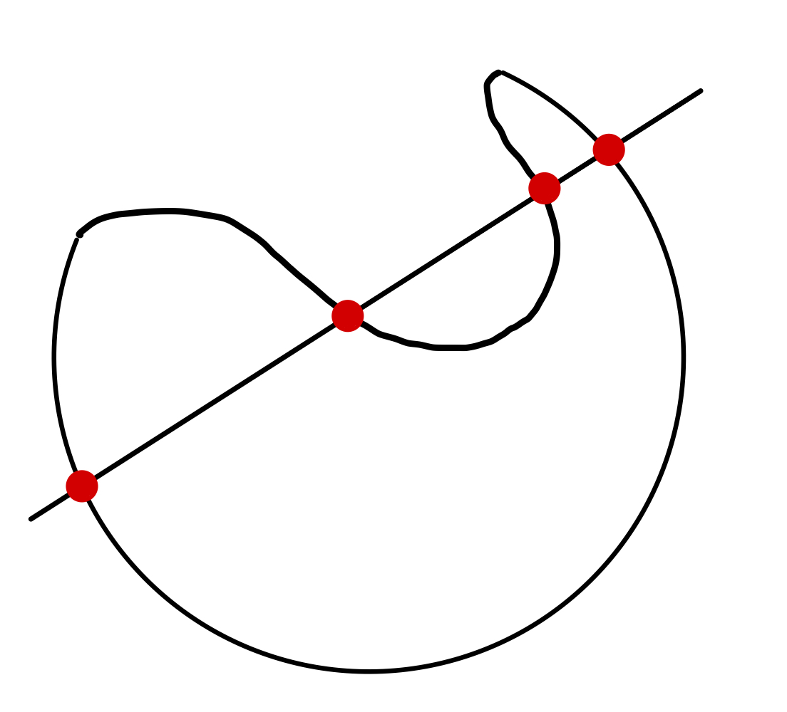

# Multi-variable Calcuus & Differential Equations - Concise Notes 1
{: .no_toc }
## MATH50004
{: .no_toc}
**Term 1 Content**

<head>
  
</head>
  

  

    PDFs
  

  
- <a href="/notes/pdfs/year2/MVC-Concise.pdf" target="_blank" style="color:#801fff;">**Open Calculus Concise - Term 1**</a> - <a href="/notes/pdfs/year2/MVC-Concise.pdf" download>**Download**</a>
  
- <a href="/notes/pdfs/year2/MVCLec.pdf" target="_blank" style="color:#801fff;">**Open Calculus Lecturer - Term 1**</a> - <a href="/notes/pdfs/year2/MVCLec.pdf" download>**Download**</a>

  

    Problem Sheets - Term 1
  

  
  - <a href="/notes/pdfs/year2/problemsheets/mvcSheets/term1/MVCPS1.pdf" target="_blank" style="color:#00ba47;">**Problem Sheet 1**</a> - <a href="/notes/pdfs/year2/problemsheets/mvcSheets/term1/MVCPS1-Sol.pdf" target="_blank">**Solutions**</a>
  
  - <a href="/notes/pdfs/year2/problemsheets/mvcSheets/term1/MVCPS2.pdf" target="_blank" style="color:#00ba47;">**Problem Sheet 2**</a> - <a href="/notes/pdfs/year2/problemsheets/mvcSheets/term1/MVCPS2-Sol.pdf" target="_blank">**Solutions**</a>
  
  - <a href="/notes/pdfs/year2/problemsheets/mvcSheets/term1/MVCPS3.pdf" target="_blank" style="color:#00ba47;">**Problem Sheet 3**</a> - <a href="/notes/pdfs/year2/problemsheets/mvcSheets/term1/MVCPS3-Sol.pdf" target="_blank">**Solutions**</a>
  
  - <a href="/notes/pdfs/year2/problemsheets/mvcSheets/term1/MVCPS4.pdf" target="_blank" style="color:#00ba47;">**Problem Sheet 4**</a> - <a href="/notes/pdfs/year2/problemsheets/mvcSheets/term1/MVCPS4-Sol.pdf" target="_blank">**Solutions**</a>
  
  - <a href="/notes/pdfs/year2/problemsheets/mvcSheets/term1/MVCPS5.pdf" target="_blank" style="color:#00ba47;">**Problem Sheet 5**</a> - <a href="/notes/pdfs/year2/problemsheets/mvcSheets/term1/MVCPS5-Sol.pdf" target="_blank">**Solutions**</a>

  

    Problem Sheets - Term 2
  

  
  - <a href="/notes/pdfs/year2/problemsheets/linalgSheets/term2/MVCPS1.pdf" target="_blank" style="color:#00ba47;">**Problem Sheet 1**</a> - <a href="/notes/pdfs/year2/problemsheets/linalgSheets/term2/MVCPS1-Sol.pdf" target="_blank">**Solutions**</a>
  

  

    Table of contents
  

<!--   {: .text-delta } -->
* TOC
{:toc}

---

**Colour Code** - **Definition** are
**green** in these notes,
**Consequences** are **red**
and **Causes** are **blue**

*Content from MATH40004 assumed to be known.*

# **Term I**

# Vector Calculus

## Prelim

**Definition 1.1.1 -** **Einstein Summation Convention**

$$a_{i}x_{i} = \sum_{i=1}^{3}x_{i}$$ 

**Definition 1.1.2 -** **The Kronecker delta**

$$\delta_{ij} = 
\begin{cases} 
      1, & i=j \\
      0, & i \neq j
   \end{cases}$$

  

**Definition 1.1.3 -** **The Permutation Symbol**

$$\epsilon_{ijk} = 
\begin{cases} 
      0, & \text{ if any 2 elements $i,j,k$ equal} \\
      1, & \text{if $i, j, k$ a cyclic permutation of $1, 2, 3$} \\\
      -1, & \text{if $i, j, k$ an acyclic permutation $1, 3, 2$}
   \end{cases}$$ 

 

**Formula -**  **Relation between Kroenecker Delta and Permutation Symbol**

$$\epsilon_{ijk} \epsilon_{klm} = \delta_{jl} \delta_{km} - \delta_{jm} \delta_{kl}$$
$$\epsilon_{ijk} \epsilon_{ilm} = \delta_{jl} \delta_{km} - \delta_{jm} \delta{kl}$$

  
**Definition 1.1.4 -** **Vector Products**

**Here are some identities!:**

-   $\textbf{a} \cdot \textbf{b} = a_{i}b_{i}$

-   $[\mathbf{a} \times \mathbf{b}]_{i} = \epsilon_{ijk} a_{j} b_{k}$

-   $\textbf{a} \times \textbf{b} = \begin{vmatrix}\textbf{i} & \textbf{j} & \textbf{k}\\ a_1 & a_2 & a_3 \\ b_1 & b_2 & b_3\end{vmatrix}$
    $\implies [a \times b]_{i} = epsilon_{ijk} a_j b_k$

-   $\textbf{a} \cdot (\textbf{b} \times \textbf{c}) = (\textbf{a} \times \textbf{b}) \cdot \textbf{c} = \epsilon_{ijk} a_i b_j c_k$

-   $\textbf{a} \times (\textbf{b} \times \textbf{c}) = (\textbf{a} \cdot \textbf{c}) \textbf{b} - (\textbf{a} \cdot \textbf{b}) \textbf{c} \Rightarrow [\textbf{a} \times (\textbf{b} \times \textbf{c})]_i = (\textbf{a} \cdot \textbf{c}) b_i - (\textbf{a} \cdot \textbf{b}) c_i$

## Gradient, Div, and Curl

**Definition 1.2 -** **Gradient, Directional Derivatives**

$\phi =$ constant, defines a surface in 3D, varying the constant yields a family of surfaces.

$$\hat{\textbf{n}}\frac{\partial \phi}{\partial n} = \nabla = (\frac{\delta}{\delta x}, \frac{\delta}{\delta y}, \frac{\delta}{\delta z}) \Rightarrow \nabla \phi = \frac{\delta \phi}{ \delta x} + \frac{\delta \phi}{ \delta y} + \frac{\delta \phi}{ \delta z}$$

s = $\frac{\delta \phi}{\delta s} = \nabla \phi \cdot \textbf{\^{s}}$

**$\nabla \phi = \textbf{\^{r}} \frac{\delta \phi}{\delta r} + \frac{\hat{\theta}}{r} \frac{\delta \phi}{\delta \theta} + \textbf{k} \frac{\delta \phi}{\delta z}$**

**Definition 1.2.3 -** **Tangent Plane to $\phi(P)$**

$$(\mathbf{r}-\mathbf{r}_{p})\cdot(\nabla \phi)_{P} = 0$$
$$\left(\frac{\delta \phi}{\delta x}\right)_P (x-x_P) + \left(\frac{\delta \phi}{\delta y}\right)_P (y-y_P) + \left(\frac{\delta \phi}{\delta z}\right)_P (z-z_P) = 0$$

## Divergence & Curl

**Definition 1.3.1 -** **Divergence and Curl**

**A** a vector function of position

$$\textcolor{ForestGreen}{\textbf{Div  \textbf{A}}} = \nabla \cdot \textbf{A} = \frac{\delta A_1}{\delta x} + \frac{\delta A_2}{\delta y} + \frac{\delta A_3}{\delta z} \text{ where }A = A_1 \textbf{\^{i}} + A_2 \textbf{\^{j}} + A_3 \textbf{\^{k}}$$

$$\textcolor{ForestGreen}{\textbf{Curl \textbf{A}}} = \nabla \times \textbf{A} = \textbf{\^{i}} \left(\frac{\delta A_3}{\delta y} - \frac{\delta A_2}{\delta z} \right) - \textbf{\^{j}} \left(\frac{\delta A_3}{\delta x} - \frac{\delta A_1}{\delta z} \right) + \textbf{\^{k}} \left(\frac{\delta A_2}{\delta x} - \frac{\delta A_1}{\delta y} \right)$$

**Definition -** **Laplacian Operator**

$$\nabla^2 \phi = \text{div}(\nabla \phi) = \frac{\delta^2 \phi}{\delta x^2} + \frac{\delta^2 \phi}{\delta y^2} + \frac{\delta^2 \phi}{\delta z^2}$$

## Operations with Grad operator

**Resulting Equalities**

1.  $\nabla(\phi_1+\phi_2) = \nabla \phi_1 + \nabla \phi_2$

2.  $\text{div }(\textbf{A} + \textbf{B}) = \text{div }\textbf{A} + \text{div }\textbf{B}$

3.  $\text{curl }(\textbf{A} + \textbf{B}) = \text{curl }\textbf{A} + \text{curl }\textbf{B}$

4.  $\nabla (\phi \psi) = \phi \nabla \psi + \psi \nabla \phi$

5.  $\text{div}(\phi \textbf{A}) = \phi \text{ div }\textbf{A} + \nabla \phi \cdot \textbf{A}$

6.  $\text{curl}(\phi \textbf{A}) = \phi \text{ curl }\textbf{A} + \nabla \phi \times \textbf{A}$

7.  $\text{div}(\textbf{A} \times \textbf{B}) = \textbf{B} \cdot \text{curl }\textbf{A} - \textbf{A} \cdot \text{curl } \textbf{B}$

8.  $\text{curl}(\textbf{A} \times \textbf{B}) = (\textbf{B} \cdot \nabla)\textbf{ A} - \textbf{B}\text{ div }\textbf{A} -(\textbf{A} \cdot \nabla)\textbf{B} + \textbf{A} \text{ div }\textbf{B}$

9.  $\nabla(\textbf{A} \cdot \textbf{B}) = (\textbf{B} \cdot \nabla)\textbf{A}+(\textbf{A} \cdot \nabla)\textbf{B} + \textbf{B} \times \text{curl }\textbf{A} + \textbf{A} \times \text{curl } \textbf{B}$

10. $\text{curl }(\nabla \phi) =  0$

11. $\text{curl }(\text{curl } \textbf{A}) =  \nabla(\text{div } \textbf{A})-\nabla^2 \textbf{A}$

12. $\text{div }(\text{curl } \textbf{A}) =  0$

# Integration

**Definition 1.4.6** - **Scalar and Vector Fields**

If at each point of region $V$, scalar function $\phi$ defined -

  $\phi$ a scalar field over $V$

Similarly if vector function $A$ defined $\forall v \in V$, **$A$ a vector field.**

If curl $A = 0$, $A$ is an **irrotational vector field**. If div $A = 0$, $A$ a **solenoidal vector field**

## Path Integrals

**Definition 1.5.1 -** **Definition of a Path Integral**

$$\lim_{n\rightarrow \infty} \sum_{n=1}^{N} f_{n} \delta s_n = \int_{\gamma}f ds \Rightarrow \int_{\gamma}\textbf{F} \cdot d\textbf{r} \int_{\gamma}\textbf{F}\cdot \textbf{\^{t}} ds $$ where $\hat{t}$  is the normalized vector tangent to the path

  
  
**Definition 1.5.3 -** **Conservative forces**

If [**$F = \nabla \phi$**] for a **differentiable scalar function $\phi$**, **$F$ is said to be a** **conservative field**, which has the following properties:

$$\int_{\gamma} \textbf{F} \cdot d\textbf{r} = \phi(B)-\phi(A)$$ 
  

Result independent of path joining **A** and **B**, in particular for $\gamma$ a closed curve ($B \equiv A$) We have:

$$\oint_{\gamma}\textbf{F}\cdot d\textbf{r} = 0$$ 

Call this a **circulation of F** around $\gamma$

If a vector field **F** s.t **$\oint_{\gamma}F\cdot dr = 0$**, for any closed curve $\gamma$ say **F a conservative field**, if $\textbf{F} = \nabla\phi \implies \textbf{F}$ conservative.

If **F** conservative $\implies$ can always find differentiable scalar function $\phi$ s.t **F**$=\nabla\phi$, call $\phi$ the **potential of field F**

**Definition 1.5.4 -**  **Calculation of Path Integrals**

$\textbf{F}=\textbf{F}(x, y, z)$ $\gamma$ $(x(t), y(t), z(t)),$

$$\textbf{r} = {x(t)\textbf{\^{i}}+y(t)\textbf{\^{j}}+z(t)\textbf{\^{k}}} \Rightarrow d\textbf{r} = \frac{dx}{dt}\textbf{\^{i}}+\frac{dy}{dt}\textbf{\^{j}}+\frac{dz}{dt}\textbf{\^{k}}$$

$$\implies
\int_{\gamma}\textbf{F}\cdot d\textbf{r} = \int_{t_0}^{t_1}\left(\textbf{F}_{1}\frac{dx}{dt}+\textbf{F}_{2}\frac{dy}{dt}+\textbf{F}_{3}\frac{dz}{dt}\right) dt$$

## Surface Integrals

**Definition 1.6.1 -** **Surface Integral**

Consider a surface $S$,where we find the surface integral of $f = f(P)$ over $S$.

Dividing $S$ into small elements of area $\delta S_{i}$, with $f_{i}$ the values of $f$ at typical points $P_{i}$ of $\delta S_{i}$

The **surface integral of $f$ over $S$** is

$$\int_{S}f dS = \lim_{\substack{N \to \infty \\ max(\delta S_{n}) \to 0}}\sum_{n=1}^{N}f_{n}\delta S_{n}$$

  
$f$ may be a vector or a scalar.

### Types of Surfaces

<!-- 

  
  
  

 -->

Closed Surface             |  Convex                      |  Not Convex
:-------------------------:|:----------------------------:|:---------------:
  |    | 

**Definitions**

1.  **Closed Surface** - Divides $3D$ space into $2$ non-connected regions; interior and exterior.

2.  **Open Surface** - Does not divide $3D$ space into 2 non-connected regions - has a rim which can be represented by closed curve.\
    Can think of closed surfaces as sum of 2 open surfaces.

3.  **Convex Surface** - A surface which
    is crossed by a straight line at most twice

### Evaluating surface integrals for plane surfaces in x-y plane

$dS$ infinitesimal area $\implies$ think of as approx. plane.\
**Vector areal element $dS$** is the vector $\hat{\mathbf{n}}dS$ for
$\hat{\mathbf{n}}$ the unit normal vector to $dS$.\
For a plane lying in $z = 0$, we can say $dS = dxdy$

For a rectangle, $x = a,b$ and $y = c,d$ circumscribing convex $S$. We let

$$y = 
\begin{cases}
      F_{1}(x) & \text{upper half ADB}\\
      F_{2}(x) & \text{lower half ACB}
\end{cases}$$
  

Area of  $\mathbf{S}= \int_{S}dS = \int_{x=a}^{x=b}\int_{y=F_{2}(x)}^{y=F_{1}(x)}dydx = \int_{a}^{b}[F_{1}(x) -F_{2}(x)]dx $

For $f(x,y)$ a function of position

$$\int_{S}fdS = \int_{x=a}^{x=b}\int_{y = F_{2}(x)}^{y=F_{1}(x)}f(x,y)dydx$$

Equivalently;

$$x =
\begin{cases}
      G_{1}(x) & \text{right half CBD}\\
      G_{2}(x) & \text{left half CAD}
\end{cases}$$
  
$$\textcolor{red}{\text{\textbf{Area of  }} \mathbf{S} = \int_{S}dS = \int_{c}^{d} G_{1}(y) - G_{2}(y)dy}$$
  
$$\int_{S}fdS =  \int_{y=c}^{y=d}\int_{x = G_{2}(x)}^{x=G_{1}(x)}f(x,y)dxdy$$

### Projection of an area onto a plane

$$dS = \frac{d\Sigma}{|\hat{\mathbf{n}}\cdot\hat{\mathbf{k}}|}$$

### The Projection Theorem

$P$ a point on surface $S$, which at no point is orthogonal to $\mathbf{k}$

$$\int_{S}f(P)dS = \int_{\Sigma}f(P)\frac{dx\ dy}{|\hat{\mathbf{n}}\cdot\hat{\mathbf{k}}|}$$

  
For $\Sigma$ a projection of $S$ onto $z= 0$, with $\hat{\mathbf{n}}$ normal to $S$\
For $S$ given by $z = \phi(x,y)$

$$\int_{S}f(x,y,z)dS = \int_{\Sigma_{z}}f(x,y,\phi(x,y))\frac{dx\ dy}{|\hat{\mathbf{n}}\cdot\hat{\mathbf{k}}|}$$

Projecting onto $x =0$ or $y = 0$\

$$\int_{S}f(P)dS = \int_{\Sigma_{x}}f(x,y,\phi(x,y))\frac{dy\ dz}{|\hat{\mathbf{n}}\cdot\hat{\mathbf{i}}|} = \int_{\Sigma_{y}}f(x,y,\phi(x,y))\frac{dx\ dz}{|\hat{\mathbf{n}}\cdot\hat{\mathbf{j}}|}$$

$\Sigma_{x}$, projection onto $x=0$, $\Sigma_{y}$, projection onto $y=0$

## Volume Integrals

**Definition 1.7.1 -** **Volume Integral**

Considering a volume $\tau$, split into $N$ subregions, $\{\delta \tau_{i}\}$, with $\{P_{i}\}$ typical points of $\{\delta \tau_{i}\}$.

$$\int_{\tau}f d\tau = \lim_{\substack{N \to \infty \\ max(\delta \tau_{i}) \to 0}}\sum_{i=1}^{N}f(P_{i})\delta \tau_{i}$$

In Cartesian coordinates, the volume element $d \tau = dxdydz$

## Results relating line,surface and volume integrals

### Green's Theorem in the plane

$R$ a closed plane region bounded by a simple plane closed convex curve
in $x-y$ plane.\
$L,M$ continuous functions of $x,y$ with continuous derivatives
throughout $R$. Then:

$$\oint_{C}(L\ dx + M\ dy) = \int_{R}(\frac{\partial M}{\partial x} - \frac{\partial L}{\partial y})dxdy,$$

For $C$ the boundary of $R$ described in the counter-clockwise sense.

### Vector forms of Green's Theorem

*(i) $2D$ Stokes Theorem

Let $F = L\mathbf{i} + M\mathbf{j}$ and
$d\mathbf{r} = dx\mathbf{i} + dy\mathbf{j}$. Then

$$\text{curl }\mathbf{F} = \left(\frac{\partial M}{\partial x} - \frac{\partial L}{\partial y}\right)\mathbf{k}$$

  
Over region $R$ write $dxdy = dS$. 

$$\label{eq1}
\begin{split}
\oint_{C}F \cdot dr & = \int_{R}k\cdot \text{curl } F dS\\
& = \int_{R}\text{curl }F \cdot d\mathbf{S}, \qquad d\mathbf{S} = \hat{\mathbf{k}}dS
\end{split}$$

*(ii) Divergence Theorem in $2D$*\

Let $\mathbf{F} = M\mathbf{i} - L\mathbf{j}$. Then

$$\text{div }\mathbf{F} = \frac{\partial M}{\partial x} - \frac{\partial L}{\partial y}$$

So we can rewrite Green's Theorem as

$$\int_{R}\text{div }\mathbf{F} dxdy  = \oint_{C}F\cdot\hat{\mathbf{n}}ds$$

Green's Theorem holds for more complicated geometries too, if C not convex we can see it as the composition of 2 or more simple convex closed curves.\
Joining $A$, $A'$ form $C_{1}, C_{2}$ enclosing $R_{1},R_{2}$ s.t
$R_{1} + R_{2} =R$

$$\oint_{C}\mathbf{F}\cdot dr = \oint_{C_{1}}\mathbf{F}\cdot d\mathbf{r} + \oint_{C_{2}}\mathbf{F}\cdot d\mathbf{r} = \int_{R} \text{curl }\mathbf{F}\cdot d\mathbf{S}$$
  

$$\begin{split}
        \oint_{C_{1}} & = \int_{AXA'} + \int_{A'}^{A}\\
        \oint_{C_{2}} & = \int_{A'YA} + \int_{A}^{A'}\\
    \end{split}$$

### Green's Theorem in multiply-connected regions

$R$ **simply-connected** if any closed curve in $R$ can be shrunk to a point without leaving $R$.

For $2D$ any region with a hole in it; **not simply connected**, we say it is **multiply-connected**

**Green's theorem still holds in multiply-connected regions**.

$C$ interpreted as the entire inner and outer boundary.

For doubly-connected region, describe outer $C_{0}$ anti-clockwise, $C_{1}$ clockwise, and join them via $A$ on $C_{0}$ and $B$ on $C_{1}$

$R$ now a simply connected region bounded by $(C_{0} + AB + C_{1} + BA)$

$$\int_{R}\text{curl }\mathbf{F}\cdot d\mathbf{S} = \left(\oint_{C_{0}} + \int_{A}^{B} + \oint_{C_{0}} + \int_{B}^{A}\right)(\mathbf{F}\cdot d\mathbf{r})$$

$$\int_{R}\text{curl }\mathbf{F}\cdot d\mathbf{S} = \left(\oint_{C_{0}} + \oint_{C_{1}} \right)(\mathbf{F}\cdot d\mathbf{r}) = \left( \oint_{C}\mathbf{F}\cdot d\mathbf{r} \right)$$
  

Where $C = C_{0} + C_{1}$

### Flux

If $S$ is a surface then the flux of $A$ across $S$ is defined as

$$\int_{S}\mathbf{A\cdot \hat{n}}dS$$

If $S$ a closed surface then by
convention draw unit normal $\mathbf{\hat{n}}$ **out** of $S$.

### The divergence theorem

If $\tau$ the volume enclosed by a closed surface $S$ with unit outward normal $\mathbf{\hat{n}}$ and $\mathbf{A}$ is a vector field with continuous derivatives throughout $\tau$, then:

$$\int_{S}\mathbf{A\cdot \hat{n}}dS = \int_{\tau}div \mathbf{A}d\tau$$

### The Divergence theorem in more complicated geometries!

1.  **Non-convex surfaces**

    *non-convex surface $S$ can be divided by
    surfaces(s) $\sigma$ into 2 (or more) parts $S_{1}$ and $S_{2}$
    which together with $\sigma$ form convex surfaces
    $S_{1} + \sigma, S_{2} + \sigma$*/\
    Applying divergence theorem to the convex parts, upon addition
    yields the same result as before.

2.  **A region with internal boundaries**

    1.  *Simply-connected regions* - e.g space between concentric
        spheres.

        

        Given interior surface $S_{i}$ and outer surface $S_{o}$. A
        plane $\Pi$ cutting both $S_{o},S_{i}$, divides $S_{o},S_{i}$
        into open $S_{o}^{(1)},S_{o}^{(2)}$ and
        $S_{i}^{(1)},S_{i}^{(2)}$ respectively.\
        Apply divergence theorem to $\tau_{1},\tau_{2}$ bounded by
        closed $S_{o}^{(1)} + S_{i}^{(1)} + \Pi$ and
        $S_{o}^{(2)} + S_{i}^{(2)} + \Pi$. Upon addition contribution
        from $\Pi$ cancels.
        $$\int_{S_{o}+S_{i}}\mathbf{A\cdot \hat{n}}dS = \int_{S}\mathbf{A\cdot \hat{n}}dS = \int_{\tau_{1}}div \mathbf{A}d\tau + \int_{\tau_{2}}div \mathbf{A}d\tau = \int_{\tau}div \mathbf{A}d\tau$$

    2.  *Multiply-connected regions*

        

        

        e.g. region between 2 cyclinders.\
        Given interior surface $S_{i}$ and outer surface $S_{o}$, linked
        by plane $\Pi$.\
        Consider the closed surface, enclosing simply connected region
        $\tau$

        

        $S_{i} +$ side 1 of $\Pi+ S_{o} +$ side 2 of $\Pi$
        

        Applying divergence theorem to $\tau$. Once again gives
        $$\int_{S_{0}+S_{i}}\mathbf{A\cdot\hat{n}}dS = \int_{\tau}div\mathbf{A}d\tau$$

### Green's identity in 3D

For $\phi$ and $\psi$ 2 scalar fields with continuous derivatives. We consider $\mathbf{A} = \phi \nabla \psi$, for which we have

$$\begin{aligned}
        div\mathbf{A} &= \phi\nabla^{2}\psi + (\underline{\nabla}\phi)\cdot(\underline{\nabla}\psi)\\
        \mathbf{\hat{n}\cdot A} &= \phi(\underline{\nabla}\psi)\cdot\hat{\mathbf{n}} = \phi\frac{\partial \psi}{\partial n}
    \end{aligned}$$

**Green's first identity**

$$\int_{S}\left \{ \phi\frac{\partial \psi}{\partial n} \right \} dS = \int_{\tau}\phi\nabla^{2}\psi + (\underline{\nabla}\phi)\cdot(\underline{\nabla}\psi)d\tau$$

**Green's Second identity**

$$\int_{S}\left \{ \phi\frac{\partial \psi}{\partial n} - \psi\frac{\partial \phi}{\partial n} \right \} dS = \int_{\tau} \phi \nabla^{2}\psi - \psi\nabla^{2}\phi d\tau$$

### Green's identities in 2D

Divergence theorem in 2D: $\int_{F}div \mathbf{F}dxdy = \oint_{C}\mathbf{F\cdot\hat{n}}ds$

Giving the following Green's identities:

$$\oint_{C}\phi\frac{\partial \psi}{\partial n}ds = \int_{R}[\phi \nabla^{2}\psi + (\nabla\psi)\cdot(\nabla\phi)dxdy$$

and

$$\oint_{C}\left [\phi\frac{\partial \psi}{\partial n} - \psi\frac{\partial \phi}{\partial n} \right ]ds = \int_{R}\left [ \phi \nabla^{2}\psi - \psi\nabla^{2}\phi \right ] dxdy$$

**$\int_{R}\phi\nabla^{2}\psi\ dxdy = \oint_{C}\phi \frac{\partial \psi}{\partial n}ds - \int_{R}(\nabla\psi)\cdot(\nabla\phi)dxdy$** - **Looks like Integration by parts**

### Gauss' Flux Theorem

Let $S$ a closed surface with outward unit normal $\mathbf{\hat{n}}$ and let $O$ the origin of the coordinate system.

$\mathbf{A} = \frac{\mathbf{r}}{r^{3}}$ Then:

$$\int_{S}\frac{\mathbf{\hat{n}}\cdot\mathbf{r}}{r^{3}} =
        \begin{cases}
        0, \text{ if $O$ is exterior to $S$}\\
        4\pi, \text{ if $O$ interior to $S$}
        \end{cases}$$

### Stokes Theorem

Suppose $S$ is **open** surface with simple closed curve $\gamma$ forming its boundary.

$A$ a vector field with continuous partial derivatives, Then:

$$\oint_{\gamma}\mathbf{A}\cdot d\mathbf{r} = \int_{S}curl\mathbf{A\cdot\hat{n}}dS$$

This holds for **any** open surface with $\gamma$ as a boundary.

**Theorem**\
For $\mathbf{A}$ continuously differentiable and simply connected
region:

$$\underbrace{\oint_{\gamma}\mathbf{A}\cdot d\mathbf{r} = 0}_{\mathbf{A} \text{ conservative}} \iff curl\mathbf{A} = 0, \text{ throughout region for which $\gamma$ is drawn}$$

## Curvilinear Coordinates

### Intro + Definition

Consider generally cartesian coordinates: $(x_1,x_2,x_3)$ with each expressible as single-valued differentiable functions of the new coorinates $(u_1,u_2,u_3)$

  $$x_i = x_i(u_1,u_2,u_3)$$

$$\frac{\partial x_i}{\partial x_j} = \delta_{ij} = \frac{\partial x_i}{\partial u_1}\frac{\partial u_1}{\partial x_j} + \frac{\partial x_i}{\partial u_2}\frac{\partial u_2}{\partial x_j}+ \frac{\partial x_i}{\partial u_3}\frac{\partial u_3}{\partial x_j}$$
With the following matrix equation $$\left( \begin{array}{lll}
            \partial x_{1} / \partial u_{1} & \partial x_{1} / \partial u_{2} & \partial x_{1} / \partial u_{3} \\
            \partial x_{2} / \partial u_{1} & \partial x_{2} / \partial u_{2} & \partial x_{2} / \partial u_{3} \\
            \partial x_{3} / \partial u_{1} & \partial x_{3} / \partial u_{2} & \partial x_{3} / \partial u_{3}
            \end{array} \right) \left( \begin{array}{lll}
            \partial u_{1} / \partial x_{1} & \partial u_{1} / \partial x_{2} & \partial u_{1} / \partial x_{3} \\
            \partial u_{2} / \partial x_{1} & \partial u_{2} / \partial x_{2} & \partial u_{2} / \partial x_{3} \\
            \partial u_{3} / \partial x_{1} & \partial u_{3} / \partial x_{2} & \partial u_{3} / \partial x_{3}
        \end{array} \right)=I$$

Or more succinctly

$$J(x_u)\cdot J(u_x) = I$$

We say $J(x_u)$ the Jacobian matrix for the $(x_1,x_2,x_3)$ system.

$det\left ( J(x_u) \right)\neq 0\ \implies J(u_x)$ exists
  
$det(J(x_u)) = \frac{1}{det(J(u_x))}$

We say $(u_1,u_2,u_3)$ define a curvilinear coordinate system.\
With each $u_i =$ constant, defining a family of surfaces, with a member
of each family passing through each $P(x,y,z)$

Let $\mathbf{(\hat{a}_{1},\hat{a}_{2},\hat{a}_{3})}$ unit vectors at $P$ in the direction normal to $u_i = u_i(P)$, s.t $u_i$ increasing in the direction $\mathbf{\hat{a}_{i}}$

$$\mathbf{\hat{a}_i} = \mathbf{\frac{\nabla u_i}{\lvert \nabla u_i \rvert}}$$

if we have that $\mathbf{(\hat{a_1},\hat{a_2},\hat{a_3})}$ mutually orthogonal $\implies$ **orthogonal curvilinear coordinate system.**

$$\frac{\partial \mathbf{r}}{\partial u_i} = \mathbf{\hat{e_{i}}}h_{i}$$

For which we define $h_{i} = \lvert \partial \mathbf{r}/ \partial u_{i} \rvert$. We call these the **length scales**

### Path element

$\mathbf{r} = \mathbf{r}(u_1,u_2,u_3)$ **path element** $d\mathbf{r}$
given by

$$\begin{aligned}
        d\mathbf{r} &= \frac{\partial \mathbf{r}}{\partial u_1}du_1 + \frac{\partial \mathbf{r}}{\partial u_2}du_2 + \frac{\partial \mathbf{r}}{\partial u_3}du_3\\
        &= h_{1}du_{1}\hat{e_{1}} + h_{2}du_{2}\hat{e_{2}}+ h_{3}du_{3}\hat{e_{3}}
    \end{aligned}$$

For an orthongal system

$$(ds)^{2} = (d\mathbf{r})\cdot(d\mathbf{r}) = h_{1}(du_{1})^{2} + h_{2}(du_{2})^{2} +h_{3}(du_{3})^{2}$$
  
$$\hat{e}_{i} = \hat{a}_{i} = \mathbf{\frac{\nabla u_i}{\lvert \nabla u_i \rvert}}$$

### Volume Element

$$\begin{aligned}
        d\tau &= (h_{1}du_{1})(h_{2}du_{2})(h_{3}du_{3})\\
        &= h_1h_2h_3du_1du_2du_3
    \end{aligned}$$

### Surface element

For $u_1$ constant. $$dS = h_2h_3du_2du_3$$ similarly for $u_2,u_3$

### Properties of various orthogonal coordinates

1.  **Cartesisan coordinates** $(x,y,z)$

    

    $$  
    \begin{aligned}
    d\tau &= dxdydz & d\mathbf{r} &= dx\mathbf{\hat{i}} + dy\mathbf{\hat{j}} + dz\\mathbf{\hat{k}}
    (ds)^{2} &= (d\mathbf{r})\cdot(d\mathbf{r}) = (dx)^{2} + (dy)^{2} + (dz)^{2}
    \end{aligned}
    $$
    

    We have $h_{1} = h_{2} = h_{3}$

2.  **Cylindrical polar coordinates** $(r,\phi,z)$\
    Related to cartesian by

    $$x = r\cos \theta \quad y = r\sin \phi \quad z = z$$

    

    $\begin{aligned}
    &= () + () + () = () + ()\
    &= () + () + () = -(r) + (r)\
    &=
    \end{aligned}$

    $\begin{aligned}
    ()() &= 0\\
    ()() &= 0\\
    ()() &= 0
    \end{aligned}$

    $\begin{aligned}
    h_{1} &= = 1\\
    h_2 &= = r\\
    h_3 &= = 1
    \end{aligned}$
    

    Yielding length and volume elements:

    

    $\begin{aligned}
    (ds)^2 &= (dr)^2+r^2(d)^2+(dz)^2
    \end{aligned}$

    $\begin{aligned}
    d= rdrddz
    \end{aligned}$
    

3.  **Spherical polar coordinates** $(r,\theta,\phi)$\
    Related to cartesian by:
    $$x = r\sin\theta\cos\phi \quad y = r\sin\theta\sin\phi \quad z = r\cos\theta$$

    

    $\begin{aligned}
    &= () + () + ()\\
    &= (r) + (r) + (-r)\\
    &= (-r) + (r) + (0)
    \end{aligned}$

    $\begin{aligned}
    ()() &= 0\\
    ()() &= 0\\
    ()() &= 0
    \end{aligned}$

    $\begin{aligned}
    h\_1 &= = 1\\
    h\_2 &= = r\\
    h\_3 &= = r
    \end{aligned}$
    

    Volume element:
    

    $$d\tau = r^{2}\sin\theta drd\theta d\phi$$
    

  
### Gradient in orthogonal curvilinear coordinates

Let $\nabla \Phi = \lambda_{1}\mathbf{\hat{e}_{1}} + \lambda_{2}\mathbf{\hat{e}_{2}} + \lambda_{3}\mathbf{\hat{e}_{3}}$.

In a general coordinate system for $\lambda_{i}$s to be found.

$$d\mathbf{r} = h_{1}du_{1}\hat{e}_{1} +  h_{2}du_{2}\hat{e}_{2} + h_{3}du_{3}\hat{e}_{3}$$
  
$$\begin{aligned}
d\mathbf{\Phi} &= (\frac{\partial \phi}{\partial u_{1}})du_{1} + (\frac{\partial \phi}{\partial u_{2}})du_{2}+ (\frac{\partial \phi}{\partial u_{3}})du_{3}\\
&= (\frac{\partial \phi}{\partial x})dx + (\frac{\partial \phi}{\partial y})dy+ (\frac{\partial \phi}{\partial z})dz\\
&= (\nabla\Phi)\cdot d\mathbf{r} = \lambda_{1}h_{1}du_{1} + \lambda_{2}h_{2}du_{2} + \lambda_{3}h_{3}du_{3}
\end{aligned}$$

$$h_{i}\lambda_{i} = \frac{\partial \Phi}{\partial u_{i}}$$
  
$$\implies \nabla \Phi = \frac{\hat{\mathbf{e}}_{1}}{h_{1}}\frac{\partial \Phi}{\partial u_{1}} + \frac{\hat{\mathbf{e}}_{2}}{h_{2}}\frac{\partial \Phi}{\partial u_{2}} + \frac{\hat{\mathbf{e}}_{3}}{h_{3}}\frac{\partial \Phi}{\partial u_{3}}$$
  

1.  **Cylindrical polars** $(r,\phi,z)$\
    We have: $\begin{aligned}
                    h_{1} &= 1\\
                    h_{2} &= r\\
                    h_{3} &= 1
                    \end{aligned}$
        
    
    $$\implies \begin{aligned} \nabla = \hat{r}\frac{\partial}{\partial r} + \frac{\hat{\phi}}{r}\frac{\partial}{\partial \phi} + \hat{z}\frac{\partial}{\partial z} \end{aligned}$$

2.  **Spherical polars** $(r,\theta,\phi)$\
    We have:

    $$\begin{aligned}
    h_1 &= 1\\
    h_2 &= r\\
    h_3 &= r
    \end{aligned}$$
    
    $$\implies
    \begin{aligned}
    = + +
    \end{aligned}$$

### Expressions for unit vectors

$$\hat{\mathbf{e}}_{i} =h_{i}\nabla u_{i}$$

Alternatively, unit vectors orthogonal $\implies$ if we know 2 already then

$$\hat{\mathbf{e}}_{1} = (\hat{\mathbf{e}}_{2}\times\hat{\mathbf{e}}_{3}) = h_{2}h_{3}(\nabla u_{2} \times \nabla u_{3})$$

### Divergence in orthogonal curvilinear coordinates

Suppose we have vector field

$$\mathbf{A} = A_{1}\hat{\mathbf{e}}_{1} + A_{2}\hat{\mathbf{e}}_{2} + A_{3}\hat{\mathbf{e}}_{3}$$
  
$$\implies \nabla\cdot\mathbf{A} = \frac{1}{h_{1}h_{2}h_{3}}\left \{ \frac{\partial}{\partial u_{1}}(A_1h_2h_3) + \frac{\partial}{\partial u_{2}}(A_2h_3h_1) + \frac{\partial}{\partial u_{3}}(A_3h_1h_2) \right \}$$
  

So we have divergence in other coordinate systems as follows:

### Curl in orthogonal curvilinear coordinates

$$curl\mathbf{A} = \frac{1}{h_1h_2h_3}
        \begin{vmatrix}
        h_1\hat{e}_{1} & h_2\hat{e}_{2} & h_3\hat{e}_{3}\\
        \frac{\partial}{\partial u_{1}} & \frac{\partial}{\partial u_{2}} & \frac{\partial}{\partial u_{3}}\\
        h_{1}A_{1} & h_{2}A_{2} & h_{3}A_{3}
        \end{vmatrix}$$

1.  **Cylindrical polars**
    

    $$curl \mathbf{A} = \frac{1}{r}
                \begin{vmatrix}
                \mathbf{\hat{r}} & r\hat{\phi} & \mathbf{\hat{k}}\\
                \partial/\partial r & \partial/\partial \phi & \partial/\partial z\\
                A_1 & A2 & A_3
                \end{vmatrix}$$
    

2.  **Spherical polars**
    

    $$curl \mathbf{A} = \frac{1}{r^{2}\sin\theta}
                \begin{vmatrix}
                \mathbf{\hat{r}} & r\hat{\phi} &  r\sin\theta\hat{\phi} \\
                \partial/\partial r & \partial/\partial \phi & \partial/\partial z\\
                A_1 & rA2 & r\sin\theta A_3
                \end{vmatrix}$$
    

### The Laplacian in orthogonal curvilinear coordinates

From the above grad and div;

$$\nabla^{2}\Phi = \nabla \cdot (\nabla\Phi)$$
  
$$= \frac{1}{h_{1}h_2h_3}\left \{ \frac{\partial}{\partial u_1}\left (\frac{h_2h_3}{h_1}\frac{\partial \Phi}{\partial u_1}\right ) + \frac{\partial}{\partial u_2}\left (\frac{h_1h_3}{h_2}\frac{\partial \Phi}{\partial u_2}\right ) + \frac{\partial}{\partial u_3}\left (\frac{h_1h_2}{h_3}\frac{\partial \Phi}{\partial u_3}\right ) \right \}$$
  

1.  **Cylindrical polars** $(r,\phi,z)$\
    

    $$\begin{aligned}
                    \nabla^{2}\Phi &= \frac{1}{r}\left \{ \frac{\partial}{\partial r}\left ( r\frac{\partial \Phi}{\partial r} \right ) + \frac{\partial}{\partial \phi}\left ( \frac{1}{r}\frac{\partial \Phi}{\partial \phi} \right ) + \frac{\partial}{\partial z}\left ( r\frac{\partial \Phi}{\partial z} \right ) \right \} \\
                    &= \frac{\partial^{2}\Phi}{\partial r^{2}} + \frac{1}{r}\frac{\partial \Phi}{\partial r} + \frac{1}{r^{2}}\frac{\partial^{2}\Phi}{\partial \phi^{2}} + \frac{\partial^{2}\Phi}{\partial z^{2}}
                \end{aligned}$$
    

2.  **Spherical polars** $(r,\theta,\phi)$\
    

    $$\begin{aligned}
                    \nabla^{2}\Phi &= \frac{1}{r^{2}\sin\theta}\left \{ \frac{\partial}{\partial r}\left ( r^{2}\sin\theta\frac{\partial \Phi}{\partial r} \right ) + \frac{\partial}{\partial \theta}\left ( \sin\theta\frac{\partial \Phi}{\partial \theta} \right ) + \frac{\partial}{\partial \phi}\left ( \frac{1}{\sin\theta}\frac{\partial \Phi}{\partial \phi} \right ) \right \} \\
                    &= \frac{\partial^{2}\Phi}{\partial r^{2}} + \frac{2}{r}\frac{\partial \Phi}{\partial r} + \frac{\cot\theta}{r^{2}}\frac{\partial\Phi}{\partial \theta} + \frac{1}{r^{2}}\frac{\partial^{2}\Phi}{\partial \theta^{2}} + \frac{1}{r^{2}\sin^{2}\theta}\frac{\partial^{2}\Phi}{\partial \phi^{2}}
                \end{aligned}$$
     

## Changes of variables in surface integration

Suppose we have surface $S$, parametrized by quantities $u_1,u_2$. We can write:

$$x = x(u_1,u_2),\quad y = y(u_1,u_2), \quad z = z(u_1,u_2)$$

Consider surface to be comprised of arbitrarily small parallelograms,
its sides given by keeping either $u_1$ or $u_2$

$$\begin{aligned}
        dS &= \text{ Area of parallelogram with sides } \frac{\partial \mathbf{r}}{\partial u_1}du_{1} \text{ and } \frac{\partial \mathbf{r}}{\partial u_2}du_{2}\\
        &= \lvert \mathbf{J} \rvert du_{1}du_{2}
    \end{aligned}$$ 

**Vector Jacobian** given by $\mathbf{J} = \frac{d\mathbf{r}}{du_1}\times\frac{d\mathbf{r}}{du_2}$.

Useful in substitution of surface integrals:

$$\int_{S}f(x,y,z)dS = \int_{S}F(u_1,u_2)\lvert \mathbf{J}\rvert du_{1}du_{2]}$$

$F(u_1,u_2) = f(x(u_1,u_2),y(u_1,u_2),z(u_1,u_2))$

For S a region $R$ in the $x-y$ plane we can write:

$$\int_{R}f(x,y)dxdy = \int_{R}F(u_1,u_2)\lvert det(J(x_u)) \rvert du_1 du_2$$
  
$$\lvert \mathbf{J}\rvert = \vert \frac{d\mathbf{r}}{du_1}\times\frac{d\mathbf{r}}{du_2}\vert = det(J(x_u))  = 
    \begin{vmatrix}
    \partial x/ \partial u_1 & \partial x/\partial u_2\\
    \partial y/\partial u_1 & \partial y/\partial u_2
    \end{vmatrix}$$

For a surface described by $z = f(x,y)$. We have $x = u_1, y = u_2$ and $\mathbf{r} = (x,y,f(x,y))$\

We have:

\begin{aligned}
&= &= +\
&= &= +\
\end{aligned}

$$\begin{aligned}
        \lvert \frac{\partial \mathbf{r}}{\partial u_1} \times \frac{\partial \mathbf{r}}{\partial u_2} \rvert &= 
        \begin{Vmatrix}
        \mathbf{\hat{i}} & \mathbf{\hat{j}} & \mathbf{\hat{k}}\\
        1 & 0 & \partial f/ \partial x\\
        0 & 1 & \partial f/\partial y
        \end{Vmatrix}\\
        &= \sqrt{1 + \lvert \nabla f \rvert^{2}}
    \end{aligned}$$

So we have area of surface given by

$$\int_{\Sigma}\sqrt{1 + \lvert \nabla f \rvert^{2}}dxdy$$

for $\Sigma$ the projection of $S$ onto the $x-y$ plane.

# **Term II**

# Introduction

## ODEs and initial value problems

 
**Definition 1.2**. Ordinary differential equation

Consider $d \in \mathbb{N}$ an open set
$D \subset \mathbb{R}\times \mathbb{R}^{d}$ and function
$f:D \to \mathbb{R}^{d}$ Call 

$$\dot{x} = f(t,x)$$

 a [**d-dimensional (first-order) ordinary differential equation**]

Differentiable function $\lambda:I \to \mathbb{R}^{d}$ on interval
$I \subset \mathbb{R}$ a **solution** to a differential equation if
$(t,\lambda(t)) \in D$ and

$$\dot{\lambda}(t) = f(t,\lambda(t))\quad \forall t \in I$$

Say ODE [**autonomous**] if of form

$$\dot{x} = f(x)$$

for $f:D\to\mathbb{R}^{d}, D\subset \mathbb{R}^{d}$

**Proposition 1.3.**\
$D \subset \mathbb{R}^{d}$ open. $f:D \to \mathbb{R}^{d}$ with
autonomous ODE $$\dot{x} = f(x)$$ $\implies \exists$ constant solution
$\lambda:\mathbb{R}\to\mathbb{R}^{d}$ with $a \in \mathbb{R}^{d}$ at
$\lambda(t) = a \iff f(a) =0 \forall t$

 
**Definition 1.4**. **Initial value problem**

$d \in \mathbb{N}$ open
$D \subset \mathbb{R}\times\mathbb{R}^d,\ f:D \to \mathbb{R}^d$.\
Call the following pair a [**initial value
problem**]

 center
$\underbrace{\dot{x} = f(t,x)}_{\text{ODE}}$ and
$\underbrace{x(t_0) = x_0}_{\text{Initial condition}}$

Solutions s.t $\lambda:I \to \mathbb{R}^d$ with $t_0$ in interior of $I$
and $\lambda(t_0) = x_0$

## Visualisations

### Solution portrait

$f:D \subset \mathbb{R}\times\mathbb{R}^d \to \mathbb{R}^d$ with
$\dot{x} = f(t,x)$\
Graph of solutions given by

[**Solution Curve**]:
$G(\lambda) = \left\{(t,\lambda(t)): t \in I\right\} \subset \mathbb{R}\times \mathbb{R}^d$

derivative of curve at point $t_0 \in I$ is

$$\frac{d}{dt}(t,\lambda(t))\vert_{t = t_0} = (t,\dot{\lambda}(t_0)) = (1, f(t_0,\lambda(t_0))$$
Vector field a map $(t,x) \mapsto (1,f(t,x))$, defined on $D$

Solution Curves are tangential to vector field.\
Solution portrait given by visualisations of several solution curves in
both

$$\underbrace{(t,x)-\text{space}}_{\text{extended phase space}} \text{and }\  \underbrace{x-\text{space}}_{\text{phase space}}$$

### Phase Portraits

Autonomous differential equations not dependent on time. Visualisations
in phase-space alone suffice.

**Proposition 1.9.*(Translation invariance)***

$\lambda: I \to \mathbb{R}^{d}$ a solution to $\dot{x} = f(x)$

$\implies \forall \tau \in \mathbb{R}, \mu: \tilde{I}\to \mathbb{R}^{d}$

where $\tilde{I} = \{t\in \mathbb{R}: t+ \tau \in I\}$

$\mu(t) = \lambda(t+ \tau),\ \forall t \in \tilde{I}$ also a solution to this differential equation.

# Existence & Uniqueness

## Picard iterates

**Proposition 2.1.** - (Reformation as integral equation)

Consider initial value problem $\dot{x} = f(t,x),\quad x(t_0) = x_0$\
for $f: D\subset \mathbb{R}\times\mathbb{R}^{d} \to \mathbb{R}^{d}$
continuous and $(t_0,x_0) \in D$\
$\lambda: I \to \mathbb{R}^{d}$ a function on interval $I$ s.t
$t_0 \in I$ and $\{(t,\lambda(t)): t \in I\} \subset D$

Following are equivalent:

1.  $\lambda$ solves initial value problem\
    $\dot{\lambda}(t) = f(t,\lambda(t)),\ \forall t \in I$\
    $\lambda(t_0) = x_0$

2.  $\lambda$ continuous and
    $$\lambda(t) = x_0 + \int_{t_0}^{t}f(s,\lambda(s))ds\ \forall t \in I$$

***Higher dimensional derivative***\
for $g:\mathbb{R}\to\mathbb{R}^{d}$
$$\int_{t_0}^{t}g(s)ds = \begin{pmatrix}\int_{t_0}^{t}g_1(s)ds\\ \vdots \\ \int_{t_0}^{t}g_d(s)ds\end{pmatrix}$$

 
**Definition 3**. **(Picard iterates)**

Consider initial value problem; $\dot{x} = f(t,x)\quad x(t_0) = x_0$ and
chosen interval $J$ s.t $t_0 \in J$\
Define [**initial function**]:

$$\lambda_0(t) \equiv x_0 \quad \forall t \in J$$

and inductively the [**Picard iterates**]:

$$\lambda_{n+1}(t) := x_0 + \int_{t_0}^{t}f(s,\lambda_n(s))ds \quad \forall t\in J\ \forall n \in \mathbb{N}_{0}$$

If $(\lambda_n)$ uniformly convergent sequence with limit $\lambda_{\infty}$ obtain:

$$\lambda_{\infty}(t) = x_0 + \int_{t_0}^{t}f(s,\lambda_{\infty}(s))ds\ \forall t \in J$$

$\implies \lambda_{\infty}$ a solution to integral equation $\implies$ solves initial value problem

## Lipschitz Continuity

**Definition**\
[**Space of continuous functions on compact interval
J**] $:= C^{0}(J,\mathbb{R}^{d})$\
This a complete normed vector space under supremum norm. (Banach Space)

 
**Definition 4**. (Normed Vector Space)

Norm on a vector space $V$ over $\mathbb{R}$ a map
$\lvert \lvert \cdot\rvert\rvert:V \to \mathbb{R}^{+}_{0}$ s.t

1.  $\lvert \lvert x\rvert\rvert = 0 \iff x = 0$

2.  $\lvert \lvert ax\rvert\rvert = \lvert a\rvert\cdot\lvert \lvert x\rvert\rvert,\ \forall a \in \mathbb{R},x \in V$

3.  $\lvert \lvert x+y\rvert\rvert\leq \lvert \lvert x\rvert\rvert+\lvert \lvert y\rvert\rvert$

Normed vector space $V$ [**complete**] if
every cauchy sequence converges in $V$\
Call a complete normed vector space a [**Banach
Space**]

 
**Definition 5**. (Continuous + Lipschitz continuous functions)

$X \subset$ normed vector space
$(V,\lvert \lvert \cdot\rvert\rvert_{V})$\
$Y \subset$ normed vector space
$(W,\lvert \lvert \cdot\rvert\rvert_{W})$\
We say a function $f:X \to Y$

1.  [**Continuous**] if

    $$\forall x \in X, \epsilon > 0, \exists \delta > 0, \lvert \lvert  x-\bar{x}\rvert\rvert_{V} < d \implies \lvert \lvert  f(x)-f(\bar{x})\rvert\rvert_{W} < \epsilon$$

2.  [**Lipschitz Continuous**] if

    $$\exists K > 0, \lvert \lvert  f(x)-f(\bar{x})\rvert\rvert_{W} \leq K\lvert \lvert  x-\bar{x}\rvert\rvert_{V}\ \forall x,\bar{x} \in X$$

    Call $K$ a [**Lipschitz Constant**]

 center
Lipschitz continuous $\implies$ Continuous

### Lipschitz Continuity and MVT

 
**Theorem 1**. (Mean Value Theorem)

$I$ compact interval, $f$ continuously differentiable\
$\forall x,y \in I,\ \exists \xi \in (x,y)$ s.t\
$f(x)- f(y) = f'(\xi)(x-y)$\
$\implies f'$ bounded $\implies$ $f$ Lipschitz continuous

### Lipschitz Continuity and Mean Value Inequality

 
**Definition 6**. (Operator norm of a matrix)

For given matrix $A \in M_n(\mathbb{R})$ Operator norm:

$$\lvert \lvert A\rvert\rvert = \sup_{x\in\mathbb{R}^{n}\backslash\{0\}}\frac{\lvert \lvert  Ax\rvert\rvert}{\lvert \lvert x\rvert\rvert} = \sup_{x\in\mathbb{R}^{n}\backslash\{0\}}\left|\left|A\frac{x}{\lvert \lvert  x\rvert\rvert}\right|\right| = \sup_{x\in \mathbb{R}^{n},\lvert \lvert  x\rvert\rvert = 1}\lvert \lvert  Ax\rvert\rvert$$
 
**Theorem 2**. (Mean Value Inequality)

Consider open set $D \subset \mathbb{R}^{n}$ with
$f:D \to \mathbb{R}^{m}$ continuously differentiable\
$\forall x,y \in D$ with $[x,y] \subset D$

$$\exists \xi \in [x,y]\ s.t\ \lvert \lvert f(x)-f(y)\rvert\rvert \leq |f'(\xi)\lvert \lvert |x-y\rvert\rvert$$

$\forall x,y \in \mathbb{R}^{n}$, closed line segment connecting $x$ and $y$ given by

$$[x,y] = \{\alpha x + (1-\alpha)y \in \mathbb{R}^{n} : \alpha \in [0,1]\}$$

**Lemma 2.9.** (Triangle-like inequality for integrals)\
$I \subset R$ an interval\
$f:I \to \mathbb{R}^{m}$ continuous function

$$\implies \left\lvert \left\lvert  \int_{t_0}^{t}f(s)ds \right\rvert\right\rvert \leq \left\lvert  \int_{t_0}^{t} \lvert \lvert  f(s)\rvert\rvert ds \right\rvert \quad \forall t,t_0 \in I$$

**Corollary 2.10.** - (Lipschitz continuous and mean value inequality)\
$U \subset \mathbb{R}^{n}$ open. $f:U \to \mathbb{R}^{m}$ continuously differentiable\
Given compact and convex set $C\subset U$. Restriction is Lipschitz continuous $$f\rvert_{C}: C \to \mathbb{R}^{m}$$ Convex $C$ means $\forall x,y, \in C$ closed line segment lies in $C$ i.e. $[x,y] \subset C$

## Picard-Lindelöf Theorem

**Theorem 3**. *(Picard-Lindelöf theorem - global version)*

Consider ODE $\dot{x} = f(t,x)$\
$f:\mathbb{R}\times\mathbb{R}^d \to \mathbb{R}^d$ continuous, satisfying
global Lipschitz condition of the form

$$\lvert \lvert  f(t,x) - f(t,y) \rvert\rvert \leq K\lvert \lvert  x - y \rvert\rvert \quad \forall t \in \mathbb{R}, \forall x,y \in \mathbb{R}^d,\ K > 0 \text{ a const}$$

Take $h = \frac{1}{2K} \implies$ every intial value problem $x(t_0) = x_0$ admits a unique solution

$$\lambda:[t_0 - h, t_0 + h] \to \mathbb{R}^d$$

 
**Definition 7**.

1.  [**Globally Lipschitz continuous**]\
    if $\exists K > 0$ s.t
    $\lvert \lvert  f(t,x) - f(t,y) \rvert\rvert \leq K \lvert \lvert  x-y \rvert\rvert \quad \forall (t,x),(t,y) \in D$

2.  [**Locally Lipschitz continuous**]\
    if $\forall (t_0,x_0) \in D$ and $\exists$ neighbourhood
    $U\subset D$ of $(t_0,x_0)$ and $\exists L > 0$ s.t

    $$\lvert \lvert  f(t,x) - f(t,y) \rvert\rvert \leq K \lvert \lvert  x - y \rvert\rvert \quad \forall (t,x),(t,y) \in U$$

 
**Theorem 4**. *(Picard-Lindelöf theorem - local version)*

$D \subset \mathbb{R}\times \mathbb{R}^{d}$ open\
Consider function $f: D \to \mathbb{R}^d$ continuous and locally
Lipschitz continuous.\
For fixed $(t_0,x_0) \in D$, we have intial value problem. Following 2
hold

1.  ***Qualitative version***\
    Initial value problem has locally a uniquely determined solution

    $$\exists h = h(t_0,x_0) \text{ s.t. there is exactly one solution on } [t_0-h,t_0 + h]$$

2.  ***Quantitative version***\
    For some $\tau,\delta$ take set
    $W^{\tau,\delta}(t_0,x_0) := [t_0-\tau,t_0+\tau] \times \overline{B_{\delta}(x_0)}$.
    For
    $\overline{B_{\delta}(x_0)} := \{ x\in \mathbb{R}^d:\lvert \lvert  x- x_0 \rvert\rvert \leq \delta \}$ -
    Closed $\delta-$neighbourhood of $x_0$.\
    Assume $W^{\tau,\delta}(t_0,x_0) \subset D$, suppose
    $\exists K,M > 0$ s.t

    $$\lvert \lvert  f(t,x) - f(t,y) \rvert\rvert \leq K \lvert \lvert  x - y \rvert\rvert \quad \forall (t,x),(t,y) \in U$$

    and

    $$\lvert \lvert  f(t,x) \rvert\rvert \leq M \quad \forall (t,x) \in W^{\tau,\delta}(t_0,x_0)$$
    
    $\implies$ there is exactly one solution on $[t_0-h,t_0+h]$ with
    $h(t_0,x_0) := \min\{\tau,\frac{1}{2K},\frac{\delta}{M}\}$

**Proposition 2.14.** - (Continuously differentiable & Lipschitz
Continuity)

$D\subset \mathbb{R}\times \mathbb{R}^d$ open. Continuously differentiable function $f:D\to \mathbb{R}^d$

$\implies f$ locally Lipschitz continuous w.r.t $x$\
$\implies$ every intial value problem with differential equation with RHS $f$ solved locally uniquely.

**Lemma 2.15.** - (Solutions cannot cross)\
Let $D \subset \mathbb{R}\times \mathbb{R}^d$ open.
$f:D \to \mathbb{R}^d$ continuous and locally Lipschitz continuous w.r.t
$x$\
Given 2 solutions of $\dot{x} = f(t,x)$;
$\lambda: I \to \mathbb{R}^d, \mu: J \to \mathbb{R}^d$\
Either $\lambda(t) = \mu(t) \quad \forall t \in I \cap J$ or
$\lambda(t) \neq \mu(t) \quad \forall t \in I \cap J$

## Maximal Solutions

**Definition 8**.  - (Maximal existence interval)

Consider initial value problem $\dot{x} = f(t,x),\ x(t_0) = x_0$ Define

-   $I_{+}(t_0,x_0) := \sup\{ t_{+} \geq t_0 : \text{there exists solution on } [t_0,t_{+}] \}$

-   $I_{-}(t_0,x_0) := \sup\{ t_{-} \leq t_0 : \text{there exists solution on } [t_{-},t_0] \}$

[**Maximal existence interval:**]

$$I_{max}(t_0,x_0) := \left( I_{-}(t_0,x_0), I_{+}(t_0,x_0) \right)$$

 
**Theorem 5**. (Existence of maximal solution + boundary behaviour)

There exists maximal solution
$\lambda_{max}:I_{max}(t_0,x_0) \to \mathbb{R}^d$ to initial value
problem. Having properties:

1.  $I_{+}(t_0,x_0)$ finite\
    **Either** - maximal solution unbounded for $t\geq t_0$
    $$\sup_{t \in (t_0,I_{+}(t_0,x_0))} \lvert \lvert  \lambda_{max}(t) \rvert\rvert  = \infty$$
    **Or** boundary: $\partial D$ of $D$ non-empty and we have
    $$\lim_{t \nearrow I_{+}(t_0,x_0)} dist\left( (t,\lambda_{max}(t)),\partial D\right) = 0$$

2.  $I_{-}(t_0,x_0)$ finite\
    **Either** - maximal solution unbounded for $t \leq t_0$
    $$\sup_{t \in (I_{-}(t_0,x_0),t_0)} \lvert \lvert  \lambda_{max}(t) \rvert\rvert  = \infty$$
    **Or** boundary: $\partial D$ of $D$ non-empty and we have
    $$\lim_{t \searrow I_{-}(t_0,x_0)} dist\left( (t,\lambda_{max}(t)),\partial D\right) = 0$$

***Dist function***

$A \subset \mathbb{R}^{n},\ dist(\cdot,A):\mathbb{R}^n \to \mathbb{R}_{0}^{+}$

$$dist(y,A) := \inf\{\lvert \lvert y-a\rvert\rvert: a \in A\} \quad \forall y \in \mathbb{R}^n$$

## General solutions and flows

### General solutions

 
**Definition 9**. (General solution to non-autonomous differential equation)

Consider $\dot{x} = f(t,x)$. We define

$$\Omega := \{ (t,t_0,x_0) \in \mathbb{R}^{1+1+d}: (t_0,x_0) \in D \text{ and } t\in I_{max}(t_0,x_0) \}$$

We say $\lambda:\Omega \to \mathbb{R}^{d}$ with $\lambda(t,t_0,x_0) := \lambda_{max}(t,t_0,x_0)$ a [**general solution**] of $\dot{x} = f(t,x)$

Solution identity:

$$\frac{\partial \lambda}{\partial t}(t,t_0,x_0) = f(t,\lambda(t,t_0,x_0)) \quad \forall (t,t_0,x_0) \in \Omega$$

**Proposition 2.21.** - (Properties of general solutions)\
Consider $\dot{x} =f(t,x)$, $(t_0,x_0) \in D$
$\implies \forall s \in I_{max}(t_0,x_0)$ we have

1.  $I_{max}(s,\lambda(s,t_0,x_0)) = I_{max}(t_0,x_0)$

2.  $\lambda(t_0,t_0,x_0) = x_0$ [**(Initial value
    property)**]

3.  $\lambda(t,s,\lambda(s,t_0,x_0)) = \lambda(t,t_0,x_0) \forall t \in I_{max}(t_0,x_0)$
    [**(Cocycle property)**]

### Flows

**Definition 10**. (Flow of an autonomous differential equation)

Consider $\dot{x} = f(x)$\
Define for any initial value $x_0 \in D$

$$J_{max}(x_0) := I_{max}(0,x_0)$$

$$\varphi(t,x_0) = \lambda(t,0,x_0) \quad \forall t \in J_{max}(x_0)$$

$(t,x_0) \mapsto \phi(t,0,x_0)$ called [**flow of autonomous differential equation**]

Solution identity:

$$\frac{\partial \varphi}{\partial t}(t,x_0) = f(\varphi(t,x_0)) \quad \forall x_0 \in D, t \in J_{max}(0)$$

**Proposition 2.24** - (Properties of the flow)\
Let $\varphi$ be flow of autonomous differential equation.
$\implies \forall x \in D$ we have

1.  $J_{max}(\varphi(t,x)) = J_{max}(x) - t \quad \forall t \in J_{max}(x)$

2.  $\varphi(0,x) = x$ [**(Initial value
    property)**]

3.  $\varphi(t,\varphi(s,x)) = \varphi(t +s ,x) \quad \forall t,s$ with
    $s,t+s \in J_{max}(x)$ [**(Group
    property)**]

4.  $\varphi(-t,\varphi(t,x)) = x \quad \forall t \in J_{max}(x)$

 
**Definition 11**. (Orbits (or trajectories))

$\varphi$ flow of autonomous differential equations $\forall x \in D$,
we have the [**Orbit**] through $x$

$$O(x) := \{ \varphi(t,x) \in D: t \in J_{max}(x) \}$$

With the positive/negative half orbits:

-   $O^{+}(x) := \{ \varphi(t,x) \in D: t \in J_{max}(x) \cap \mathbb{R}^{+}_{0}\}$

-   $O^{-}(x) := \{ \varphi(t,x) \in D: t \in J_{max}(x) \cap \mathbb{R}^{-}_{0}\}$

*Types of orbits*

1.  $O(x)$ singleton $\implies f(x) = 0$ and $J_{max}(x) = \mathbb{R}$\
    Call $x$ the equilibrium

2.  $O(x)$ closed curve $\exists t> 0$ s.t $\varphi(t,x) = x$ but
    $f(x) \neq 0$ $\implies$ $J_{max}(x) = \mathbb{R}$, call $x$ periods
    with $O(x)$ periodic orbit

3.  $O(x)$ not closed curve. function $t \mapsto \varphi(t,x)$ injective
    on $J_{max}(x)$

**Proposition 2.27.** - (Orbits of one-dimensional differential
equation)\
Consider $\dot{x} = f(x)$ where $d = 1$\
$\implies$ all solutions monotone, $\not\exists$ periodic orbits\
$\implies$ trajectory either an equilibrium or non-closed curve

# Linear Systems

## Matrix exponential function

Consider linear differential equation

$$\dot{x} = Ax \quad A \in \mathbb{R}^{d\times d}$$
We have
$\lvert \lvert  Ax - Ay\rvert\rvert \leq \lvert \lvert  A\rvert\rvert \lvert \lvert  x-y\rvert\rvert$

$\implies$ globally Lipschitz continuous with constant $\lvert \lvert  A \rvert\rvert$\

Solution to every intial value problem exists and are unique.\
$\implies$ generates globally defined flow
$\varphi: \mathbb{R}\times \mathbb{R}^d \to \mathbb{R}^d$

***Picard iterates for local solutions***\
$\lambda_{0}(t) := x_0 \forall t \in J$\
$\lambda_{n+1} = P(\lambda_n)(t) = x_{0} + \int_{0}^{t}A\lambda_n(s)ds \implies \lambda_n = \sum_{k=0}^{n} \frac{t^k A^k}{k!}x_0$\
$\implies \lambda_{\infty}(t) = \varphi(t,x_0) e^{At}x_0$\
We have the series converge whenever $\lvert  t \rvert \leq h$ for some
$h >0$

 
**Definition 12**. (Matrix exponential function)

$$t \mapsto e^{At} \qquad e^{At} = \sum_{k = 0}^{\infty}\frac{t^k A^k}{k!}$$

**Lemma 3.1.**

$$\lvert \lvert  BC \rvert\rvert \leq \lvert \lvert  B \rvert\rvert \lvert \lvert  C \rvert\rvert$$

**Proposition 3.2.** - (Existence of matrix exponential)\
Matrix $B \in \mathbb{R}^{d\times d}$

$$e^{B} := \sum_{k=0}^{\infty}\frac{1}{k!}B^{k} \in \mathbb{R}^{d\times d}$$
exists

 
**Theorem 6**. (Flow of an autonomous linear differential equation)

Consider $\dot{x} = Ax, \quad A \in \mathbb{R}^{d\times d}$\
Flow $\varphi: \mathbb{R}\times \mathbb{R}^d \to \mathbb{R}^d$ given by

$$\varphi(t,x) = e^{At}x \quad \forall t \in \mathbb{R}$$

**Proposition 3.4.** - (Properties of matrix exponential)

1.  $C = T^{-1}BT \implies e^{C} = T^{-1}e^{B}T$

2.  $e^{-B} = (e^{B})^{-1}$

3.  $BC = CB \implies e^{B+C} = e^{B}e^{C}$

4.  $B = diag(B_{1},\dots,B_p) \implies e^B = diag(e^{B_1},\dots,e^{B_p})$

## Planar linear systems

Consider $\dot{x} = Ax, A \in \mathbb{R}^{2\times 2}$\
Transform $A$ in Jordan normal form $\implies J = T^{-1}AT$, $T$
invertible

$\implies e^{AT} = Te^{Jt}T^{-1}$

C1.  $A$ has $2$ distinct real eigenvalues, $a,b \in \mathbb{R}$
    $$J = \begin{pmatrix}a & 0\\ 0 & b\end{pmatrix}$$

C2.  $A$ has double real eigenvalues $a \in \mathbb{R}$, with $2$
    linearly independent eigenvectors
    $$J = \begin{pmatrix}a & 0\\ 0 & a\end{pmatrix}$$

C3.  $A$ double real eigenvalues with $1$ eigenvector
    $$J = \begin{pmatrix}a & 0\\ 1 & a\end{pmatrix}$$

C4.  $A$ has $2$ complex eigenvalues $a \pm b$, $b \neq 0$
    $$J = \begin{pmatrix}a & -b\\ b & a\end{pmatrix}$$

***$A$ not singular:***\
**C1**

$$\begin{aligned}
    J &= \begin{pmatrix}a & 0\\ 0 & b\end{pmatrix} \quad a,b \in \mathbb{R}\backslash \{0\},\ a \neq b\\
    e^{Jt} &= \begin{pmatrix} e^{at} & 0 \\ 0 & e^{bt}\end{pmatrix} \quad \forall\ t \in \mathbb{R}\end{aligned}$$

Trajectory given $O(x_0,y_0) = \{ (x,y_0(\frac{x}{x_0})^{b/a} \in \mathbb{R}^2: \frac{x}{x_0} > 0)\}$

Obtaining the following phase portraits:

**C2**

$$\begin{aligned}
    J &= \begin{pmatrix}a & 0\\ 0 & a\end{pmatrix} \quad a \in \mathbb{R}\backslash \{0\}\\
    e^{Jt} &= \begin{pmatrix} e^{at} & 0 \\ 0 & e^{at}\end{pmatrix} \quad \forall\ t \in \mathbb{R}\end{aligned}$$

Trajectory given by $O(x_0,y_0) = \{ (x_0 e^{at}, y_0 e^{at}): t \in \mathbb{R}\} = \{ (x,x\frac{y_0}{x_0}) \in \mathbb{R}^2: \frac{x}{x_0} > 0\}$

Obtaining the following phase portraits:

**C3**

$$\begin{aligned}
    J &= \begin{pmatrix}a & 1\\ 0 & a\end{pmatrix} \quad a \in \mathbb{R}\backslash \{0\}\\
    e^{Jt} &= \begin{pmatrix} e^{at} & te^{at} \\ 0 & e^{at}\end{pmatrix} \quad \forall\ t \in \mathbb{R}\end{aligned}$$

Trajectory given by $O(x_0,y_0) = \{(x_0 e^{at} + y_0 te^{at}, y_0 e^{at}): t \in \mathbb{R}\} = \{ (\frac{x_0}{y_0}y + \frac{y}{a}\ln \frac{y}{y_0}, y) \in \mathbb{R}^2: \frac{y}{y_0} > 0\}$

Obtaining the following phase portraits:

**C4** 

$$\begin{aligned}
    J &= \begin{pmatrix}a & b\\ -b & a\end{pmatrix} \quad a \in \mathbb{R}\backslash \{0\}\\
    e^{Jt} &= e^{at}\begin{pmatrix} \cos (bt) & \sin (bt) \\ -\sin (bt) & \cos (bt)\end{pmatrix} \quad \forall\ t \in \mathbb{R}\end{aligned}$$

Trajectory given by $O(x_0,y_0) = \{ e^{at} \begin{pmatrix} x_0 \cos (bt) + y_0 \sin (bt) \\ y_0 \cos (bt) - x_0 \sin (bt) \end{pmatrix}: t \in \mathbb{R}\}$

Obtaining the following phase portraits:

***$A$ singular:***

**C1** 

$$\begin{aligned}
    J &= \begin{pmatrix}a & 0\\ 0 & 0\end{pmatrix} \quad a \in \mathbb{R}\backslash \{0\}\\
    e^{Jt} &= \begin{pmatrix} e^{at} & 0 \\ 0 & 1 \end{pmatrix} \quad \forall\ t \in \mathbb{R}\end{aligned}$$

Trajectory given by
$O(x_0,y_0) = \{(e^{at}x_0, y_0) : t \in \mathbb{R}\}$\
Obtaining the following phase portraits:

**C2**

$$J = \begin{pmatrix} 0 & 0\\ 0 & 0 \end{pmatrix}$$

Trivially whole space is equilibria

**C3** 

$$\begin{aligned}
    J &= \begin{pmatrix}0 & 1\\ 0 & 0\end{pmatrix} \quad a \in \mathbb{R}\backslash \{0\}\\
    e^{Jt} &= \begin{pmatrix} 1 & t \\ 0 & 1 \end{pmatrix} \quad \forall\ t \in \mathbb{R}\end{aligned}$$

Trajectory given by $O(x_0,y_0) = e^{Jt}\begin{pmatrix}x_0 \\ y_0 \end{pmatrix}\{(x_0 + ty_0, y_0) : t \in \mathbb{R}\}$\
Obtaining the following phase portraits:

**C4**

Can't happen as a 2D matrix of real eigenvalus can't have eigenvalue of
0.

**Remark 3.5** - *(Meaning of real + imaginary parts of e.vals of A)*

1.  Rate of exponential growth\
    $Re[e.val]$ - determines rate of exponential growth behaviour of
    solution
    $$\lambda(t) = e^{At}\begin{pmatrix}x_0 \\ y_0 \end{pmatrix}$$
    Obtain exponential growth rate for $\mu (t) = e^{at}$
    $$\lim_{t\to\infty}\frac{\ln e^{at}}{t} = a$$ 

    [**Lyapunov exponent**]\
    For solution $\lambda$ with initial condition $(x_0,y_0) \neq (0,0)$
    $$\sigma_{lyap}(\lambda) = \lim_{t\to\infty}\frac{\ln \| \lambda (t)\|}{t}$$
    We have a solution decay if $\sigma_{lyap} < 0$ , grow if
    $\sigma_{lyap} > 0$

2.  Rate of Rotation\
    Solution rotates is e.vals not real.\
    For $a+bi$ an e.val

    -   $\lvert b \rvert$ - speed of rotation

    -   $sign(b)$ - orientation of rotation\
        $b> 0  \implies \circlearrowright$\
        $b< 0  \implies \circlearrowleft$

## Jordan Normal Form

**Theorem 3.6** - *Complex Jordan Normal Form*\
$A\in \mathbb{R}^{d\times d}, \exists T \in \mathbb{C}^{d\times d}$ s.t we get
$$J := T^{-1} AT = \begin{pmatrix}J_1 & & 0\\ &\ddots\\0 && J_p \end{pmatrix}$$
With Jordan blocks $$J_{j}=\left(\begin{array}{ccccc}
\rho_{j} & 1 & & 0 & 0 \\
0 & \rho_{j} & 1 & & 0 \\
& & \ddots & \ddots & \\
0 & & & \rho_{j} & 1 \\
0 & 0 & & 0 & \rho_{j}
\end{array}\right) \quad \text { for all } j \in\{1, \ldots, p\}$$ For
$p_j, j \in \{1,\dots,p\}$ complex e.vals of $A$

**Theorem 3.7** - *Real Jordan Form*\
$A \in \mathbb{R}^{d\times d}$, $\exists T \in \mathbb{R}^{d\times d}$
s.t
$$J := T^{-1} A T = \begin{pmatrix}J_1 & & 0\\ &\ddots\\0 && J_p \end{pmatrix}$$
$J_j$ as in 3.6 if $\rho_j$ real\
if $\rho_j$ complex $\implies$
$$J_j = \begin{pmatrix} C_j & I_2 && 0 &0\\ 0 & C_2 & I_2 && 0\\ &&\ddots & \ddots\\ 0 &&& C_j & I_2\\ 0 & 0 && 0 & C_j \end{pmatrix} \quad \text{ with } C_j = \begin{pmatrix} a_j & b_j\\ -b_j & a_j \end{pmatrix}\ \rho_j = a_j + ib_j$$

## Explicit representation of matrix exponential function

$A \in \mathbb{R}^{d\times d}$\
Assume invertible $T \in \mathbb{R}^{d\times d}$ transforms $A$ into real

$$J := T^{-1} A T = \begin{pmatrix}J_1 & & 0\\ &\ddots\\ 0 && J_p \end{pmatrix}$$

$$\implies e^{At} = Te^{Jt}T^{-1} = T \begin{pmatrix}e^{J_1 t} & & 0\\ &\ddots\\0 && e^{J_p t} \end{pmatrix} T^{-1}$$

**Proposition 3.8**\
$A\in \mathbb{R}^{d\times d}$ $J_j, j \in \{1,\dots,p\}$\
Jordan blocks for real Jordan normal form with eigenvalues $\rho_j$

1.  $\rho_j$ real
    $$\exp\left\{ \begin{pmatrix}\rho_j & 1 &&0\\ & \ddots&\ddots\\ &&\ddots& 1\\ 0 &&& \rho_j \end{pmatrix}t\right\} = e^{\rho_j t}\begin{pmatrix} 1 & t & t^2/2 & \dots & \frac{t^{d_j -1}}{(d_j -1)!} \\ 0 & 1 & t & \ddots & \vdots\\ && \ddots & \ddots & t^2/2\\ 0 &&& 1 & t\\ 0 & 0 && 0 & 1\end{pmatrix}$$

2.  $\rho_j = a_j + ib_j \in \mathbb{C}$
    $$\exp\left\{ \begin{pmatrix}C_j & I_2 &&0\\ & \ddots&\ddots\\ &&\ddots& I_2\\ 0 &&&C_j \end{pmatrix}t\right\} = e^{a_jt}\begin{pmatrix} G(t) & tG(t) & \frac{t^2}{2}G(t) & \dots & \frac{t^{d_j -1}}{(d_j -1)!}G(t) \\ 0 & G(t) & tG(t) & \ddots & \vdots\\ && \ddots & \ddots & \frac{t^2}{2}G(t)\\ 0 &&& G(t) & tG(t)\\ 0 & 0 && 0 & G(t)\end{pmatrix}$$

    Where

    $$G(t)=\left(\begin{array}{cc}\cos \left(b_{j} t\right) & \sin \left(b_{j} t\right) \\ -\sin \left(b_{j} t\right) & \cos \left(b_{j} t\right)\end{array}\right)\quad \forall t\ \in \mathbb{R}$$

## Exponential growth behaviour

 
**Definition 13**. - [**Spectrum of $A$**]

$$A\in \mathbb{R}^{d\times d} \quad \Sigma (A) = \left \{ Re(\rho): \rho \text{ eval of } A\right \} = \{s_1,\dots,s_p\}$$
For $\dot{x} = Ax$ we have decomposition

$$\mathbb{R}^d = E_1 \oplus \dots \oplus E_q$$ 

$E_j$ invariant

-   $x\in E_j \implies \varphi(t,x) \in E_j \ \forall t \in \mathbb{R}$

-   $x \in E_j \backslash \{0\} \implies \sigma_{lyap}(\varphi(\cdot,x)) = \lim_{t\to\infty}\frac{\|\varphi(t,x)\|}{t} = s_j$

 
**Definition 14**. - [**semi-simple eigenvalue**]

If all Jordan blocks associated to eval in real Jordan normal form are:
- 1 dim. for real e.val
- 2 dim. for non-real e.val

**Proposition 3.9** - *(Exponential estimate for matrix exponential
function)*

$A\in \mathbb{R}^{d\times d}$, Choose $\gamma > \max \Sigma(A)$\
If all e.vals $\rho$ with $Re(\rho) = \max \Sigma(A)$, semi-simple
$\implies$ take $\gamma = \max \Sigma(A)$

$$\implies \exists K>0 s.t \|e^{At} \| \leq Ke^{\gamma t} \quad \forall t\geq 0$$

## Variation of constants formula

**Proposition 3.10** - *(Variation of constants formula)*\
General solution to $\dot{x} = Ax + g(t)$ given by

$$\lambda(t,t_0,x_0) = e^{A(t-t_0)}x_0 + \int_{t_0}^{t}e^{A(t-s)}g(s) ds \quad \forall t,t_0 \in I, x_0 \in \mathbb{R}^d$$

# Non-linear systems

## Stability

### Basic definitions

 
**Definition 15**.

$x^{\ast}$ an equilibrium of $\dot{x} = f(x) \implies f(x^{*}) = 0$

1.  $x^{*}$ [**stable**] if
    $\forall \epsilon > 0, \exists \delta >0$ s.t

    $$\|\varphi(t,x) - x^{*}\| < \epsilon \quad \forall x \in B_{\delta}(x^{*}) \text{ and } t \geq 0$$

2.  $x^{\ast}$ [**unstable**] if not stable

3.  $x^{*}$ [**attractive**] if
    $\exists \delta > 0$ s.t

    $$\lim_{t\to \infty}\varphi(t,x) = x^{*} \quad \forall x \in B_{\delta}(x^{*})$$

4.  $x^{\ast}$ [**asymptotically stable**] if
    $x^{\ast}$ stable and attractive

5.  $x^{*}$ [**exponentially stable**] if
    $\exists \delta>0, K\geq 1$ and $\gamma <0$ s.t

    $$\| \varphi(t,x) -x^{*}\| \leq Ke^{\gamma t}\|$$

6.  $x^{\ast}$ [**repulsive**] if $\exists \delta >0$ s.t
    $\lim_{t\to -\infty}\varphi(t,x) = x^{*},\ \forall x \in B_{\delta}(x^{*})$

    $$INSERT FIGURES HERE$$

 
**Definition 16**. (Homoclinic and heteroclinic orbits)

$\dot{x} = f(x)\ f:\underbrace{D \subset \mathbb{R}^d}_{\text{open}}\to \mathbb{R}^d$
locally Lipschitz continuous, with flow $\varphi$\
Orbit $O(x)$ for some $x \in D$\

1.  [**Homoclinic**] orbit if $\exists$
    equilibrium $x^{*} \in D \backslash\{x\}$ s.t

    $$\lim_{t\to\infty}\varphi(t,x) = x^{\ast} \text{ and } \lim_{t\to -\infty}\varphi(t,x) = x^{\ast}$$

2.  [**Heteroclinic**] orbit if $\exists$ 2
    distinct equilibria $x_1^* \neq x_2^*$ s.t

    $$\lim_{t\to\infty}\varphi(t,x) = x_1^* \text{ and } \lim_{t\to -\infty}\varphi(t,x) = x_2^*$$

 
**Theorem 7**. (Stability of linear systems

Consider autonomous linear system,
$\dot{x} = Ax, A \in \mathbb{R}^{d\times d}$\
Have trivial equilibrium $x^{\ast} = 0$

1.  stable $\iff$
    - $Re(\rho) \leq 0\ \forall \rho$ e.vals of $A$\
    - e.val $\rho$ semi-simple $\forall$ e.vals $\rho$ of $A$ with
    $Re(\rho) =0$

2.  exponentially stable $\iff Re(\rho) < 0\ \forall$ e.vals $\rho$ of
    $A$

### Hyperbolicity

 
**Definition 17**.

$A \in \mathbb{R}^{d\times d}$
[**hyperbolic**] if $Re(\lambda) \neq 0\ \forall \lambda$ e.vals of $A$

Equilibrium $x^{\ast}$ of differential equation $\dot{x} = f(x)\ f:D\subset \mathbb{R}^d \to \mathbb{R}^d$ continuouslydifferentiable, is [**hyperbolic**] if matrix $f'(x^{\ast}) \in \mathbb{R}^{d\times d}$ hyperbolic.

**Lemma 4.9** - *Gronwall Lemma*\
Consider continuous function $u:[a,b] \to \mathbb{R},$ let $c,d \geq 0$\
Assume $u$ satisfies implicit inequality
$$0 \leq u(t) \leq c + d\int_{a}^{t}u(s) ds \quad \forall t \in [a,b]$$

 
**Theorem 8**. (Linearised stability)

$\dot{x} = f(x)\ f:\underbrace{D \subset \mathbb{R}^d}_{\text{open}}\to \mathbb{R}^d$
continuously differentiable.

Assume $x^{\ast}$ equilibrium of above s.t $\forall$ e.vals $\lambda \in \mathbb{C}$ of linearisation of $f'(x^{\ast})\in \mathbb{R}^{d\times d}$ we have $Re(\lambda) < 0 \implies x^{\ast}$ is exponentially stable.

### Stable and unstable sets, invariant sets

 
**Definition 18**. (Stable + unstable set)

$\dot{x} = f(x)\ f:\underbrace{D \subset \mathbb{R}^d}_{\text{open}}\to \mathbb{R}^d$
locally lipschitz continuous, with flow $\varphi$ and equilibria $x^{\ast}$\
[**Stable set**] of $x^{\ast}$
$$W^{s}(x^{\ast}) = \{ x \in D: \lim_{t\to\infty} \varphi(t,x) = x^{\ast}\}$$
[**Unstable set**] of $x^{\ast}$
$$W^{u}(x^{\ast}) = \{ x \in D: \lim_{t\to-\infty} \varphi(t,x) = x^{\ast}\}$$

 
**Definition 19**. (Invariance)

$\dot{x} = f(x)\ f:\underbrace{D \subset \mathbb{R}^d}_{\text{open}}\to \mathbb{R}^d$
locally lipschitz continuous..

1.  [**positively invariant**] if
    $\forall x \in M, O^+(x) \subset M$

2.  [**negatively invariant**] if
    $\forall x \in M, O^-(x) \subset M$

3.  [**invariant**] if
    $\forall x\in M, O(x) \subset M$

## Limit Sets

 
**Definition 20**. (Omega and alpha limit sets)

$\dot{x} = f(x)\ f:\underbrace{D \subset \mathbb{R}^d}_{\text{open}}\to \mathbb{R}^d$
locally lipschitz continuous, with flow $\varphi, x\in D$

1.  $x_w \in D$ an [**omega limit point**]
    of $x$\
    If $\exists$ sequence $\{t_n\}_{n\in\mathbb{N}}$ s.t
    $\lim_{n\to \infty} t_n = \infty$ and
    $$x_\omega = \lim_{n\to\infty}\varphi(t_n,x)$$
    [**$\omega(x)$**]$= \{$all omega limit
    points of $x\}$

2.  $x_{\alpha}\in D$ an [**alpha limit
    point**] of $x$\
    if $\exists$ sequence $\{t_n\}_{n\in\mathbb{N}}$ s.t
    $\lim_{n\to\infty}t_n = -\infty$ and
    $$x_{\alpha} = \lim_{n\to\infty}\varphi(t_n,x)$$
    [**$\alpha(x)$**]$= \{$all alpha limit
    points of $x\}$

**Proposition 4.19** - *(Alternative characterisation of limit sets)*\
$\varphi$ flow of differential from above $x\in D$
$$\omega(x) = \bigcap_{t\geq 0}\overline{O^{+}(\varphi(t,x))}$$
$$\alpha(x) = \bigcup_{t\leq 0}\overline{O^{-}(\varphi(t,x))}$$

**Proposition 4.21** - *(properties of $\omega,\alpha$ limit sets)*\
$\dot{x} = f(x)\ f:\underbrace{D \subset \mathbb{R}^d}_{\text{open}}\to \mathbb{R}^d$
locally lipschitz continuous, $x\in D$

1.  $\omega(x)$ invariant\
    if $O^+(x)$ bounded and
    $\overline{O^+(x)} \subset D \implies \omega(x) \neq \emptyset$
    compact

2.  $\alpha(x)$ invariant if $O^{-}(x)$ bounded and
    $\overline{O^{-}(x)} \subset D \implies \alpha(x) \neq \emptyset$
    compact

## Lyapunov functions

 
**Definition 21**. (Orbital derivatives)

$\dot{x} = f(x)\ f:\underbrace{D \subset \mathbb{R}^d}_{\text{open}}\to \mathbb{R}^d$
locally lipschitz continuous\
$V:D\to \mathbb{R}$ continuosly differentiable function.\
Define [**orbital derivative**] $\dot{V}$ of
$V$
$$\dot{V}(x) := V'(x)\cdot f(x) = \sum_{i=1}^{d}\frac{\partial V}{\partial x_i}(x) f_{i}(x)$$
$V'(x) \in \mathbb{R}^{1\times d}$ the gradient of $V$ at $x \in D$\
$\dot{V}$ describes derivative of $V$ along solution $\mu:I \to D$ of
$\dot{x} = f(x)$

 
**Definition 22**. (Lyapunov functions)

$\dot{x} = f(x)\ f:\underbrace{D \subset \mathbb{R}^d}_{\text{open}}\to \mathbb{R}^d$
Locally Lipschitz continuous.\
$V: D \to \mathbb{R}$ continuously differentiable function\
$V$ a Lyapunov function if $\dot{V}(X) \leq 0\ \forall x \in D$\
*Remark.*\
Lyapunov function decrease along solutions
$$V(\varphi(t,x)) \leq V(x) \ \forall t \in [0,\sup J_{max}(x))$$

**Proposition 4.25.** - *(Sublevel sets of Lyapunov functions are
positively invariant)*\
$\dot{x} = f(x)\ f:\underbrace{D \subset \mathbb{R}^d}_{\text{open}}\to \mathbb{R}^d$
Locally Lipschitz continuous, with Lyapunov function $V:D\to\mathbb{R}$\
Any sublevel set of form
$$S_{c} := \{ x\in D: V(x) \leq c\},\ c\in \mathbb{R}$$
is positively invariant

 
**Theorem 9**. (Lyapunov's direct method for stability)

$\dot{x} = f(x)\ f:\underbrace{D \subset \mathbb{R}^d}_{\text{open}}\to \mathbb{R}^d$
Locally Lipschitz continuous, $x^{\ast}$ an equilibria and
$V:D\to \mathbb{R}$ lyapunov funtion s.t
$$V(x^{\ast}) = 0, V(x) >0 \ \forall x \in D\backslash\{x^{\ast}\} \implies x^{\ast} \text{ stable }$$

 
**Theorem 10**. (La Salle's invariance principal)

$\dot{x} = f(x)\ f:\underbrace{D \subset \mathbb{R}^d}_{\text{open}}\to \mathbb{R}^d$
Locally Lipschitz continuous, with Lyapunov function $V:D\to\mathbb{R}$
$$\omega(x) \subset \{ y \in D: \dot{V}(y) = 0\} \ \forall x \in D$$

**Corollary 4.30** - *(Reformation of La Salle's invariance principle)*\
$\dot{x} = f(x)\ f:\underbrace{D \subset \mathbb{R}^d}_{\text{open}}\to \mathbb{R}^d$
Locally Lipschitz continuous, with Lyapunov function $V:D\to\mathbb{R}$
$$\forall x \in D \omega(x) \subset \underbrace{\text{ largest invariant subset of } \{y \in D:\dot{V}(y) = 0\}}_{= \bigcup \text{ invariant subsets of } \{y \in D:\dot{V}(y) = 0\}}$$

 
**Theorem 11**. (Lyapunov's direct method for asymptotic stability)

$\dot{x} = f(x)\ f:\underbrace{D \subset \mathbb{R}^d}_{\text{open}}\to \mathbb{R}^d$
Locally Lipschitz continuous, $x^{\ast} \in D, V:D\to\mathbb{R}$ Lyapunov
function s.t $$\begin{aligned}
    V(x^{\ast}) =0 &\text{ and } V(x) > 0\ \forall x \in D\backslash\{x^{\ast}\}\\
    \dot{V}(x^{\ast}) =0 &\text{ and } \dot{V}(x) < 0\ \forall x \in D\backslash\{x^{\ast}\}\end{aligned}$$
$\implies x^{\ast}$ asymptotically stable\
**Corollary 4.33** - *(Sublevel sets of Lyapunov functions are subsets
of domain of attraction)*\
$\dot{x} = f(x)\ f:\underbrace{D \subset \mathbb{R}^d}_{\text{open}}\to \mathbb{R}^d$
Locally Lipschitz continuous, $x^{\ast} \in D, V:D\to\mathbb{R}$ Lyapunov
function\
Consider sublevel sets of Lyapunov function $V$

$$S_{c} := \{x \in D: V(x) \leq c\} \ \forall c>0$$

$\implies S_c$ subset of domain of attraction $W^{s}(x^{\ast})$ if $S_c \subset D$ compact

## Poincaré-Bendixson Theorem

 
**Theorem 12**. (Poincare-Bendixson Theorem

$\dot{x} = f(x)\ f:\underbrace{D \subset \mathbb{R}^2}_{\text{open}}\to \mathbb{R}^2$
with flow $\varphi$ continuously differentiable.\
Assume for some $x\in D, O^{+}(x) \subset K$ compact $\subset D$\
$K$ containing not more than finitely many equilibria.\
One of the following 3 hold for $\omega(x)$

1.  $\omega(x)$ a singleton, consisting of an equilibrium

2.  $\omega(x)$ a periodic orbit

3.  $\omega(x)$ consists of equilibria + non-closed orbits\
    non-closed orbits in $\omega(x)$ converge forward and backward in
    time to equilibria in $\omega(x)$\
    $\implies$ either homoclinic or heteroclinic orbits.

**Corollary 4.35** - *(Existence of a periodic orbit)*\
$\dot{x} = f(x)\ f:\underbrace{D \subset \mathbb{R}^2}_{\text{open}}\to \mathbb{R}^2$
continuously differentiable with flow $\varphi$.\
Assume for $x\in D$, $O^{+}(x) \subset K$ compact $\subset D$\
$D$ not containing an equilibrium $\implies \omega(x)$ periodic orbit.
