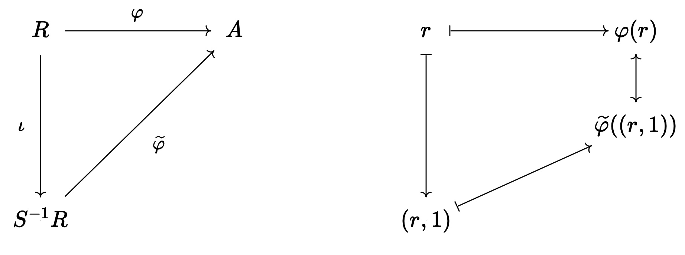

# Algebra 3 - Concise Notes
{: .no_toc }
## MATH60035
{: .no_toc}

  

    PDFs
  

  
- <a href="/notes/pdfs/year3/LecNotes/ALG3-Concise.pdf" target="_blank" style="color:#801fff;">**Open Algebra 3 Concise**</a> - <a href="/notes/pdfs/year3/LecNotes/ALG3-Concise.pdf" download>**Download**</a>
- <a href="/notes/pdfs/year3/LecNotes/ALG3-LecNotes.pdf" target="_blank" style="color:#801fff;">**Open Algebra 3 Lecture notes**</a> - <a href="/notes/pdfs/year3/LecNotes/ALG3-LecNotes.pdf" download>**Download**</a>

  

    Problem Sheets
  

  
  - <a href="/notes/pdfs/year3/probSheets/alg3/ALG3-PS1.pdf" target="_blank" style="color:#00ba47;">**Problem Sheet 1**</a> - <a href="/notes/pdfs/year3/probSheets/alg3/ALG3-PS1-Sol.pdf"  target="_blank">**Solutions**</a>
  
  - <a href="/notes/pdfs/year3/probSheets/alg3/ALG3-PS2.pdf" target="_blank" style="color:#00ba47;">**Problem Sheet 2**</a> - <a href="/notes/pdfs/year3/probSheets/alg3/ALG3-PS2-Sol.pdf"  target="_blank">**Solutions**</a>

  - <a href="/notes/pdfs/year3/probSheets/alg3/ALG3-PS3.pdf" target="_blank" style="color:#00ba47;">**Problem Sheet 3**</a> - <a href="/notes/pdfs/year3/probSheets/alg3/ALG3-PS3-Sol.pdf"  target="_blank">**Solutions**</a>
  
  - <a href="/notes/pdfs/year3/probSheets/alg3/ALG3-PS4.pdf" target="_blank" style="color:#00ba47;">**Problem Sheet 4**</a> - <a href="/notes/pdfs/year3/probSheets/alg3/ALG3-PS4-Sol.pdf"  target="_blank">**Solutions**</a>

  

    Table of contents
  

<!--   {: .text-delta } -->
* TOC
{:toc}

---

# Rings

## Basic Definitions and Examples

**Definition 1**. A *monoid* $(M, \cdot )$ a set $M$ and binary op
$\cdot  \colon M \times M \to M$, with $1_{M} \in M$ s.t

-   *$m \cdot  1_M = m = 1_M \cdot  m \forall  m \in M$*

-   *Operation $\cdot$ is associative,
    $x \cdot (y \cdot z) = (x \cdot  y) \cdot  z$*

**Definition 2**. *A *ring* a set
$(R, + : R \times R \to R, \cdot : R\times R \to R)$ with elements
$0_R,1_R \in R$ s.t*

-   *$(R,+)$ an abelian group with identity $0_R$*

-   *$(R,\cdot )$ a monoid with identity $1_R$*

-   *Distributivity: $a(b+c) = ab + ac, (b+c)a = ba + ca$*

**Note:* write additive inverse as $-r$*

**Definition 3**. *Say $R$ a ring *commutative* if
$a \cdot  b = b \cdot  a, \forall a,b \in R$*

**Definition 4**. *For $S \subset R$ , $R$ a ring. Say $S$ a *subring*
of $R$ if*

-   *$0_R, 1_R \in S$*

-   *$+, \cdot$ make $S$ into a ring with identities $0_R,1_{R}$*

*We write $S \leq  R$*

**Proposition 5**. *$R$ a ring, $1_R = 0_R \iff R = \{0\}$ the trivial
ring*

**Definition 6**. $u \in R$ a unit, if $\exists v \in R$ s.t
$u \cdot  v = v \cdot  u = 1_R$

$$R^{\times } \subseteq R, \text{ the set of units in } R$$ 

**Definition 7**. A *division ring* a non-trivial ring, s.t every
$u \neq  0_R \in R$ a unit. 

$$R^{\times } = R \backslash \{0\}$$

A **Field** a commutative division ring*

**Proposition 8**. *Subset $R^{\times } \subset R$ a group under
multiplication.*

## Constructions of rings

**Example 9**. $R,S$ rings $\implies R \times  S$ the product ring a
ring via
$$(r,s) + (r^\prime ,s^\prime ) = (r + r^\prime ,s + s^\prime ) \quad (r,s)\cdot (r^\prime ,s^\prime ) = (r\cdot r^\prime ,s \cdot s^\prime )$$

**Example 10**. $R$ a ring, the **polynomial ring** $R[X]$ a ring
$$R[X] = \{f = a_0 + a_1 X + \ldots  a_n X^n \mid a_i \in R \}$$ 

So for $f = \sum_{i=1}^{n} a_i X^i$, $g = \sum_{i=1}^{k} b_i X^i$, we have ring
ops 

$$f + g :=  \sum_{r=0}^{\mathop{\max} \{n,m\}} (a_{i} + b_{i}) X^i$$

$$f \cdot g :=  \sum_{i=0}^{n + k} 
        \left( \sum_{j=0}^{i} a_{j}b_{i-j}  \right) X^i$$
        
*Note:* call maximal $n$ s.t $a_n \neq  0_R$ the $deg(f)$\
For $f$ of degree $n \geq 0$, if $a_{n}=1$ say $f$ is monic.\
*Notation:* Write $R[X,Y]$ for $(R[X])[Y]$ polynomial ring in 2
variables, and in general
$R[X_1, \ldots  , X_n] = (\ldots ((R[X_1])[X_2]\ldots  )[X_n] )$

**Example 11**. **Laurent polynomials* on $R$ the set $R[X,X^{-1} ]$

$$R[X,X^{-1} ] = \left\{f = \sum_{i\in \mathbb{Z}} a_{i}X^i \mid \text{ only finitely many } a_i \neq 0 \right\}$$

Operations defined similarly to $R[X]$\
We have here the set of monomials $\{X^i: i \in \mathbb{Z}\}$ form a
group under multiplication.*

**Example 12**. *$G$ a group, $R$ a ring. Define the *Group Ring*
$R[G]$:

$$R[G] := \left\{\sum_{g\in G} a_{g}g \mid a_{g} \in R, |\{g\in G: a_{g}\neq 0\}| < \infty \right\}$$

With addition and multiplication as follows

$$\left( \sum_{g\in G} a_{g}g \right) 
        +
        \left( \sum_{g\in G} b_{g}g \right) 
        =
        \sum_{g\in G} (a_{g} +_{R} b_{g} )g$$

$$\left( \sum_{g\in G} a_{g}g   \right) \cdot 
        \left( \sum_{g\in G} b_{g} g  \right) 
        =
        \sum_{g\in G}
        \left( \sum_{h \in G} a_{h} \cdot_{R} b_{h^{-1}g}  \right)  g$$

We have that
$R[X,X^{-1} ] \cong R[C_\infty], C_\infty = (\mathbb{Z}, + )$\
If $R$ commutative ring, then $R[G]$ commutative $\iff G$ abelian.*

**Example 13**.

*$$M_{n}(R) = \text{ set of } n\times n \text{ matrices},\ R \text{ a ring}$$

A ring over the usual addition and multiplication*

**Example 14**. *Abelian group $A$

$$\mathop{End}(A) = \{f:A \to A\mid f \text{ a group homomorphism} \}$$

A ring with ops

$$(f +_{\mathop{End}(A)} g)(x) := f(x) +_{A} g(x) \quad (f \cdot_{\mathop{End}(A)} g)(x) := (f \circ g)(x)$$

Group of units of $\mathop{End}(A)$ is the *automorphism group* of $A$
denoted $\mathop{Aut}(A)$*

## Homomorphisms, ideals and quotients

**Definition 15**. *$R,S$ rings. $\varphi : R \to S$ a ring homomorphism
if*

1.  *$\varphi (r_1 + r_2) = \varphi (r_1) + \varphi (r_2)$*

2.  *$\varphi (0_R) = 0_S$*

3.  *$\varphi (r_1 \cdot  r_2) = \varphi (r_1) + \varphi  (r_2)$*

4.  *$\varphi (1_R) = 1_S$*

**Definition 16**. *An isomorphism, A bijective homomorphism $\varphi$*

**Definition 17**. Kernel of homomorphism $\varphi : R \to S$

$$\mathop{ker}(\varphi ) = \{r \in R: \varphi (r) = 0_S\}$$

**Definition 18**. Image of homomorphism $\varphi : R \to S$

$$\mathop{im}(\varphi ) = \{s \in S: s = \varphi (r), \text{ for some } r \in R \}$$

**Lemma 19**. *Homomorphism $\varphi : R \to S$ injective
$\iff \mathop{ker}\varphi = \{0_R\}$*

**Definition 20**. A ideal $I \subset R$ an abelian subgroup s.t

$$\forall i \in I, r \in R
        \begin{cases}
            ri \in I, &\text{ left ideal }  \\
            ir \in I, &\text{ right ideal }
        \end{cases}$$ 
        
This the strong closure property.\
A two-sided or bi-ideal both a left and right ideal.

**Lemma 21**. *$\varphi : R\to S$ a homomorphism, then
$\mathop{ker}(\varphi ) \subset R$ a two-sided ideal*

**Definition 22**. *Proper ideal, an ideal $I \neq R$\
For every proper ideal $I$, we have $1 \notin I$ $\implies$ not a
subring.\
Even more generally, proper ideals do not contain any unit.

$$\text{if } I \neq  R \implies I \subset R \backslash R^{\times }$$

**Definition 23**. *For element $a \in R$, write the ideal generated by
$a$ as, 

$$(a) = Ra = \{r \cdot  a \mid r \in R\} \subset R$$ 

The ideal generated by $a_1, \ldots  a_n$

$$\begin{pmatrix} a_1, \ldots ,a_n \end{pmatrix} = \{r_1 a_1 + \ldots  r_k a_k \mid r_i \in R\}$$

**Definition 24**. *$A \subset R$ define ideal generated by $A$ as

$$(A) = R \cdot A = \left\{ \\sum_{a \in A} r_{a} \cdot  a \mid r_{a}\in R, \text{ only finitely many non-zero}   \right\}$$

**Definition 25**. Say ideal $I$ principal if $I = (a)$ for some
$a \in R$

**Definition 26**. Let $I \subset R$ a two-sided ideal\
Quotient ring $R/I = \{r + I \mid  r \in R\}$ a ring with
$0_R + I, 1_R + I$

$$(r_1 + I) +  (r_2 + I) = (r_1 + r_2 ) + I,\quad (r_1 + I) \cdot (r_2 + I) = r_1 r_2 + I$$

**Proposition 27**. Quotient ring a ring, and function

$$\varphi \colon R \to R/I, r \mapsto r + I$$ 

a ring homomorphism.

**Proposition 28**. (Euclidean algorithm for polynomials)\
Let $F$ a field, and $f,g \in F[X] \implies \exists r,q \in F[X]$ s.t

$$f = gq + r$$ 

with $\mathop{deg } r < \mathop{deg } g$

 
**Theorem 29**. *(First isomorphism theorem)\
Let $\varphi :R \to S$ a ring homomorphism, $\mathop{ker}(\varphi) \subseteq R$ a 2-sided ideal and

$$\frac{R}{\mathop{ker}(\varphi )} \cong \mathop{im}(\varphi ) \leq S$$

 
**Theorem 30**. *(Second isomorphism theorem)\
$R \leq S$ be subrings, $J \subseteq S$ a 2-sided ideal. Then*

(i) *$R+ J = \{r + j: r\in R, j \in J\} \leq S$ a subring*

(ii) *$J \subseteq R + J$ and $J \cap R \subseteq R$ are both 2-sided
     ideal*

(iii) *$\frac{R+J}{J} = \{r + J: r\in R\} \leq \frac{S}{J} \leq \frac{S}{J}$
      a subring, and $\frac{R}{R \cap  J} \cong \frac{R+J}{J}$*

 
**Theorem 31**. *(Third isomorphism theorem)\
Let $R$ a ring, $I,J \subseteq R$ 2-sided ideals s.t $I \subseteq J$
Then $J/I \subseteq R/I$ a 2-sided ideal and*

$$\left( \frac{R}{I} \right) / 
        \left( \frac{J}{I} \right) \cong \frac{R}{J}$$

# Integral Domains

## Integral domains, maximal and prime ideals

**Definition 32**. *$R$ a commutative ring. Element $x \in R$ a *zero
divisor* if
$x \neq 0, \exists y \neq 0 \text{ s.t } x \cdot  y = 0 \in R$*

**Definition 33**. Integral domain (ID) a non-trivial commutative ring
without zero divisors

$$\text{a ring where if } ab = 0 \implies a = 0 \text{ or } b = 0$$

**Lemma 34**. *$R$ a finite ring, and integral domain $\implies R$ a
field.*

**Lemma 35**. *$R$ an integral domain. Then $R[X]$ an integral domain*

**Lemma 36**. *A non-trivial commutative ring $R$ a field $\iff$ its
only ideals are $\{0\}$ and $R$*

**Definition 37**. *An ideal $I$ of ring $R$ **maximal** if $I \neq R$
and for any ideal $J$ s.t $I \leq  J \leq  R$ either $J = I$ or $J = R$*

**Lemma 38**. *$R$ a commutative ring. $I \subseteq R$ maximal $\iff$
$R/I$ is a field*

**Definition 39**. *Ideal $I \subseteq R$ is prime if $I \neq  R$ and if
$a,b \in R$ s.t $a \cdot  b \in I \implies  a \in I$ or $b \in I$*

**Lemma 40**. *$R$ a commutative ring. $I \subseteq R$ ideal, prime
$\iff$ $R/I$ is an integral domain*

**Corollary 41**. *$R$ commutative ring. Then every maximal ideal is a
prime ideal.*

**Definition 42**. *$R$ a ring. $\iota : \mathbb{Z} \to R$ the unique
such map. The *characteristic* of $R$ the unique non-negative $n$ s.t
$\mathop{ker}(\iota ) = n \mathbb{Z}$*

**Lemma 43**. *$R$ an integral domain. $\mathop{char}(R) = 0$ or $p$ a
prime number.*

## Factorisation in Integral domains

**Definition 44**. *$R$ a ring. Say for $a,b \in R$ $a$ divides $b$,
$a \mid b$ if $\exists c \in R$ s.t $b = ac$. Equivalently
$(b) \subseteq (a)$*

**Definition 45**. *$R$ a ring, say $a,b \in R$ associates if $a = bc$
for some $c \in R^{\times }$ a unit. Equivalently $(a) = (b)$ or
$a \mid b$ and ${b \mid a}$*

**Definition 46**. *$R$ a ring. $a \in R$ irreducible if $a \neq  0$,
and $a \notin R^{\times }$ and if $a = xy \implies x \in R^{\times}$ or
$y \in R^{\times }$*

**Definition 47**. *$R$ a ring. $a \in R$ prime if $a \neq 0$ and
$a \notin R^{\times }$ and if $a | xy \implies a|x$ or $a |y$*

**Lemma 48**. *A principal ideal $(r)$ prime ideal in $R$ $\iff r = 0$
or $r$ prime*

**Lemma 49**. *If $r \in R$ prime, then $r$ irreducible*

**Definition 50**. *(Euclidean domain)\
An integral domain $R$ a Euclidean Domain (ED) if $\exists$ Euclidean
function $\phi : R\backslash \{0\} \to \mathbb{Z}_{\geq 0}$ s.t*

1.  *$\phi (a \cdot  b) \geq  \phi (b), \forall a,b \neq  0$*

2.  If $a,b \in R, b \neq  0 \implies \exists q,r \in R$ s.t

    $$a = b \cdot  q + r$$ 

    With either $r = 0$ or $\phi (r) < \phi (b)$*

**Definition 51**. *(Principal ideal domain)\
A ring $R$, an integral domain, is a principal ideal domain (PID) if
every ideal is a principal ideal.

$$\forall I \subseteq R \text{ an ideal } \implies \exists a \text{ s.t } I = (a)$$

**Proposition 52**. *Let $R$ a Euclidean domain. Then $R$ a principal
ideal domain*

**Definition 53**. *(Unique factorisation domain)\
An integral domain a unique factorisation domain (UFD) if*

1.  *Every non-unit written as product of irreducibles*

2.  *If $p_1 \ldots  p_n = q_1 \ldots  q_m$ with $p_i, q_j$
    irreducibles, then $n = m$ and they can be reordered s.t $p_i$ is an
    associate of $q_i$*

 
**Theorem 54**. *(PID $\implies$ UFD)\
If $R$ a principal ideal domain, then $R$ a unique factorisation
domain.*

**Lemma 55**. *$R$ a PID, then a principal ideal $(r)$ maximal $\iff$
$r$ irreducible or, if $R$ a field, $r = 0$*

**Proposition 56**. *$R$ a PID, if $r \in R$ irreducible then $r$
prime.*

**Corollary 57**. *$R$ a PID, Then every non-zero prime ideal is
maximal*

**Definition 58**. *(ACC - Ascending Chain Condition)\
A commutative ring satisfies the ACC, if

$$I_1 \subseteq I_2 \subseteq I_3 \subseteq \ldots  \text{ ,a chain of ideals}$$

Then $\exists N \in \mathbb{N}$ s.t $I_n = I_n + 1$ for some
$n \geq  N$*

**Definition 59**. *(Noetherian Ring)\
A commutative ring satisfying the ACC is Noetherian.*

**Proposition 60**. *$R$ a PID $\implies$ $R$ Noetherian*

**Definition 61**. *(Greatest Common Divisor, gcd)\
$R$ a ring, $d$ a (gcd) of $a_1,a_2, \ldots  , a_n$ if
$d | a_{i}, \forall  i$ and if any other $d^\prime$ satisfies
$d^\prime  | a_{i}, \forall i$ then $d^\prime | d$*

**Lemma 62**. *$R$ a UFD $\implies$ (gcd) exists and is unique up to
associates.\
i.e if $d, d^\prime$ are gcds of $a_1, a_2 , \ldots  a_n$ then
$d, d^\prime$ are associates.*

**The above lemmas and theorems yield the following chain of
implications**

$$\underbrace{(\mathbb{Z})}_{\text{isomorphic to } \mathbb{Z} } \implies \text{ED} \implies \text{PID} \implies \text{UFD} \implies \text{ID} \implies \text{Commutative Ring} \implies \text{Ring}$$

$$(\mathbb{Z}) \underbrace{\not\Leftarrow}_{\mathbb{Q}, \mathbb{Z}[i]} \text{ED} \underbrace{\not\Leftarrow}_{\mathbb{Z}[\frac{1 + \sqrt{-19} }{2}]} \text{PID} \underbrace{\not\Leftarrow}_{\mathbb{Z}[X]} \text{UFD} \underbrace{\not\Leftarrow}_{\mathbb{Z}[\sqrt{-5} ]} \text{ID} \underbrace{\not\Leftarrow}_{\mathbb{Z}/6\mathbb{Z}} \text{Commutative Ring} \underbrace{\not\Leftarrow}_{M_2(\mathbb{Z})} \text{Ring}$$

## Localisation

**Definition 63**. *$R$ an ID, $S \subseteq (R, \cdot )$ a
multiplicative submonoid. $0 \notin S$. **Localisation** is set of
equivalence classes

$$S^{-1} R = \left\{(r,s) \mid r \in R, s \in S, (r,s) \sim  (r^\prime ,s^\prime) \text{ if } rs^\prime = r^\prime s)\right\}$$

Pair $(r,s)$ denoted $\frac{r}{s}$ - this is a ring with ops.

$$(r,s) \cdot  (r^\prime , s^\prime ) :=  (r r^\prime ,s s^\prime),\quad (r,s) + (r^\prime ,s^\prime ) = (r s^\prime  + r^\prime s,s s^\prime )$$

**Definition 64**. *$R = \mathbb{Z}, S = R \backslash \{0\}$, Then the
rational numbers $\mathbb{Q}$ defined as $S^{-1} R$*

**Proposition 65**. *$R$ an ID, $S$ a multiplicative submonoid s.t
$0 \notin S$ Then the map $\iota :R \to S^{-1} R$ is injective*

**Definition 66**. *$R$ a commutative ring, $S \subseteq R$ a
submonoid.\
Localisation

$$S^{-1} R = \{(r,s) \mid r\in R, s\in S, (r,s) \sim (r^\prime ,s^\prime )  \text{ if } \exists t \in S, t(rs^\prime  - r^\prime s ) = 0\}$$

Note we have $t$ in this definition when we move away from $R$ being an
integral domain.*

**Definition 67**. *If $R$ an integral domain $S = R\backslash\{0\}$, we
have $S^{-1} R$ field. Define the field of fractions of $R$,
$\mathop{Frac}(R) := S^{-1} R$*

**Proposition 68**. *(Universal property of localisation)\
If $A$ a commutative ring, and $\varphi :R \to A$ a ring homomorphism,
s.t $\varphi (S) \subset A^{\times }$ then, $\varphi$ factors through
the homomorphism $\iota :R \to S^{-1} R$ i.e
$\exists ! \widetilde{\varphi} :S^{-1} R \to A$ s.t
$\varphi = \iota  \circ \widetilde{\varphi}$*

**Definition 69**. *$R$ a commutative ring, $S \subseteq R$ a
multiplicative submonoid.\
Localisation, $S^{-1} R$ the unique ring $R^\prime$ s.t
$\exists \iota R \to R'$ s.t*

1.  *$\iota (S) \subseteq (R^\prime )^{\times}$*

2.  *For all commutative rings $A$ and maps $\varphi :R \to A$ with
    $\varphi (S) \subseteq A^{\times }$,
    $\exists !\ \widetilde{\varphi} :R^\prime \to A$ s.t
    $\varphi = \widetilde{\varphi} \circ \iota$*

**Corollary 70**. *$R$ an ID, $F$ a field, $\varphi :R \to F$ an
injective ring homomorphism. Then $\varphi$ factors through the map from
$R$ to $\mathop{Frac}(R)$: $\varphi = \iota  \circ  \widetilde{\varphi}$
for $\iota :R \to \mathop{Frac}(R)$ with $\widetilde{\varphi}$
injective*

**Corollary 71**. *$F$ a field, $\mathop{charm}(F) = 0$. $F$ has
subfield isomorphic to $\mathbb{Q}$\
If $\mathop{char}(F) = p$ contains subfield isomorphic to
$\mathbb{F}_{p}$*

**Lemma 72**. *$F$ a field, $F \leq R$ a subring $\implies R$ a vector
space over $F$*

**Corollary 73**. *Every field a vector space over $\mathbb{F}_{p}$ or
$\mathbb{Q}$*

**Example 74**. *$R$ a commutative ring. $I \subset R$ a prime ideal,
$S = R \backslash I$ also a multiplicative submonoid.\
Denote $S^{-1} R$ as $R_{I}$*

**Proposition 75**. *$R$ a commutative ring, $I \subseteq R$ a prime
ideal. Then $R_{I}$ has a unique maximal ideal given by
$\overline{I} = \{(r,s) : r \in I, s\in R\backslash I\}$*

**Definition 76**. *A local ring a ring which has a unique maximal
ideal*

**Definition 77**. *Set
$S^{-1} I := \{\frac{i}{s}\mid s \in S, i \in I\}$ an ideal in
$S^{-1} R$ call this the image of $I$ under the localisation*

**Proposition 78**. *Every ideal $I \subseteq S^{-1}  R$ of form
$S^{-1}  J$ for some $J \subseteq R$ an ideal.*

# Polynomial Rings

## Factorisation in polynomial rings and Gauss' Lemma

**Definition 79**. *$R$ a UFD,
$f = a_0 + a_{1} X + \ldots a_n X^n   \in R[X]$. The content is

$$c(f) = gcd \begin{pmatrix} a_0, \ldots ,a_n \end{pmatrix} \in R$$

Equivalently define content as the ideal
$(gcd \begin{pmatrix} a_0, \ldots ,a_n \end{pmatrix})$*

**Definition 80**. *A polynomial is primitive if $c(f) \in R^{\times }$,
the $a_{i}$ are coprime\
Or as an ideal we have $c(f) = R[X]$*

**Lemma 81**. *$R$ a UFD, if $f\in R[X]$ then $f = c(f) \cdot  f_1$ for
some $f_1 \in R[X]$ primitive*

**Lemma 82**. *Let $R$ A UFD. If $f,g \in R[X]$ primitive then $fg$
primitive.*

**Corollary 83**. *Let $R$ a UFD. $f,g \in R[X]$ we have $c(fg)$ is an
associate of $c(f)c(g)$*

**Lemma 84**. *(Gauss' Lemma)\
Let $R$ a UFD and $f \in R[X]$ a primitive polynomial. Then $f$
irreducible in $R[X] \iff f$ irreducible $F[X]$ where
$F= \mathop{Frac}(R)$*

 
**Theorem 85**. *(Polynomial rings over UFDs)\
If $R$ a UFD, then $R[X]$a UFD.\
Further if $R$ a UFD then $R[X_1, \ldots  , X_n]$ a UFD*

**Proposition 86**. *(Eisenstein's Criterion)\
$R$ a UFD, We let $$f = a_0 + a_{1}X + \ldots  + a_{n}X^n \ \in R[X]$$
be primitive with $a_{n} \neq  0$. Let $p \in R$ irreducible s.t*

1.  *$p \nmid a_{n}$*

2.  *$p \mid a_{i}\ \forall 0 \leq  i \leq n$*

3.  *$p^{2} \nmid a_0$*

*Then $f$ irreducible in $R[X]$ and hence in $\mathop{Frac}(R)[X]$*

## Algebraic Integers

**Definition 87**. *$\alpha  \in \mathbb{C}$ an algebraic integer if
$$\exists \text{ monic } f \in \mathbb{Z}[X]  \text{ s.t } f(\alpha) = 0$$

**Definition 88**. *$\alpha$ algebraic integer, write
$\mathbb{Z}[\alpha]  \leq  \mathbb{C}$ for smallest subring containing
$\alpha$\
Construct $\mathbb{Z}[\alpha]$ by taking it as image of
$\phi : \mathbb{Z}[X] \to \mathbb{C}$ given by $g \mapsto g(\alpha )$
with $\phi$ inducing an isomorphism
$$\mathbb{Z}[X] / I \cong \mathbb{Z}[\alpha],\quad  I = \mathop{ker}\phi$$

**Proposition 89**. *$\alpha \in \mathbb{C}$ an algebraic integer and
let $\phi : \mathbb{Z}[X] \to \mathbb{C}$ the ring homomorphism given by
$f \mapsto f(\alpha )$ Then ideal $$I = \mathop{ker}(\phi )$$ is
principal with $I = (f_\alpha  )$ for some irreducible monic $f_\alpha$*

**Definition 90**. *Let $\alpha \in \mathbb{C}$ an algebraic integer.
Then minimal polynomial a polynomial $f_\alpha$ is the irreducible
monice s.t $I = \mathop{ker}(\phi) = (f_\alpha )$*

**Lemma 91**. *Let $\alpha \in \mathbb{Q}$ be an algebraic integer. Then
$\alpha  \in \mathbb{Z}$*

## Noetherian rings and Hilbert's basis theorem

**Definition 92**. *A commutative ring Noetherian if it satisfies the
ACC (*see Def. 2.46*)*

**Definition 93**. *Ideal $I$ finitely generated if can be written as
$I= \begin{pmatrix} r_1, \ldots ,r_n \end{pmatrix}$ for some
$r_1, \ldots   ,r_n \in R$*

**Proposition 94**. *A commutative ring is Noetherian $\iff$ every ideal
is finitely generated.\
*Note: PID trivially satisfy this.**

**Proposition 95**. *$R$ Noetherian, and $I \subseteq R$ an ideal
$\implies R / I$ Noetherian.*

 
**Theorem 96**. *(Hilbert's basis theorem)\
$R$ a Noetherian ring, $\implies R[X]$ also Noetherian.*

# Modules

## Basic definitions and examples

**Definition 97**. *$R$ a ring. A left R-module
$(\underbrace{M}_{\text{set} }, \underbrace{+: M \times M \to M}_{addition}, \underbrace{\cdot : R \times M \to M}_{mult})$
with $0_{M} \in M$ s.t*

-   *$(M,+)$ an abelian group with identity $0_{M}$*

*And we have $\cdot$ satisfying the following*

(i) *$(r_1 + r_2) \cdot  m = (r_1 \cdot  m) + (r_2 \cdot  m)$*

(ii) *$r \cdot (m_1 + m_2) = (r \cdot  m_1) + (r \cdot  m_2)$*

(iii) *$r_1 \cdot  (r_2 \cdot  m) = (r_1 \cdot  r_2) \cdot  m$*

(iv) *$1_{R}\cdot m = m$*

Right-module is the same but we have now $(\cdot : M \times R \to M)$
with (iii) now as $(m \cdot  r_1) \cdot  r_2 = m \cdot (r_1 \cdot  r_2)$

**Definition 98**. *$R$ a ring.\
$R$-module an abelian group M, equipped with ring homomorphism*

*$$\varphi : R \longrightarrow \underbrace{\mathop{End}(M)}_{\{f:M \to M \mid f \text{ a group hom.} \}}$$

Such that 

$$\begin{aligned}
          \cdot \colon R\times M & \longrightarrow M      \\
          (r,m)          & \longmapsto \varphi(r)(m)
\end{aligned}$$

## Constructions of modules

**Definition 99**. *Let $M_1, M_2, \ldots  , M_k$ be $R$- modules. Direct
sum is also an $R$-module 

$$M_1 \oplus M_2 \oplus \ldots \oplus M_{k}$$

Which is the set $M_1 \times \ldots  \times M_{k}$ with addition given
by

$$\begin{pmatrix} m_1, \ldots ,m_k \end{pmatrix} + \begin{pmatrix} m^\prime_1, \ldots ,m^\prime_k \end{pmatrix} = \begin{pmatrix} m_1 + m'_1, \ldots ,m_k + m'_k \end{pmatrix}$$

And $R$-action given by

$$r \cdot \begin{pmatrix} m_1, \ldots ,m_k \end{pmatrix} = \begin{pmatrix} rm_1, \ldots ,rm_k \end{pmatrix}$$

**Definition 100**. *Let $M$ an $R$-module. A subset $N \subseteq M$ an
$R$-submodule if it is a subgroup of $(M, + , 0_{M})$ and if
$n \in N, r\in R \implies rn \in N$. Write $N \leq  M$*

**Definition 101**. *Let $N  \leq M$ be an $R$-submodule. The quotient
module $M / N$ the set of $N-$cosets in $(M, + , 0_{M}$ with $R$-action
given by $$r \cdot (m + N) = (r \cdot  m) + N$$

**Definition 102**. *Function $f: M \to N$ between $R$- modules an
$R$- module homomorphism if it is a homomorphism of abelian groups and
satisfies

$$f(r \cdot  m) = r \cdot  f(m), \quad \forall r \in R, m \in M$$

An isomorphism, is a bijective homomorphism.\
Say 2 $R$- modules are isomorphic if there exists isomorphism between
them.*

**Definition 103**. *If $R_1, R_2$ rings, $M_1$ an $R_1$-module and
$M_2$ an $R_2$-module, then $(M_1 \times  M_2)$ is a
$(R_1 \times  R_2)$-module with action

$$(r_1,r_2) \cdot  (m_1,m_2) := (r_1m_2, r_2 m_2)$$

**Definition 104**. *$R$ a commutative ring, $S \subseteq R$ a
multiplicative submonoid, $M$ an $R$-module.\
**Localisation** of $M$ by $S$,

$$S^{-1} M = \{(m,s) \mid m \in M, s\in S , (m,s) \sim (m^\prime ,s^\prime ) \text{ if } \exists t \in S \text{ s.t } t(ms^\prime - m^\prime  s) = 0  \}$$

This an $S^{-1} R$-module, with natural structure of abelian group, and
$S^{-1} R$ action given by

$$(r,t) \cdot  (m,s) := (rm,ts)\ (r,t) \in S^{-1} R  , (m,s) \in S^{-1} M$$

Given ideal $I \subseteq R$ localisation $S^{-1} I \subset S^{-1} R$ as
an ideal is isomorphism as an $S^{-1} R$-module to the localisation of
$I$ as a module.*

## Basic theory of modules

THEOREM NUMBERS AND DEFS TO BE AMENDED

**Theorem 105**. *(1st isomorphism theorem)\
Let $f: M \to N$ an $R$-module homomorphism, Then we have*

-   *$\mathop{ker}(f) = \{m \in M: f(m) = 0\} \leq M$ (is an
    R-submodule)*

-   *$\mathop{im}(f) = \{f(m): m \in M\} \leq N$ (is an R-submodule)*

*Then $M / \mathop{ker}(f) \cong \mathop{im}(f)$*

**Definition 106**. *Let $f: M \to N$ a map of $R$-modules. We define
the cokernel of $f$ as 

$$\mathop{coker}(f) = N / \mathop{im}(f)$$*

**Remark 107**. *For submodules, $A_1, \ldots  , A_{n}$

$$A_1 + \ldots   + A_{n} = \{a_1 + \cdots + a_{n}: a_{i} \in A_{i}\} \leq  M \ \text{(an }R\text{-submodule)}$$

**Theorem 108**. *(2nd isomorphism theorem)\
Let $M$ an $R$-module, let $A,B \leq M$ then*

-   *$A+ B := \{a+b: a\in A, b\in B\}$*

-   *$A \cap  B \leq M$*

*Then 

$$\frac{A+B}{A} \cong \frac{B}{A \cap B}$$*

**Theorem 109**. *(3rd isomorphism theorem)\
Let $M$ an $R$-module, and $N \leq  L \leq  M$, Then:*

-   *$L / N \leq M / N$*

-   *$M / L \cong \frac{M / N}{L / N}$*

**Definition 110**. *$M$ an $R$-module, $m \in M$, submodule generated
by $m$ is 

$$Rm:= \{r \cdot  m : r \in R\} \leq  M$$*

**Definition 111**. *$M$ an $R$-module, $m \in M$, the annihilator of
$m$ is 

$$\mathop{Ann}(m) := \{r\in R: r \cdot  m = 0\}$$

Since $\mathop{Ann}(m) = \mathop{ker}(\varphi )$ for the homomorphism

$$\varphi \colon R \to M, r \mapsto r \cdot  m$$

by 1st isomorphism theorem, we have $\mathop{Ann}(m) \leq  R, Rm \cong R / \mathop{Ann}(m)$*

 example
**Example 112**. *$R$ a PID, let $I \subseteq R$ an ideal. Then

$$I \cong R$$

as $R$-modules.*

**Definition 113**. $R$-module, $M$ is finitely generated if
$\exists m_1, \ldots  , m_{n}$ s.t 

$$\begin{aligned}
        M &= Rm_1 + Rm_2 + \ldots  + Rm_{n}\\
        &= \{r_{1}m_1 + \ldots  + r_n m_n: r_1, \ldots , r_{n} \in R   \}
    \end{aligned}$$

**Lemma 114**. *$M$ an $R$-module, then $M$ is finitely generated $\iff$
$\exists$ surjective $R$-module homomorphism $f: R^n \to M$ for some
$n$*

**Corollary 115**. *Let $N \leq  M$ be $R$-modules, if $M$ finitely
generated, then $M / N$ is finitely generated.*

## Free and projective modules

**Definition 116**. *Given set $S$ define the free module over $S$ to be
$R$-module

$$R^{(S)} = \bigoplus_{i \in S} R = \{(x_{i})_{i \in S} \in \prod\limits_{s\in S} R : x_{i} = 0 \text{ for all but finitely many } i  \}$$

with coordinate wise addition and $R$-action.\
An $R$-module $M$ is free if $M \cong R^{(S)}$ for some $S$*

**Proposition 117**. *The free module $R^{(S)}$ is finitely generated
$\iff S$ finite*

**Proposition 118**. *$F$ a field.If $M$ an $F-$module, then $M$ a free
$F-$module*

**Definition 119**. *$S \subseteq M$ generates $M$ freely if*

1.  *$S$ generates $M$ as an $R$-module, i.e. $R \cdot  S = M$*

2.  *Any set function $\psi : S \to N$, $N$ a $R$-module, extends to an
    $R$-module map $\theta :M \to N$*

**Definition 120**. *$R$-module $M$ is free, if it is freely generated
by some subset $S \subseteq M$. A set $S$ with this property called a
basis for $M$*

**Proposition 121**. *The two definitions of free module are equivalent*

**Lemma 122**. *Suppose $M, N$ are $R$-modules, s.t $M$ freely generated
by $S \subseteq M$ and $N$ freely generated by $T \subseteq N$.\
If $\exists$ bijection, $S \cong T$ then $M \cong N$ as $R$-modules*

**Definition 123**. Let
$m1, \ldots ,m_{n} \in M \implies \{m_1, \ldots ,m_{n} \}$ is linearly
independent if 

$$\sum_{i=1}^{n} r_{i}m_{i}=0$$

$\implies r_1 = r_2 = \ldots = r_{n} = 0$

**Proposition 124**. *For a subset
$S = \{m1, \ldots ,m_{n} \}\subseteq M$, following are equivalent;*

(i) *$S$ generates $M$ freely, equivalent to $M \cong R^n$*

(ii) *$S$ generates $M$ and $S$ is linearly independent*

(iii) *Every element of $M$ is uniquely expressible as

$$r_1 m_1 + r_2 m_2 + \ldots r_{n}m_{n}$$

for some $r_{i}\in R$*

**Definition 125**. *$M$ a finitely generated $R$-module. We have show
that $\exists \varphi : R^n \to M$ a surjective $R$-module homomorphism,
for some $n$.\
Call the $R$-submodule $ker(\varphi ) \leq  R^n$ the *relation module*
for those generators*

**Definition 126**. *A finitely generated $R$-module $M$ is *finitely
presented* if there exists a surjective homomorphism $f: R^n \to M$ such
that $ker(f)$ a finitely generated $R$-module*

**Proposition 127**. *Let $\varphi :R^m \to R^n$ an $R$-module
homomorphism\
Let $e_1, \ldots , e_{m} \in R^m$ and $v_1, \ldots ,v_{n}\in R^n$ the
standard basis elements\
Let $\varphi (e_{j}) = \sum_{i=1}^{n} A_{ij} e_{i}$ for some
$A_{ij} \in R$ and let $A = (A_{ij} ) \in M_{m\times n}(R)$ the
corresponding $n \times m$ matrix\
Then $\varphi (r) = A \cdot  r$*

**Definition 128**. *Say a ring $R$ has the invariant basis number
property (IBN) if $R^n \cong R^m$ are isomorphic as $R$-modules
$\iff n = m$*

**Proposition 129**. *Non-trivial commutative rings have the invariant
basis number property*

**Definition 130**. *An $R$-module $M$ is *stably free* if there exists
$n$ such that $M \oplus R^n$ is a free module\
An $R$-module $M$ is projective if there exists an $R$-module $N$ such
that $M \oplus N$ is a free $R$-module*

## Noetherian modules

**Theorem 131**. *An $R$-module $M$ is Noetherian $\iff$ every
$R$-submodule of $M$ is finitely generated.*

**Corollary 132**. *R a PID $\implies$ R is Noetherian*

**Theorem 133**. *Any finitely generated module over a Noetherian ring
is Noetherian*

**Proposition 134**. *$M$ a Noetherian $R$-module, then $\forall$
submodules $N \leq  M$, both $N$ and $M / N$ are Noetherian*

**Proposition 135**. *Let $M$ an $R$-module, let $N$ a Noetherian
submodule of $M$, and suppose that $M / N$ is Noetherian. Then $M$is
Noetherian*

**Corollary 136**. *If $M,N$ are Noetherian $R$-modules, then so is
$M \oplus N$*

**Corollary 137**. *If $R$ is Noetherian, then any free $R$-module of
finite rank is Noetherian*

**Corollary 138**. *Let $R$ a Noetherian ring. Then every finitely
generated $R$-module is finitely presented*

## Modules over principal ideal domains

**Theorem 139**. *(Classification of finitely generated modules over a
PID)\
Let $R$ a PID. If $M$ finitely generated $R$-module, then
$\exists n,r \geq  0$ and elements $d_1, \ldots ,d_{r}\in R$ such that

$$M \cong R^n \oplus R / (d_1) \oplus \ldots \oplus R / (d_{r})$$

We can assume that $d_1 \mid d_2 \mid  \ldots \mid d_{r}$\
Can be shown that is we choose the $d_{i}$ to satisfy these conditions,
then the $n$ and $d_{i}$ are unique.

