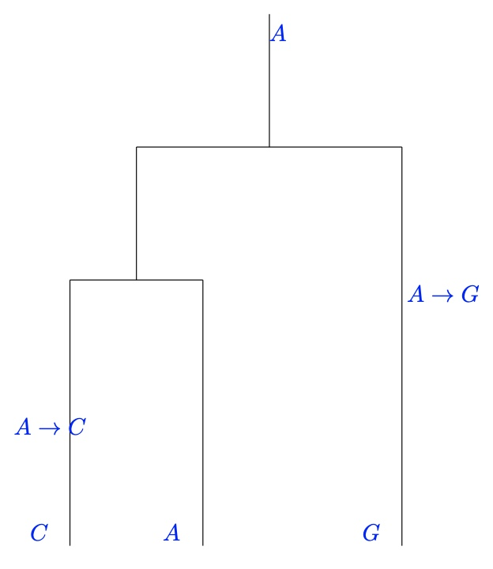

# Applied Probability - Concise Notes
{: .no_toc }
## MATH60045
{: .no_toc}

  

    PDFs
  

  
- <a href="/notes/pdfs/year3/LecNotes/AP-Concise.pdf" target="_blank" style="color:#801fff;">**Open Applied Probability Concise**</a> - <a href="/notes/pdfs/year3/LecNotes/AP-Concise.pdf" download>**Download**</a>
- <a href="/notes/pdfs/year3/LecNotes/AP-LecNote.pdf" target="_blank" style="color:#801fff;">**Open Applied Probability Lecture Notes**</a> - <a href="/notes/pdfs/year3/LecNotes/AP-LecNotes.pdf" download>**Download**</a>

  

    Problem Sheets
  

  
  - <a href="/notes/pdfs/year3/probSheets/ap/AP-PS.pdf" target="_blank" style="color:#00ba47;">**All 5 Problem Sheets**</a>

  - <a href="/notes/pdfs/year3/probSheets/ap/AP-PS1-Sol.pdf"  target="_blank">**PS1 - Solutions**</a>

  - <a href="/notes/pdfs/year3/probSheets/ap/AP-PS2-Sol.pdf"  target="_blank">**PS2 - Solutions**</a>

  - <a href="/notes/pdfs/year3/probSheets/ap/AP-PS3-Sol.pdf"  target="_blank">**PS3 - Solutions**</a>

  - <a href="/notes/pdfs/year3/probSheets/ap/AP-PS4-Sol.pdf"  target="_blank">**PS4 - Solutions**</a>

  - <a href="/notes/pdfs/year3/probSheets/ap/AP-PS5-Sol.pdf"  target="_blank">**PS5 - Solutions**</a>

  

    Table of contents
  

<!--   {: .text-delta } -->
* TOC
{:toc}

---

# Discrete-time Markov Chains

## Definition of discrete time Markov Chains

**Definition 1**. A discrete-time stochastic process
$X = \{X_n\}_{n \in \mathbb{N}_{0} }$ taking values in countable state
space $E$ a Markov chain if it satisfies the Markov condition

$$P(X_{n} = j \mid  X_{n-1} = i, X_{n-2} = x_{n-2} , \ldots  , X_{0} = x_0) = P(X_{n} = j \mid  X_{n-1} = i), \forall n \in \mathbb{N}\
        \forall x_0, \ldots , x_{n-2}, i ,j \in E$$

**Definition 2**. *(Time Homogenous)*

1.  *Markov Chain $\{X_{n}\}_{n \in \mathbb{N}_{0}}$ is time-homogenous
    if*
    
    $$P(X_{n+1} = j \mid  X_{n} = i ) = P(X_1 = j \mid  X_0 = i),\ \forall n \in \mathbb{N}_0, i,j \in E$$

2.  *Transition matrix $P = (p_{ij} )_{i,j\in E}$ is the $K \times  K$
    matrix of transition probabilities*

**Definition 3**. *(Stochastic Matrix)\
A square matrix $P$ a stochastic matrix if*

1.  $p_{ij} \geq  0, \forall  i,j$

2.  $\sum_{j} p_{ij} =1\ \forall  i$

**Theorem 4**. *Transition matrix $P$ is stochastic*

## The $n$-step transition probabilities and Chapman-Kolmogorov equations

**Definition 5**. $n \in \mathbb{N}$, we have*

$$P_{n} = (p_{ij} (n)) = P(X_{m+n} = j, X_{m}=i),\ m \in \mathbb{N}_0$$

The matrix of $n$-step transition probabilities.

**Lemma 6**. *For discrete markov chain $\{X_{n}\}_{n \geq 0}$ on state
space $E$ we have*

$$P(X_{n+m} = x_{n+m} \mid  X_{n} = x_{n}, \ldots , X_0 = x_0 ) = P(X_{n+m} = x_{n+m} \mid X_{n} = x_{n}),\ m \in \mathbb{N}, \forall x_{n+m}, x_{n}, \ldots , x_0 \in E$$

**Theorem 7**. Let $m\in \mathbb{N}_0, n \in \mathbb{N}$ Then we have
$\forall i,j \in E$

$$p_{ij } (m+n) = \sum_{l\in E} p_{il}(m) p_{lj} (n) \quad P_{m+n}  = P_{m}P_{n} \quad P_{n} = P^n$$

**Remark 8**. Extend definition for case $K = \infty$\
Let $\mathbf{x}$ a $K$-dimensional row vector, $P$ a $K \times  K$
matrix

$$(\mathbf{x} P)_{j} := \sum_{i\in E} x_{i} p_{ij}, \quad (P^{2})_{ik} := \sum_{j\in E} p_{ij} p_{jk}, \ i,j,k \in \mathbb{N}$$

Define $P^n$ similarly and take $(P^0)_{ij} = \delta_{ij}$

## Dynamics of a Markov Chain

**Definition 9**. Denote probability mass function of $X_{n}$ for
$n \in \mathbb{N}_0$ by 

$$\nu_{i}^{(n)} = P(X_{n} = i),\ i \in E$$ 

Take
$K = \mathop{card}(E)$, denote by $\mathbf{\nu}^{(n)}$ the
$K$-dimensional row vector with elements $\nu_{i}^{n}, i \in E$\
Call this the **marginal distribution** of chain at time
$n \in \mathbb{N}_0$

**Theorem 10**. We have

$$\mathbf{\nu}^{(m+n)} = \mathbf{\nu}^{(m)}P_{n}= \mathbf{\nu}^{(m)}P^{n},\ \forall n \in \mathbb{N}, m \in \mathbb{N}_0$$

So

$$\mathbf{\nu}^{(n)} = \nu^{(0)} P_{n} = \mathbf{\nu}^{(0)} P^{n},\ \forall n \in \mathbb{N}$$

**Theorem 11**. Let $X = \{X_{n}\}_{n \in \mathbb{N}_{0}}$ a Markov
chain on countable state space $E$

Then given initial distribution $\mathbf{\nu}^{(0)}$ and transition
matrix $P$, we determine all finite dimensional distributions of Markov
chain.

$\forall 0 \leq n_1 < n_2 < \cdots < n_{k-1} < n_{k} \ (n_{i} \in \mathbb{N}_0, i = 1, \ldots ,k  ), k \in \mathbb{N}, x_1, \ldots ,x_k \in E$

We have 

$$\begin{aligned}
        P(X_{n_1} = x_1, X_{n_2} = x_2, \ldots , X_{n_{k}} = x_{k}) &= 
        (\mathbf{\nu}^{(0)}P^{n_1})_{x_1} (P^{n_2 - n_1})_{x_1 x_2} \cdots (P^{n_{k} - n_{k-1}})x_{k-1} x_{k}\\
        &= (\mathbf{\nu}P^{n_1})x_1 p_{x_1 x_2}(n_2 - n_1) \cdots p_{x_{k-1} x_{k}}(n_{k}-n_{k-1} )
    \end{aligned}$$

## First passage/hitting times

**Definition 12**. Define **first passage/hitting time** of $X$ for
state $j \in E$ as 

$$T_{j} = \mathop{\min} \{n \in N: X_{n}=j\}$$

If $X_{n} \neq  j, \forall n \in \mathbb{N}$ then set $T_{j} = \infty$

**Definition 13**. *For $i,j \in E, n \in \mathbb{N}$ define **first
passage probability**

$$f_{ij} (n) = P(T_{j} = n \mid  X_0 = i) = P(X_{n} = j, X_{n-1} \neq  j, \ldots  , X_1 \neq  j \mid X_0 = i)$$

Probability that we visit state $j$ at time $n$, given we start at $i$
at time $0$

Define $f_{ij} (0) = 0, f_{ij} (1) = p_{ij} , \forall i,j \in E$

**Definition 14**. Define 

$$f_{ij} = P(T_{j} < \infty \mid  X_0 = i)$$

For $i \neq  j$, we have $f_{ij}$ the probability that the chain ever
visits state $j$, starting at $i$

Call $f_{ii}$ the **returning probability***

**Proposition 15**. $\forall  i,j \in E$

$$f_{ij} = \sum_{n=1}^{\infty} f_{ij} (n)$$

**Lemma 16**. $\forall i,j \in E, n \in \mathbb{N}$, we have

$$\begin{aligned}
        p_{ij} (n) &= \sum_{l=0}^{n} f_{ij} (l) p_{jj}(n-l)\\
                   &= \sum_{l=1}^{n} f_{ij} (l) p_{jj}(n-l)
    \end{aligned}$$

## Recurrence and transience

**Definition 17**. Let $\{X_{n}\}_{n \in \mathbb{N}_{0}}$ be a markov
chain on countable state space $E$.

$$j \in E,\ P(X_{n}=j,\text{for some } n \in \mathbb{N}\mid X_0 = j ) = f_{jj}
    \begin{cases}
            1, &\text{ recurrent}  ;\\
            <1, &\text{ transient }  .
    \end{cases}$$

**Theorem 18**. $j \in E$ 

$$\sum_{n=1}^{\infty} p_{ij} (n) =
            \begin{cases}
                \infty , & \iff  \text{ recurrent }  ;\\
                < \infty , & \iff  \text{ transient }  .
            \end{cases}$$

**Define**

$$N_{j} = \sum_{n=0}^{\infty } I_{n}^{(j)}, \quad I_{n}^{(j)} = I_{X_n = j} = \begin{cases}
        1, &\text{ if } X_{n} = j ;\\
        0, &\text{ if } X_{n}\neq j .
    \end{cases}$$

**Theorem 19**. $j \in E$ transient*

1.  $P(N_{j} = n \mid  X_0 = j) = f_{jj}^{n-1} (1 - f_{jj})$ for
    $n \in \mathbb{N}$ *geometric distribution with param $f_{jj}$*

2.  $i \neq  j$

 $$P(N_{j} = n \mid X_0 = i) =
                \begin{cases}
                    1 - f_{ij} , &\text{ if } n=0 ;\\
                    f_{ij} f_{jj}^{n-1}(1-f_{jj}), &\text{ if } n \in \mathbb{N} .
                \end{cases}$$

 
**Corollary 20**. $j \in E$ transient

1.  $$E(N_{j}\mid X_0 = j) = \frac{1}{1-f_{jj}}$$

2.  $i \neq  j$ we have

    $$E(N_{j} \mid X_0 = i) = \frac{f_{ij}}{1 - f_{jj}}$$

**Theorem 21**. *Given $X_0 = j$, we have

$$E(N_{j} \mid X_0 = j) = \sum_{n=0}^{\infty} p_{jj}(n)$$

Sum may diverge to $\infty$

 
**Corollary 22**. $j \in E$ transient then
$p_{ij} (n) \xrightarrow[n\to \infty]{} 0, \forall  i \in E$

### Mean recurrence time, null and positive recurrence

**Definition 23**. The **mean recurrence time** $\mu_{i}$ of state
$i \in E$ defined as $\mu_{i} = E[T_{i} \mid  X_0 = i]$

**Theorem 24**. *Let $i \in E$. We have
$P(T_{i} = \infty  \mid  X_0 = i) > 0$ $\iff i$ transient, where we get

$$\mu_{i} = E[T_{i} \mid X_0 = i = \infty ]$$

**Theorem 25**. *For recurrent state $i \in E$ we have

$$\mu_{i}= E[T_{i}\mid X_0 = i] = \sum_{n=1}^{\infty} n f_{ii}(n)$$

Can be finite or infinite.

**Definition 26**. *A recurrent state $i \in E$ 

$$\mu_{i} = 
        \begin{cases}
            \infty , &\text{ called } \textbf{null} ;\\
            < \infty , &\text{ called } \textbf{positive}  .
        \end{cases}$$

**Theorem 27**. *Recurrent state $i \in E$ null $\iff$
$p_{ii}(n) \xrightarrow[n\to \infty ]{} 0$\
Further, if this holds, then
$p_{ji} (n) \xrightarrow[n\to \infty ]{} 0 , \forall j \in E$

### Generating functions for $p_{ij} (n), f_{ij} (n)$ (READING MATERIAL)

### Example: Null recurrence/transience of a simple random walk (READING MATERIAL)

$$SEE\ FULL\ OFFICIAL\ NOTES$$

## Aperiodicity and ergodicity

**Definition 28**. Period of state $i$ defined by

$$d(i) = gcd\{n : p_{ii}(n) > 0\}$$

**Definition 29**. *A state ergodic if it is positive recurrent and
aperiodic*

## Communicating classes

**Definition 30**. *(Accessible and Communicating)*

1.  $j$ accessible from $i$, $i \to j$, if $\exists m \in \mathbb{N}_0$
    s.t $p_{ij} (m) >0$

2.  $i, j$ communicate, if $i \to j$ and $j \to i$; write
    $i \leftrightarrow j$

**Theorem 31**. *(Communication an equivalence relation)\
Satisfies, reflexivity, symmetry and transitivity*

**Theorem 32**. *If $i \leftrightarrow j$ then*

1.  $i,j$ have same period

2.  $i$ transient/recurrent $\iff$ $j$ transient/recurrent

3.  $i$ null recurrent $\iff$ $j$ null recurrent

**Definition 33**. *Set of states $C$ is*

1.  ***closed** if $\forall i \in C, j \notin C, p_{ij} - 0$

2.  ***irreducible** if $i \leftrightarrow j, \forall  i,j \in C$

**Theorem 34**. *Let $C$ a closed communicating class, transition matrix
$P$ restricted to $C$ is stochastic*

### The decomposition theorem

**Theorem 35**. $C$ a communicating class, consisting of recurrent
states. Then $C$ is closed*

**Theorem 36**. *State-space $E$ can be partitioned uniquely into

$$E = \underbrace{T}_{\text{transient states} } \cup \left( \bigcup\limits_{i} \underbrace{C_{i}}_{\substack{\text{irreducible, closed}\\ \text{set of recurrent states}} }  \right)$$

**Theorem 37**. $K < \infty$ Then at least one state is recurrent and
all recurrent states are positive.

**Theorem 38**. $C$ a finite, closed communicating class $\implies$ all
states in $C$ positive recurrent

### Class properties

| Type of Class | Finite             | Infinite                                      |
|---------------|--------------------|-----------------------------------------------|
| Closed        | positive recurrent | positive recurrent, null recurrent, transient |
| Not Closed    | transient          | transient                                     |

## Application: The gambler's ruin problem

### The problem and the results

Consider a gambler with initial fortune $i \in \{0,1, \ldots  , N\}$. At
each play of the game, the gambler has

-   probability $p$ of winning one unit

-   probability $q$ of losing one unit

-   each successive game is independent

**What is the probability, a gambler starting at $i$ units, has their
fortune reach $N$ before $0$ ?**

Let $X_{n}$ denote gamblers fortune at time $n$. Then $\{X_{n}\}_{n \in \mathbb{N}_{0}}$ is a Markov Chain with transition probabilities, shown in diagram above.

This yields 3 communicating classes.

$$\underbrace{C_1 = \{0\}, C_2 = \{N\}}_{\substack{\text{positive recurrent}\\ \text{since finite and closed} } }, T_1 = \{1,2, \ldots  , N-1\}$$

**Define the following for our problem:**\
Define first time $X$ visits state $i$ as

$$V_{i} = \mathop{\min} \{n \in \mathbb{N}_0 : X_{n} = i\}$$

$$h_{i} = h_{i}(N) = P(V_{N}< V_0 \mid  X_0 = i)$$

This yields the following recurrence relation

$$h_{i} = h_{i+1} p + h_{i-1} q,\ i = 1,2, \ldots  , N-1$$

**Theorem 39**. From above we achieve 

$$h_{i}= h_{i}(N) =
        \begin{cases}
            \frac{1-(q /p)^i}{1 - (q /p)^N}, &\text{ if } p \neq  \frac{1}{2} ;\\
            \frac{i}{N}, &\text{ if } p = \frac{1}{2} .
        \end{cases}$$

**Theorem 40**. *We also have

$$\lim\limits_{N \to \infty} h_{i}(N) = h_{i}(\infty ) = 
        \begin{cases}
            1 - (q /p)^i, &\text{ if } p > \frac{1}{2} ;\\
            0, &\text{ if } p \leq  \frac{1}{2} .
        \end{cases}$$

-   $p > \frac{1}{2} \implies \frac{q}{p} < 1 \implies \lim\limits_{N \to \infty} (\frac{q}{p})^N = 0$

-   $p < \frac{1}{2} \implies \frac{q}{p} > 1 \implies \lim\limits_{N \to \infty}  = \infty$

## Stationarity

**Definition 41**. *(Distributions)*

1.  row vector $\mathbf{\lambda}$ a **distribution** on $E$ if

    $$\forall j \in E, \lambda_{j} \geq  0,\ \text{ and } \sum_{j\in E} = 1$$

2.  row vector $\mathbf{\lambda}$ with non-negative entries is called
    **invariant** for transition matrix $P$ if $$\lambda P = \lambda$$

3.  row vector $\mathbf{\pi}$ is **invariant/stationary/equilibrium
    distribution** of Markov chain on $E$ with transition matrix $P$ if

    1.  $\mathbf{\pi}$ a distribution

    2.  *it is invariant*

    $$\pi P^n = \pi$$

### Stationarity distribution for irreducible Markov Chains

**Theorem 42**. *An irreducible chain has stationary distribution $\pi$
$\iff$ all states are positive recurrent.\
$\pi$ unique stationary distribution, s.t
$\pi_i = \mu_{i}^{-1} \forall  i$

**Lemma 43**. *For markov chain $X$ we have
$\forall j \in E, n, m \in \mathbb{N}$

$$f_{jj}(m+n) = \sum_{i\in E, i \neq j} l_{ji} (m) f_{ij} (n)$$

For $l_{ji} (n) = P(X_{n} = i. T_{j} \geq  n \mid X_0 = j)$

 
**Corollary 44**. *For Markov Chain $X$ we have
$\forall i,j \in E, i \neq  j$ and $\forall n,m \in \mathbb{N}$

$$f_{jj}(m+n) \geq l_{ji} (m) f_{ij}  (n)$$

**Lemma 45**. *Let $i \neq  j$ Then $l_{ji} (1) = p_{ji}$, and for
integers $n \geq 2$

$$l_{ji} (n) = \sum_{r\in E: r \neq j} p_{ri} l_{jr} (n-1)$$

**Lemma 46**. $\forall j \in E$ of an irreducible, recurrent chain, the
vector $\mathbf{\rho}(j)$ satisfies $\rho_{i}(j) < \infty\ \forall  i$
and further $\mathbf{\rho} (j) = \mathbf{\rho} (j)P$

**Lemma 47**. *Every irreducible, positive, recurrent chain has a
stationary distribution*

**Theorem 48**. If the chain is irreducible and recurrent, then
$\exists \mathbf{x} > 0$ s.t $\mathbf{x}  = \mathbf{x} \mathbf{P}$
unique up to multiplicative constant. 

$$\text{Chain is } 
        \begin{cases}
            \text{positive recurrent}, &\text{ if } \sum_{i}x_{i} < \infty  ;\\
            \text{null} , &\text{ if }  \sum_{i}x_{i} = \infty  .
        \end{cases}$$

**Lemma 49**. Let $T$ a non-negative integer valued random variable on
probability space $(\Omega ,\mathcal{F} ,P)$, with
$A \in \mathcal{F}$ an event s.t $P(A) > 0$. Can show
that 

$$E(T\mid A) = \sum_{n=1}^{\infty} P(T \geq  n \mid A)$$

**Theorem** *(Dominated convergence theorem)*

Let $\mathcal{I}$ be a countable index set.\
If $\sum_{i \in \mathcal{I}} a_{i}(n)$ is an absolutely
convergent series $\forall  n \in N$ s.t

1.  $\forall i \in \mathcal{I}$ the limit
    $\lim\limits_{n \to \infty} a_{i}(n) = a_{i}$ exists

2.  $\exists$ seq. $(b_{i})_{i\in I}$ s.t $b_{i} \geq  0\, \forall i$
    and $\sum_{i\in \mathcal{I}} b_{i} < \infty$ s.t
    $\forall n, i: \mid a_{i}(n)\mid \leq  b_{i}$

Then $\sum_{i\in \mathcal{I}} \mid a_{i} \mid < \infty$ and

$$\sum_{i\in I}a_{i} = \sum_{i\in I} \lim\limits_{n \to \infty} a_{i}(n) = \lim\limits_{n \to \infty} \sum_{i\in \mathcal{I}}a_{i}(n)$$

### Limiting distribution

**Definition 50**. A distribution $\pi$ is the limiting distribution of
a discrete-time Markov Chain if, $\forall i,j \in E$ we have

$$\lim\limits_{n \to \infty} p_{ij} (n) = \pi_{j}$$

**Definition 51**. For irreducible aperiodic chain we have

$$\lim\limits_{n \to \infty} p_{ij} (n) = \frac{1}{\mu_{j}}$$

### Ergodic Theorem

**Theorem 52**. *(Ergodic Theorem)\
Suppose we have irreducible Markov chain
$\{X_{n}\}_{n \in \mathbb{N}_{0}}$ with state space $E$. Let $\mu_{i}$
the mean recurrence time to state $i \in E$

$$V_{i}(n) = \sum_{k=0}^{n-1} \mathbf{1}_{\{X_{k}=i\}}$$ 

The number of visits to $i$ before $n$

So we have $V_{i}(n) / n$ the proportion of time before $n$ spent at $i$

$$P        \left(\frac{V_{i}(n)}{n}\to \frac{1}{\mu_{i}}, \text{ as } n \to \infty\right) = 1$$

**Summary: Properties of irreducible Markov Chains**\
3 kinds of irreducible Markov Chains

1.  **Positive recurrent**

    1.  Stationary distribution $\pi$ exists

    2.  Stationary distribution is unique

    3.  All mean recurrence times are finite and
        $\mu_{i} = \frac{1}{\pi_i}$

    4.  $V_{i}(n) / n \xrightarrow[n \to \infty ]{} \pi_i$

    5.  If chain aperiodic

        $$\lim\limits_{n \to \infty} P(X_{n} = i) = \pi_i, \forall  i \in E$$

2.  **Null recurrent**

    1.  Recurrent, but all mean recurrence times are infinite

    2.  No stationary distribution exists

    3.  $V_{i}(n) / n \xrightarrow[n \to \infty ]{} 0$

    4.  $$\lim\limits_{n \to \infty} P(X_{n} = i) = 0, \forall  i \in E$$

3.  **Transient**

    1.  Any particular state is eventually never visited

    2.  No stationary distribution exists

    3.  $V_{i}(n) / n \xrightarrow[n \to \infty ]{} 0$

    4.  $$\lim\limits_{n \to \infty} P(X_{n} = i) = 0, \forall i \in E$$

### Properties of the elements of a stationary distribution associated with transient or null-recurrent states

**Theorem 53**. *Let $X$ a time-homogeneous Markov Chain on countable
state space $E$\
If $\pi$ a stationary distribution of $X$, $i \in E$ either transient or
null-recurrent, then $\pi_i = 0$

### Existence of a stationary distribution on a finite state space

**Theorem 54**. *If state space finite $\implies \exists$ at least one
positive recurrent communicating class*

**Theorem 55**. *Suppose finite state space. The stationary distribution
$\pi$ for transition matrix $P$ unique $\iff$ there is a unique closed
communicating class*

 
**Corollary 56**. Markov chain on finite state space, and $N \geq  2$
closed classes.\
$C_{i}$ the closed classes of Markov chain and $\pi^(i)$ the stationary
distribution associated with class $C_{i}$ using construction

$$\pi_{j}^{(i)} = 
        \begin{cases}
            \pi_{j}^{C_{i}}, &\text{ if } j \in C_{i} ;\\
            0 , &\text{ if } j \notin C_{i} .
        \end{cases}$$ 
        
Then every stationary distribution of Markov Chain
represented as 

$$\sum_{i=1}^{N} \omega_{i}\pi^{(i)}$$ 

For weights $\omega_{i} \geq 0, \sum_{i=1}^{n} \omega _{i} = 1$

### Limiting distributions on a finite state space

**Theorem 57**. *Let $K = \mid E\mid  < \infty$ Suppose for some $i \in E$ that

$$\lim\limits_{n \to \infty} p_{ij} (n) = \pi_{j}, \quad \forall  j \in E$$

Then $\pi$ a stationary distribution*

## Time reversibility

**Theorem 58**. *For irreducible, positive recurrent Markov chain
$\{X_{n}\}_{n \in 0,1, \ldots , N }, N \in \mathbb{N}$ assume $\pi$ a
stationary distribution, and $P$ a transition matrix, and
$\forall n \in \{0,1, \ldots  , N\}$ the marginal distribution
$\nu^{(n)}= \pi$

$$Y_{n} = X_{N-n}, \quad \text{The reversed chain defined for } n \in \{0,1, \ldots , N\}$$

We have $Y$ a Markov chain, satisfying

$$P(Y_{n+1} = j \mid  Y_{n} = i) = \frac{\pi_{j}}{\pi_i}p_{ji}$$

**Definition 59**. $X = \{X_{n}: n \in \{0,1, \ldots  , N\}\}$ an
irreducible Markov chain with stationary distribution $\pi$ and marginal
distributions $\nu^{(n)} = \pi,\ \forall n \in \{0,1, \ldots  , N\}$\
Markov chain $X$ **time-reversible** if transition matrices of X and its
reversal $Y$ are the same.*

**Theorem 60**. $\{X_{n}\}_{n \in \{0,1, \ldots  , N\}}$
time-reversible $\iff, \forall  i,j \in E$

$$\pi_i p_{ij} = \pi_{j}p_{ji}$$

**Theorem 61**. *For irreducible chain, if $\exists \pi$ s.t *3.10.1*
holds $\forall  i,j \in E$. Then the chain is time-reversible (once in
its stationary regime) and positive recurrent with stationary
distribution $\pi$

# Properties of the Exponential Distribution

## Definition and basic properties

**Definition 62**. *(Exponential distribution)\
A continuous random variable $X$ is $X \sim Exp(\lambda )$ if it has
density function 

$$f_{X}(x) = 
        \begin{cases}
            \lambda e^{-\lambda x}, &\text{ if } x>0 ;\\
            0, &\text{ if } \text{otherwise}  .
        \end{cases}$$
        
Cumulative distribution function 

$$F_{X}(x) = 
        \begin{cases}
            0, &\text{ if } x \leq 0 ;\\
            1-e^{-\lambda x}, &\text{ if } x>0 .
        \end{cases}$$ 
        
Survival function of the exponential distribution is given by 

$$P(X > x) = 
            \begin{cases}
                1, &\text{ if } x \leq 0 ;\\
                e^{-\lambda x}, &\text{ if } x > 0 .
            \end{cases}$$

**Theorem 63**. $X \sim Exp(\lambda )$ for $\lambda  > 0$ Then*

1.  $E(X) = \frac{1}{\lambda }$

2.  $\lambda X \sim Exp(1)$

**Theorem 64**. Let $n \in \mathbb{N}$ and $\lambda > 0$. Consider
independent and identically distributed random variables
$H_{i}\sim Exp(\lambda )$, for $i = 1, \ldots  , n$\
Let $J_{n} := \sum_{i=1}^{n} H_{i}$ Then $J_{n}$ follows the
Gamma($n,\lambda$) distribution, i.e

$$f_{J_{n}}(t) = \frac{\lambda^n}{\Gamma (n)}t^{n-1}e^{-\lambda t}$$

**Theorem 65**. *Let $n \in \mathbb{N}$ and
$\lambda_1, \ldots  , \lambda_n$. Consider independent random variables
$H_{i} \sim Exp(\lambda_{i})$ for $i = 1, \ldots  , n$. Let
$H := \mathop{\min} \{H_1, \ldots  , H_{n}\}$ Then*

1.  $H \sim Exp(\sum_{i=1}^{n} \lambda i)$

2.  *For any
    $k = 1, \ldots  , n, P(H = H_{k}) = \lambda_{k} / \sum_{i=1}^{n} \lambda_{i}$

**Theorem 66**. *Consider a countable index set $E$ and
$\{H_{i}: i \in E\}$ independent random variables with
$H_{i} \sim Exp(\lambda_{i}), \forall i \in E$. Suppose that
$\sum_{i\in E} \lambda_{i}< \infty$ and set $H := \inf_{i\in E} H_{i}$\
Then the infimum is attained at a unique random value $I$ of $E$ with
probability $1$\
$H, I$ are independent, with
$H \sim Exp(\sum_{i\in E}\lambda_{i} < \infty)$ and
$P(I = i) = \lambda_{i} / \sum_{k\in E} \lambda_{k}$

**Remark 67**. *Suppose we have
$X \sim Exp(\lambda_{X}), Y \sim Exp(\lambda_{Y})$, Then

$$P(X < Y) = P(\mathop{\min}\{X,Y\} = X) = \frac{\lambda_{X}}{\lambda_{X} + \lambda_{Y}}$$

## Lack of memory property

**Theorem 68**. *(Lack of memory property)\
A continuous random variable $X: \Omega \to (0,\infty )$ has an
exponential distribution $\iff$ has the lack of memory property

$$P(X > x + y \mid X >x) = P(X >y),\quad \forall x,y > 0$$

**Remark 69**. *A random variable $X: \Omega \to (0,\infty )$ has an
exponential distribution $\iff$ has lack of memory property:

$$P(X > x + y \mid X >x) = P(X >y),\quad \forall x,y > 0$$

## Criterion for the convergence/divergence of an infinite sum of independent exponentially distributed random variables

**Theorem 70**. *Consider sequence of independent random variables
$H_{i}\sim Exp(\lambda_{i})$ for $0 < \lambda_{i}< \infty$ for all
$i \in \mathbb{N}$ and let $J_\infty = \sum_{i=1}^{\infty} H_{i}$,
Then:*

1.  *If
    $\sum_{i=1}^{\infty} \frac{1}{\lambda_{i}} < \infty \implies P(J_\infty < \infty ) = 1$

2.  *If
    $\sum_{i=1}^{\infty} \frac{1}{\lambda_{i}} = \infty \implies P(J_\infty = \infty ) = 1$

**Lemma 71**. *For $x \geq 1$, we have 

$$\log 
        \left( 1 + \frac{1}{x} \right) \geq \log (2)\frac{1}{x}$$

$$\log (1+x) > \frac{x}{x+1}, \quad \text{for } x > -1$$

# Poisson Process

## Remarks on continuous-time stochastic processes on a countable state space

## Some Definitions

**Definition 72**. *A stochastic process $\{N_{t}\}_{t \geq  0}$ a
**counting process** if $N_{t}$ represents the total number of 'events'
that have occurred up to time $t$\
Having the following properties:*

1.  $N_0 = 0$

2.  $\forall  t \geq  0, N_{t}\in \mathbb{N}_0$

3.  *If $0 \leq  s \leq t, N_{s} \leq N_{t}$

4.  *For $s < t, N_{t} - N_{s} =$ the number of events in interval
    $(s,t]$

5.  *Process is piecewise constant and has upward jumps of size 1 i.e
    $N_{t} - N_{t-} \in \{0,1\}$

**Definition 73**. *Let $(J_{n})_{n \in \mathbb{N}_0}$ a strictly
increasing sequence of positive random variables s.t $J_0 = 0$ almost
surely.\
Define process $\{N_{t}\}_{t \geq 0}$ as

$$N_{t} = \sum_{n=1}^{\infty} \mathbf{1}_{\{J_{n}\leq t\}} ,$$ 

Interpret $J_{n}$ as the (random) time at which the $n$th event occurs.\
The $n$th jump time.*

### Poisson Process: First Definition

**Definition 74**. *Define $o(\cdot )$ notation.\
A function $f$ is $o(\delta )$ if

$$\lim\limits_{\delta  \downarrow 0} \frac{f(\delta )}{\delta } = 0$$

With the following properties*

-   if $f,g$ are $o(\delta )$ then so is $f + g$

-   if $f$ is $o(\delta )$ and $c \in \mathbb{R}$ then $cf$ is
    $o(\delta )$

**Definition 75**. *A **Poisson process** $\{N_{t}\}_{t \geq 0}$ of rate
$\lambda >0$ is a non-decreasing stochastic process with values in
$\mathbb{N}_0$ satisfying:*

1.  $N_0 = 0^1$

2.  *Increments are independent, that is given any $n \in \mathbb{N}$
    and $0 \leq  t_0 < t_1 < t_2 < \ldots  < t_n$ random variables
    $N_{t_0}, N_{t_1} - N_{t_0}, N_{t_2} - N_{t_1}, N_{t_3} - N_{t_2}, \ldots , N_{t_n} - N_{t_{n-1}}$
    are independent*

3.  *The increments are stationary, Given any 2 distinct times
    $0 \leq  s <t, \forall k \in \mathbb{N}_0$

    $$P(N_{t}- N_{s} = k) = P(N_{t-s} = k)$$

4.  There is a 'single arrival', i.e
    $\forall t \geq  0, \delta  > 0, d \to 0$: 
    
    $$\begin{aligned}
                P(N_{t+\delta } - N_{t} = 1) &= \lambda \delta + o(\delta )\\
                P(N_{t+\delta } -N_{t} \geq  2) &= o(\delta )
            \end{aligned}$$

### Poisson Process: Second definition

**Definition 76**. *A **Poisson Process** $\{N_{t}\}_{t \geq 0}$ of rate
$\lambda  > 0$ is a stochastic process with values in $\mathbb{N}_0$
satisfying*

1.  $N_0 = 0$

2.  *Increments are independent, that is given any $n \in \mathbb{N}$
    and $0 \leq  t_0 < t_1 < t_2 < \ldots  < t_n$ random variables
    $N_{t_0}, N_{t_1} - N_{t_0}, N_{t_2} - N_{t_1}, N_{t_3} - N_{t_2}, \ldots , N_{t_n} - N_{t_{n-1}}$
    are independent*

3.  *The increments are stationary, Given any 2 distinct times
    $0 \leq  s <t, \forall k \in \mathbb{N}_0$

    $$P(N_{t}- N_{s} = k) = P(N_{t-s} = k)$$

4.  $\forall  t \geq  0, N_{t} \sim \mathop{Poi}(\lambda t)$

    $$\forall  k \in \mathbb{N}_0, P(N_{t} =k) = \frac{(\lambda t)^k}{k !} e^{-\lambda t}$$

### Right-continuous modification

**Definition 77**. *For 2 stochastic processes
$\{X_{t}\}_{t \geq 0},\{Y_{t}\}_{t \geq 0}$, say $X$ a modification of
$Y$ if 

$$X_{t} = Y_{t},\ \text{almost surely for each} t \geq  0$$

$$P(X_{t} = Y_{t}) = 1, \forall t \geq  0$$ 

Can show that for each
Poisson process, $\exists !$ modification which is *càdlàg*, (right
continuous with left limits).*

**Remark 78**. *Note that the jump chain of the Poisson Process given by
$Z = (Z_{n})_{n \in \mathbb{N}_0}$, where
$Z_{n} = n, n \in \mathbb{N}_0$

### Equivalence of definitions

**Theorem 79**. *Definition *5.3.3, 5.3.4* are equivalent*

**Lemma 80**. *Laplace transform of a Poisson random variable of mean
$\lambda t, X\sim \mathop{Poi}(\lambda t)$ for $\lambda >0, t>0$ is
given by

$$\mathcal{L}_{X}(u) = \exp \{\lambda t[e^{-u} -1]\},\quad \forall u > 0$$

## Some properties of Poisson processes

### Inter-arrival time distribution

**Definition 81**. *Let $\{N_{t}\}_{t \geq  0}$ a Poisson process of
rate $\lambda >0$\
Then the inter-arrival times are independently and identically
distributed exponential random variables with parameter $\lambda$

### Time to the $n^{th}$ event

**Theorem 82**. *We have $\forall  n \in \mathbb{N}$, the time to the
$n^{th}$ event $J_{n}$ follows a Gamma$n,\lambda$ distribution, with
density

$$f_{J_n} (t) = \frac{\lambda^n}{\Gamma (n)}t^{n-1} e^{-\lambda t},\ t > 0$$

### Poisson process: Third definition

**Definition 83**. *A **Poisson process** $\{N_t\}_{t \geq  0}$ of rate
$\lambda > 0$ is a stochastic process with values in $\mathbb{N}_0$ s.t*

1.  $H_1,H_2, \ldots$ denote independently and identically
    exponentially distributed random variables with parameter
    $\lambda  > 0$

2.  *Let $J_0 = 0$ and $J_{n} = \sum_{i=1}^{n} H_{i}$

3.  *Define

    $$N_{t} = \sup \{n \in \mathbb{N}_0  : J_{n} \leq  t  \},\quad \forall t \geq  0$$

**Theorem 84**. *Definitions *5.3.3, 5.3.4, 5.4.4* are equivalent*

### Conditional distribution of the arrival times

**Theorem 85**. *Let $\{N_{t}\}_{t \geq  0}$ be a Poisson process of
rate $l > 0$. Then $\forall n \in \mathbb{N}, t > 0$, the conditional
density of $\begin{pmatrix} J_1, \ldots ,J_n \end{pmatrix}$ given by
$N_{t} = n$ is given by

$$f_{\begin{pmatrix} J_1, \ldots ,J_n \end{pmatrix}} \begin{pmatrix} t_1, \ldots ,t_n \mid  N_{t}= n\end{pmatrix} =
        \begin{cases}
            \frac{n! }{t^n}, &\text{ if }  0 < t_1 < \ldots < t_n \leq  t ;\\
            0, &\text{ otherwise }  .
        \end{cases}$$

**Remark 86**. *The above theorem says, conditional on the fact $n$
events have occured in $[0,t]$, the times
$\begin{pmatrix} J_1, \ldots ,J_n \end{pmatrix}$ at which the events
occur, when considered as unordered random variables are independently
and uniformly distributed on $[0,t]$

## Some extensions to Poisson processes

### Superposition

**Theorem 87**. *Given $n$ independent Poisson processes
$\{N_t^(1)\}_{t \geq  0}, \ldots , \{N_{t}^{(n)}\}_{t \geq  0}$ with
respective rates, $\lambda _1, \ldots  , \lambda_{n}>0$ define

$$N_{t} = \sum_{i=1}^{n} N_{t}^{(i)},\quad t \geq  0$$

Then $\{N_{t}\}_{t \geq  0}$ a Poisson process with rate
$\lambda = \sum_{i=1}^{n} \lambda_{i}$ and is called a **superposition
of Poisson processes***

### Thinning

**Theorem 88**. *Let $\{N_{t}\}_{t \geq  0}$ a Poisson process with rate
$\lambda  > 0$. Assume that each arrival, independent of other arrivals,
is marked as a type $k$ event with probability $p_{k}$ for
$k = 1, \ldots  , n$ where $\sum_{i=1}^{n} p_{i} = 1$.\
Let $N_{t}^{(k)}$ denote the number of type $k$ events in $[0,t]$ . Then
$\{N_{t}^{(k)}\}_{t \geq 0}$ a Poisson process with rate $\lambda p_{k}$
and the processes

$$\{N_t^(1)\}_{t \geq  0}, \ldots , \{N_{t}^{(n)}\}_{t \geq  0}$$

are independent. Each process called a **thinned Poisson process***

### Non-homogeneous Poisson processes

**Definition 89**. *Let $\lambda : [0,\infty) \mapsto (0,\infty )$
denote a non-negative and locally integrable function, called the
**intensity function**\
A non-decreasing stochastic process $N = \{N_{t}\}_{t \geq  0}$ with
values in $\mathbb{N}_0$ called a **non-homogeneous Poisson process**
with intensity function $(\lambda (t))_{t \geq  0}$ if it satifies the
following:*

1.  $N_0 = 0$

2.  $N$ has independent increments*

3.  *'Single arrival' property, For $t \geq  0, \delta  > 0$

    $$\begin{aligned}
                P(N_{t+\delta } - N_{t} = 1) &= \lambda (t)\delta  + o(\delta )\\
                P(N_{t+\delta } - N_{t} \geq  2) &= o(\delta )
            \end{aligned}$$

*Note that (3) also implies that

$$P(N_{t+\delta } - N_{t} = 0) =1 - \lambda (t)  + o(\delta )$$

**Theorem 90**. *Let $N = \{N_{t}\}_{t \geq  0}$ denote a
non-homogeneous Poisson process with continuous intensity function
$(\lambda (t))_{t \geq  0}$ Then

$$N_{t}\sim \mathop{Poi}(m(t)),\quad \text{where}\quad m(t) = \int_0^t    \lambda (s) ds$$

i.e. $\forall t \geq  0, n \in \mathbb{N}_0$

$$P(N_{t}= n) = \frac{[m(t)]^n}{n !}e^{-m(t)}$$

### Compound Poisson processes

**Definition 91**. *Let $\{N_{t}\}_{t \geq  0}$ be a Poisson process of
rate $\lambda  > 0$.\
$Y_1,Y_2, \ldots$ be a sequence of independent and identically
distributed random variables, that are independent of
$\{N_{t}\}_{t \geq 0}$. Then the process $\{S_{t}\}_{t \geq  0}$ with

$$S_{t} = \sum\limits_{i=1}^{N_{i}} Y_{i},\quad t \geq  0$$

is a **compound Poisson process***

**Theorem 92**. *Let $\{S_{t}\}_{t \geq  0}$ a compound Poisson process.
Then for $t \geq  0$

$$E(S_{t}) = \lambda t E(Y_1), \quad Var(S_{t}) = \lambda t E(Y_{1}^{2} )$$

as defined in *Definition 5.5.12**

## The Cramér-Lundberg model in insurance mathematics

**Definition 93**. *The **Cramér-Lundberg model** is given by the
following five conditions.*

1.  *Claim size process is denoted by $Y = (Y_{k})_{k \in \mathbb{N}}$,
    for $Y_{k}$ denoting the positive i.i.d random variables with finite
    mean $\mu  = E(Y)1$ and variance
    $\sigma^{2}  = Var(Y_1) \leq  \infty$

2.  *Claim times occur at the random instants of time

    $$0 < J_1 < J_2 < \ldots  a.s..$$

3.  *The claim arrival process is denoted by

    $$N_{t} = \sup \{n \in \mathbb{N}: J_{n} \leq  t\}, t \geq  0$$

    which is the number of claims in the interval $[0,t]$.*

4.  *The inter-arrival times are denoted by

    $$H_1 = J_1, H_{k} = J_{k}- J_{k-1} , k = 2,3, \ldots$$
    
    and are independent and exponentially distributed with parameter $\lambda$

5.  *sequences $(Y_{k},(H_{k}))$ are independent of each other*

**Definition 94**. *The **Total claim amount** is defined as the process
$(S_{t})_{t \geq  0}$ satisfying 

$$S_{t} = 
        \begin{cases}
            \sum_{i=1}^{N_{t}} Y_{i}, &\text{ if } N_{t} > 0 ;\\
            0, &\text{ if } N_{t} =0 .
        \end{cases}$$ 
        
Observe that the total claim amount is modelled as a compound Poisson process.*

**Theorem 95**. *The total claim amount distribution given by

$$P(S_{t}\leq  x) = \sum_{n=0}^{\infty} e^{-\lambda  t} \frac{(\lambda t)^n}{n !}P
        \left( \sum_{i=1}^{n} Y_{i} \leq  x \right), \quad x \geq  0, t \geq  0$$

and $P(S_{t}\leq  x) = 0$ for $x < 0$

**Definition 96**. *The **risk process** $\{U_{t}\}_{t \geq  0}$ is
defined as 

$$U_{t} = u + ct - S_{t},\quad t \geq  0$$

where $u \geq  0$, the **initial capital** and $c > 0$ denotes the **premium income rate***

**Definition 97**. *We have the following definitions\
*

1.  *The **ruin probability in finite time** is given by

    $$\psi (u,T) = P(U_{t} < 0 \ \text{ for some } t \leq  T ),\ 0 < T < \infty, u \geq  0$$

2.  *The **ruin probability in infinite time** is given by

    $$\psi (u) := \psi (u, \infty ), u \geq  0$$

**Theorem 98**.

$$E(U_{t}) = u + ct - \lambda t \mu  + (c - \lambda \mu )t$$

A minimal requirement for choosing the premium could be 

$$c > \lambda \mu$$

referred to as the **net profit condition***

## The coalescent process

### Problem

-   Given collection of $n$ individuals - observe a DNA sequence from
    the individual

-   A DNA sequence a collection of letters; A,C,T and G - for simplicity
    take that only one letter observed

-   Coalescent process provides genealogical tree representation of this
    data. A tree-like structure representing the history of the
    individuals backward in time.\
    Individuals coalesce until we have only individual - the most recent
    common ancestor.

### The Process

-   At start of process we have $n \geq 2$ individuals (all of the same
    DNA base)

-   Each pair of individuals coalesce according to an (independent)
    Poisson process of rate $1$

-   We have $\begin{pmatrix}
             n \\
             2 \\
        \end{pmatrix}$ pairs - time to first coalescent event is
    exponential random variable of rate $\begin{pmatrix}
             n \\
             2 \\
        \end{pmatrix}$ - since we consider the minimum of
    $\begin{pmatrix}
             n \\
             2 \\
        \end{pmatrix}$ independent $Exp(1)$-distributed random
    variables.

-   At first event - 2 individuals picked uniformly at random and
    combined

-   Continue this until there is only one individual - the most recent
    common ancestor

-   So we have $n-1$ coalescent events

-   Model, assumes all individuals have the same DNA base, so we require
    another mechanism - a mutation process

-   In this process the number of individuals decrease - our first
    example of a death process.

### Time to most recent common ancestor

Time to most recent common ancestor estimated i.e. the height of the
tree, estimated by 

$$E    \left( \sum_{k=1}^{n-1} H_{k} \right), \text{ for } n \in \mathbb{N}, n \geq  2$$

Where we have that $H_{k}$ the time to $k^{th}$ coalescence

$$H_{k} \sim \text{Exp}
    \left(  \begin{pmatrix}
         n - (k-1) \\
         2 \\
    \end{pmatrix} \right) \implies E(H_{k}) = 
    \left( \begin{pmatrix}
         n-(k-1) \\
         2 \\
    \end{pmatrix} \right)^{-1}$$

So we have that

$$\begin{aligned}
    E( \sum_{k=1}^{n-1} H_{k}) &= \sum_{k=1}^{n-1} E(H_{k})\\
    &= \sum_{k=1}^{n-1} \begin{pmatrix}
         (n-k+1)! \\
         (n-k-1)! 2! \\
    \end{pmatrix}^{-1} = \sum_{k=1}^{n-1}  \frac{2(n-k-1)!}{(n-k+1)!}\\
    &= \sum_{k=1}^{n-1} \frac{2}{(n-k+1)(n-k)} = \sum_{k=1}^{n-1} \frac{2}{k(k+1)}\\
    &= 2
    \left( 1 - \frac{1}{n} \right) \end{aligned}$$

Further, since $H_{n-1} \sim \text{Exp}
\left(  
\begin{pmatrix}
    2 \\
     2 \\
\end{pmatrix} \right)$ 

$$E(H_{n-1} ) = 1$$

# Continuous-time Markov Chains

## Some definitions

**Definition 99**. *A continuous-time process
$\{X_{t}\}_{t \in [0,\infty )}$ satisfies the **Markov property** if

$$P(X_{t_{n}} = j \mid X_{t_1} = i_1, \ldots , X_{t_{n-1} } = i_{n-1}  ) = P(X_{t_n} = j \mid X_{t_{n-1} } = i_{n-1} )$$

for all $j, i_1, \ldots , i_{n-1} \in E$ and for any sequence
$0 \leq t_1 < \ldots < t_{n} < \infty$ of times (with $n \in \mathbb{N}$
)*

**Definition 100**. *The **transition probability** $p_{ij} (s,t)$ is,
for $s \leq  t, i,j \in E$ 

$$p_{ij} (s,t) = P(X_{t}= j \mid  X_{s}=i)$$

also, the chain is **homogeneous** if 

$$p_{ij} (s,t) = p_{ij} (0,t-s)$$

Write $p_{ij} (t-s) = p_{ij} (s,t)$ in this case\
Let $\mathbf{P}_{t}  = (p_{ij} (t))$*

**Theorem 101**. *The family $\{\mathbf{P}_{t} : t \geq  0\}$ is a
**stochastic semigroup**; that is, it satisfies*

1.  *$\mathbf{P}_0 = I_{K\times K}$*

2.  *$\mathbf{P}_{t}$ is stochastic - non-negative entries with rows
    summing to $1$*

3.  *The Chapman-Kolmogorov equations hold:

    $$\mathbf{P}_{s+t} = \mathbf{P}_{s}\mathbf{P}_{t},\quad \forall s,t \geq  0$$

**Definition 102**. *The semigroup $\{\mathbf{P}_{t}\}$ is called
**standard** if

$$\lim\limits_{t \downarrow 0}   \mathbf{P}_{t} = \mathbf{I}\ (= \mathbf{P}_0 )$$

where $\mathbf{I} = \mathbf{I}_{K\times K}$\
A semigroup standard $\iff$ its elements $p_{ij} (t)$ are continuous
functions in $t$*

## Holding times and alarm clocks

### Holding times

Suppose that we have $\{X_{t}\}_{t\geq 0}$ a continuous-time homogeneous
Markov Chain, suppose that $t \geq 0$ and for, $i \in E$, we have
$X_{t}=i$. Given $X_{t}=i$, define

$$H_{\mid i} = \inf \{s \geq  0 : X_{t+s} \neq i\}$$ 
to be the **holding
time at state** $i$ , that is the length of time that a continuous-time
Markov chain started in state $i$ stays in state $i$ before
transitioning to a new state.\
Note that holding times does not depend on $t$ since we work under
time-homogeneity assumption

$$\inf \{s \geq 0: X_{t+s} \neq  i\}\mid X_{t} = i \stackrel{\text{def.}}{=} = \inf \{s \geq  0: X_{s} \neq i\}\mid X_0 =i$$

**Theorem 103**. *The holding times $H_{\mid i}$, for $i \in E$ follows
an exponential distribution*

### Describing the evolution of a Markov Chain using exponential holding times

Can describe the evolution of continuous-time Markov chains by
specifying **transition rates** between states and using the concept of
**exponential alarm clocks**

-   $\forall i \in E$ denote $n_{i}$- number of states which can be
    reached from state $i$

-   Associate $n_{i}$ independent, exponential alarm clocks with rates
    $q_{ij}$ provided $j$ can be reached from state $i$

-   When chain first visits state $i$, all $n_{i}$ exponential alarm
    clocks are set simultaneously

-   First alarm clock which rings, determines which state the chain
    transitions to.

-   As soon as state $j$ has been reached - set $n_{j}$ independent
    exponential alarm clocks associated to $j$and repeat the process

    $$q_{ij} \text{ - \textbf{transition rates} }$$

-   Let $i \neq  j$, with $q_{ij} > 0$ denote the transition rates when
    state $j$ can be reached from state $i$

-   Let $i \neq  j$, set $q_{ij} = 0$ if $j$ can't be reached from $i$

-   Also set $q_{ii} = 0, \forall  i \in E$

-   The minimum/infimum of the $n_{i}$ exponential alarm clocks of state
    $i$,follows an exponential distribution with rate

    $$q_{i} = \sum_{j\in E} q_{ij}$$

-   $P(i \to j) = P(q_{i} = q_{ij} ) = \frac{q_{ij} }{q_{i}}$

-   Hence, the transition probabilities of embedded chain $Z$ given by

    $$p_{ij}^{Z} = \frac{q_{ij} }{q_{i}}$$ 
    
    We assumed above that $0 < q_{i} < \infty$. In case that $q_{i} = 0$ then we have
    $p_{ii}^{Z} = 1$

## The generator

**Definition 104**. *The generator $\mathbf{G} = (g_{ij} )_{i,j \in E}$
of the Markov chain with stochastic semigroup $\mathbf{P}_{t}$ is
defined as the $card(E) \times card(E)$ matrix given by

$$\mathbf{G} := \lim\limits_{\delta  \downarrow 0} \frac{1}{\delta }[\mathbf{P}_\delta - \mathbf{I} ] = \lim\limits_{\delta  \downarrow 0} \frac{1}{\delta }[\mathbf{P} -\mathbf{P}_0]$$

That is, $\mathbf{P}_{t}$ differentiable at $t =0$*

### Transition probabilities of the associated jump chain

Can now derive the transition probabilities of the embedded/jump chain -
expressing them in terms of the generator\
if $X_{t} = i$- stay at $i$ for exponentially distributed time with rate
$-g_{ii} = q_{i}$ and then moves to other state $j$\
Probability that the chain jumps to $j \neq  i$ is $-g_{ij}/ g_{ii}$\
i.e for $i \neq  j$,

$$p_{ij}^{Z} = -\frac{g_{ij}}{g_{ii}} = \frac{q_{ij} }{q_{i}}$$

Equivalent to

$$q_{ij} = q_{i}p_{ij}^{Z}$$

## The forward and backward equations

**Theorem 105**. *Subject to regularity conditions, a continuous-time
Markov chain with stochastic semigroup $\{\mathbf{P}_{t}\}$ and
generator $\mathbf{G}$ satisfies the **Kolmogorov forward equation**

$$\mathbf{P}^\prime_{t} = \mathbf{P}_{t}\mathbf{G}$$

and the **Kolmogorov backward equation**

$$\mathbf{P}'_{t}= \mathbf{G} \mathbf{P}_{t},\quad \forall t \geq 0$$

### Matrix exponentials

## Irreducibility, stationarity and limiting distribution

**Definition 106**. *Chains is **irreducible** if for any $i,j \in E$ we
have $p_{ij} (t) > 0,$ for some $t$*

**Theorem 107**. *If $p_{ij} (t) > 0, \text{ for some } t > 0$ then
$p_{ij} (t) > 0,\ \forall t > 0$*

**Definition 108**. *A distribution $\mathbf{\pi}$ is the **limiting
distribution** of a continuous-time Markov chain if, for all states
$i,j \in E$ we have 

$$\lim\limits_{t \to \infty} p_{ij} (t) = \pi_{j}$$

**Definition 109**. *A distribution $\mathbf{\pi}$ is a stationary
distribution if $\mathbf{\pi = \pi P_{t}} \ \forall  t \geq  0$*

**Theorem 110**. *Subject to regularity conditions, we have
$\mathbf{\pi = \pi P_{t}}, \forall t \geq  0 \iff \mathbf{\pi G} = 0$*

**Theorem 111**. *Let $X$ an irreducible Markov chain with a standard
semigroup $\{\mathbf{P}_{t}\}$ of transition probabilities*

1.  *If $\exists$ stationary distribution $\mathbf{\pi}$ then it is
    unique and $\forall i,j \in E$

    $$\lim\limits_{t \to +\infty } p_{ij} (t) = \pi_{j}$$

2.  *If there is no stationary distribution then

    $$\lim\limits_{t \to +\infty} p_{ij}(t) = 0 \ \forall  i,j \in E$$

## Jump chain and explosion

Subject to regularity conditions, can construct the jump chain $Z$ from
a continuous time Markov chain $X$ as follows

-   $J_{n}$ denote the $n$th change in value of the chain $X$ and set
    $J_0 = 0$

-   Values $Z_{n} = X_{J_{n}+}$ of $X$ form a discrete-time Markov Chain
    $Z = \{Z_{n}\}_{n \in \mathbb{N}_0}$

-   Transition matrix of $Z$ denoted by $\mathbf{P}^Z$ and satisfies

    -   $p_{ij}^{Z} = g_{ij} / g_{i}$ if $g_{i} := - g_{ii} > 0$

    -   if $g_{i} = 0$, then the chain gets absorbed in state $i$ once
        it gets there for the first time.

-   If $Z_{n} = j$ then the holding time
    $H_{n+1} = J_{n+1} -J_{n} = H_{\mid j}$ has exponential distribution
    with parameter $g_{j}$

-   The chain $Z$ is called the **jump chain of** $X$

Consider the converse - a discrete-time Markov chain $Z$ taking values
in $E$ - Try and find a continuous-time Markov chain $X$ having $Z$ as
its jump chain - Many such $X$ exist

-   Let $\mathbf{P}^Z$ denote transition matrix of the discrete-time
    Markov chain $Z$ taking values in $E$\
    Assume $p_{ii}^{Z} = 0,\ \forall  i \in E$

-   $i \in E$ let $g_{i}$ denote non-negative constants. Define

    $$g_{ij} = \begin{cases}
                g_{i}p_{ij}^{Z} , &\text{ if } i \neq j;\\
                - g_{i} , &\text{ if }  i = j.
            \end{cases}$$ 

Construction of continuous-time Markov chain $X$ done as follows

-   Set $X_0 = Z_0$

-   After holding time $H_1 = H_{\mid Z_0} \sim Exp(g_{Z_0})$ the
    process jumps to state $Z_1$

-   After holding time $H_2 = H_{\mid Z_1} \sim Exp(gZ_1)$ the process
    jumps to state $Z_3$

-   Formally: conditionally on the values $Z_{n}$ of chain $Z$ let
    $H_1, H_2, \ldots$ be independent random variables with exponential
    distribution $H_{i} \sim Exp(gZ_{i-1} )$, $i = 1,2, \ldots$. Set
    $J_{n} = H_1 + \ldots + H_{n}$

-   Then define 

    $$X_{t} = 
            \begin{cases}
                Z_{n}, &\text{ if } J_{n} \leq  t \leq  J_{n+1} \text{ for some } n  ;\\
                \infty , &\text{ otherwise i.e. if } J_\infty \leq t  .
            \end{cases}$$

-   Note that the special state $\infty$ added in case the chain
    explodes Recall that
    $J_\infty = \lim\limits_{n \to \infty} J_{n}\cdot J_\infty$ called
    the **explosion time** say chain **explodes** if

    $$P(J_\infty  < \infty ) > 0$$ 
    
    Can show that

-   $X$ a continuous-time Markov chain with state space
    $E \cup  \{\infty \}$

-   Matrix $G$ is the generator of $X$

-   $Z$ is the jump chain of $X$

**Theorem 112**. *The cain $X$ constructed above does not explodes if
any of the following conditions hold*

1.  *State space $E$ is finite*

2.  *$\sup_{i \in E} g_{i} < \infty$*

3.  *$X_0 = i$ where $i$ a recurrent state for the jump chain $Z$*

## Birth processes

**Definition 113**. *A birth process with intensities
$\lambda_0, \lambda_1, \ldots \geq 0$ a stochastic process
$\{N_{t}\}_{t \geq  0}$ with values in $\mathbb{N}_0$, such that*

1.  *Non-decreasing process: $N_0 \geq  0$; if $s < t$ then
    $N_{s}\leq  N_{t}$*

2.  *There is a 'single arrival' i.e. the infinitesimal transition
    probabilities are for $t \geq  0, \delta > 0, n ,m \in \mathbb{N}_0$

    $$P(N_{t+\delta } = n + m \mid N_{t} = n ) = 
                \begin{cases}
                    1 - \lambda_{n}\delta + o(\delta ), &\text{ if } m = 0 ;\\
                    \lambda_{n}\delta + o(\delta ), &\text{ if }  m =1 ;\\
                    o(\delta ) &\text{ if } m > 1
                \end{cases}$$

3.  *Conditionally independent increments: Let $s < t$ then the
    conditional on the values of $N_{s}$, the increment $N_{t}-N_{s}$ is
    independent of all arrivals prior to $s$*

*Note that by conditionally independent increments, mean that for
$0 \leq  s < t$, conditional on the value of $N_{s}$, the increment
$N_{t} - N_{s}$ independent of all arrivals prior to $s$ i.e. for
$k,l , x(r) \in \{0,1,2, \ldots  \}$ for $0 \leq  r<s$ we have

$$P(N_{t} - N_{s} = k \mid N_{s} = l, N_{r} = x(r) \text{ for } 0 \leq  r< s) = P(N_{t}-N_{s} = k \mid N_{s}= l)$$

Birth process a continuous-time Markov chain\
A Poisson process a special case of a birth process (with
$\lambda_{n} = \lambda , \forall n \in \mathbb{N}_0$)\
With the general case, birth rates depend on the current state of the
process.*

### The forward and backward equations

Let $\{N_{t}\}$ a birth process with positive intensities
$\lambda_0 ,\ldots$\, With transition probabilities

$$p_{ij} (t) = P(N_{t+s}  = j \mid N_{s}=  i ) = P(N_{t}= j \mid  N_0 = i), \quad \text{for } i,j \in E$$

**Theorem 114**. *For $i,j \in E, i < j, t \geq 0$ the forward equations
of a birth process are given by

$$\frac{dp_{ij}(t)}{dt} = -\lambda_{j}p_{ij} (t) + \lambda_{j-1} p_{i,j-1} (t)$$

with $\lambda_{-1} = 0,$ and the backward equation given by

$$\frac{dp_{ij} (t)}{dt} = -\lambda_{i}p_{ij}(t) + \lambda_{i}+p_{i+1,j} (t)$$

Where for both, boundary condition given by $p_{ij} (0) = \delta_{ij}$ -
$\delta$ the Kronecker delta*

**Theorem 115**. *Let $\{N_{t}\}_{t\geq 0}$ a birth process of positive
intensities $\lambda_0, \ldots$ Then the forward equations have unique
solutions which satisfies the backward equations*

### Explosion of a birth process

**Definition 116**. *Let $J_0, J_1, \ldots$ denote the jump times of a
birth process $N$

$$J_0 = 0 \quad J_{n+1} = \inf \{t \geq  J_{n}: N_{t}\neq N_{J_{n}} \}, \quad n \in \mathbb{N}_0$$

Further let $H_1,H_2, \ldots$ denote the corresponding holding times. As
before, we write

$$J_\infty = \lim\limits_{n \to \infty} J_{n}= \sum_{i=1}^{\infty} H_{i}$$

Then we say that explosion of the birth process $N$ is possible if

$$P(J_\infty < \infty ) > 0$$

**Theorem 117**. Let $N$ be a birth process started from $k \in \mathbb{N}_0$, with rates $\lambda_{k},\lambda_{k+1}, \ldots > 0 $
Then: 

$$\text{ If } \sum_{i=k}^{\infty} \frac{1}{\lambda_{i}} 
        \begin{cases}
            < \infty , &\text{ Then } P(J_\infty  < \infty ) = 1 \text{ (Explosion occurs with probability 1)}  ;\\
             = \infty , &\text{ Then } P(J_\infty = \infty ) = 1 \text{ (Probability explosion occurs is 0)} .
        \end{cases}$$

## Birth-death processes

**Definition 118**. ***Birth-death process**\
Suppose we are given the following process $\{X_{t}\}_{t \geq 0}$*

1.  *$\{X_{t}\}_{t \geq 0}$ is Markov chain on $E = \mathbb{N}_0$*

2.  *The infinitesimal transition probabilities are (for
    $t \geq  0, \delta > 0, n \in \mathbb{N}_0, m\in \mathbb{Z}$ )

    $$P(X_{t+\delta } = n+m \mid X_{t}=n ) =\begin{cases}
                    1 - (\lambda_{n}+ \mu_{n})\delta  + o(\delta ), &\text{ if } m = 0 ;\\
                    \lambda_{n} + o(\delta ), &\text{ if }  m = 1.\\
                    \mu_{n}\delta + o(\delta ), & \text{ if } m = -1\\
                    o(\delta ), & \text{ if } \left\vert m \right\vert >1
                \end{cases}$$

3.  *The birth rates $\lambda_0, \lambda_1, \ldots$ and the death rates
    $\mu_0, \mu_1, \ldots$ satisfy

    $$\lambda_{i}\geq  0, \quad \mu_{i} \geq  0 \quad \mu_0 = 0$$

*We have the generator given by 

$$\begin{pmatrix}
            -\lambda_0 & \lambda_0 & 0 & 0 & 0 &  \ldots   \\
            \mu_1 & -(\lambda_1 + \mu_1) & \lambda_1 & 0 & 0 &  \ldots   \\
            0 & \mu_2 & -(\lambda_2 + \mu_2) & \lambda_2 & 0 &  \ldots   \\
            0 & 0 & \mu_3 & -(\lambda_3 + \mu_3) & \lambda_3 & \ldots     \\
            \vdots & \vdots & \vdots & \vdots & \vdots &  \ddots\\
        \end{pmatrix}$$

*We take a look at the asymptotic behaviour of the process.\
Suppose that $\mu_{i}, \lambda_{i} > 0, \forall i$, where the rates make
sense. Then using the claim $\pi G = 0$ 

$$\begin{aligned}
    -\lambda_0\pi_0 + \mu_1 \pi_1 &= 0\\
    \lambda_{n-1} \pi_{n-1} - (\lambda_{n}+ \mu_{n})\pi_{n} + \mu_{n+1}\pi_{n+1} &= 0, \quad n \geq 1\end{aligned}$$

# Brownian Motion

## From random walk to Brownian motion

### Modes of convergence in distribution, Slutsky's theorem and the CLT

**Definition 119**. *(Convergence in probability)\
A sequence of random variables $X_1, X_2, \ldots$ converges in
probability to $X$ written $X_{n} \xrightarrow{P} X$ if for each
$\epsilon >0$

$$\lim\limits_{n \to \infty} P(\{\omega : \left\vert  X_{n}(\omega ) - X(\omega ) \right\vert \geq  \epsilon \}) = \lim\limits_{n \to \infty} P(\left\vert X_{n}-X \right\vert \geq  \epsilon) = 0$$

**Definition 120**. *(Convergence in distribution)\
Let the cumulative distribution function of $X_{n}$ and $X$ be denoted
by $F_{n}$ and $F$ respectively\
Say $X_{n}$ converges in distribution/weakly to $X$, written
$X_{n} \xrightarrow{D}X$ if

$$\lim\limits_{n \to \infty} F_{n}(x) = F(x), \quad \text{for every continuity point } x \text{of} F(x)$$

**Theorem 121**. *(Slutsky's theorem)\
Suppose that
$X_{n}\xrightarrow[]{d} X, A_{n}\xrightarrow[]{P}a, B_{n}\xrightarrow[]{P}b$,
where $a,b$ are (deterministic) constants. Then

$$A_{n}X_{n}+ B_{n} \xrightarrow[]{d} aX + b$$

**Theorem 122**. *(Central limit theorem)\
Let $Z_1,Z_2, \ldots$ a sequence of i.i.d random variables of finite
mean $\mu$ and finite variance $\sigma^{2}$. Then the distribution of

$$\frac{1}{\sigma \sqrt{n} } 
        \left( \sum_{i=1}^{n} Z_{i} - n \mu  \right)$$ 
        
tends to standard normal distribution as $n \to \infty$*

## Brownian Motion

**Definition 123**. *A real-valued stochastic process
$B = \{B_{t}\}_{t \geq  0}$ a **standard Brownian motion** if*

1.  *$B_0 = 0$ almost surely*

2.  *$B$ has independent increments*

3.  *$B$ has stationary increments*

4.  *The increments are Gaussian, for $0 \leq  s < t$

    $$B_{t} - B_{s} \sim N(0,(t-s));$$

5.  *The sample paths are almost surely continuous i.e. the function
    $t \mapsto B_{t}$ almost surely continuous in $t$*

**Definition 124**.*Let $B = \{B_{t}\}_{t \geq 0}$ denote a standard
Brownian motion.\
Stochastic process $Y = \{Y_{t}\}_{t \geq  0}$ defined by

$$Y_{t} = \sigma B_{t} + \mu_{t}, \forall t \geq  0$$
 
is called a **Brownian motion with drift parameter** $\mu \in \mathbb{R}$ and
**variance parameter** $\sigma^{2} , \sigma  > 0$\
Note for
$0 \leq  s < t, Y_{t} - Y_{s} \sim N(\mu (t-s), \sigma^{2} (t-s))$*

## Finite dimensional distributions and transition densities

**Theorem 125**. *Let $f\colon \mathbb{R} \to \mathbb{R}$ a continuous
function satisfying some additional regularity conditions. Then the
unique (continuous) solution $u_{t}(x)$ to the initial value problem

$$\begin{aligned}
        \frac{\partial }{\partial t} u_{t}(x) &= \frac{1}{2} \frac{\partial^{2} }{\partial x^{2} }u_{t}(x)\\
        u_0(x) &= f(x)
    \end{aligned}$$

is given by

$$u_{t}(x) = E[f(W_t^{x})] = \int_{-\infty}^{\infty} p_t (x,y) f(y) \,\mathrm{d}y$$

where $\{W_{t}^x\}$ is a Brownian motion started at $x$*

## Symmetries and scaling laws

**Proposition 126**. Let $\{B_{t}\}_{t \geq  0}$ a standard Brownian
motion. Then each of the following processes is also a standard Brownian
motion

$\{-B_{t}\}_{t \geq  0}$          |                   | Reflection                              
-------------------------------------|-------------------|-----------------------------------------
 $\{B_{t+s} - B_{s}\}_{t \geq  0}$ | for $s \geq  0$ | Translation                             
 $\{aB_{t/ a^{2} }\}_{t \geq  0}$  | for $a \geq  0$ | Rescaling (**Brownian scaling property**) 
 $\{tB_{1 / t}\}_{t \geq  0}$      |                   | Inversion 

### Some remarks

First look at maximum and minimum processes 

$$\begin{aligned}
    M_t^+ &:= \mathop{\max} \{B_{s} : 0 \leq s \leq t\}\\
    M_t^- &:= \mathop{\min} \{B_{s} : 0 \leq s \leq t\}\\\end{aligned}$$

These are well-defined, because the Brownian motion has continuous
paths, and continuous functions always attain their maximal and minimal
values on compact intervals\
Observe that if the path $B_{t}$ is replaced by its reflection $-B_{t}$
then the maximum and the minimum are interchanged and negated\
Since $-B_{t}$ a Brownian motion, follows that $M_t^+, -M_t^-$ have same
distribution 

$$M_t^+ \stackrel{d}{=} -M_t^-$$

As a first example, consider implications of Brownian scaling property
for the distributions of the maximum random variables $M_t^+$ . Fix
$a > 0$ , and define

 $$\begin{aligned}
    B_t^{\ast} &:= a B_{t/a^{2} } \\
    M_t^{+,\ast} &:= \mathop{\max}_{0 \leq s \leq t}B_s^{\ast} \\
    & = a M_{t/a^{2}}^{+} \end{aligned}$$ 
    
By Brownian scaling property
$B_t^{\ast}$ is a standard Brownian motion, and so random variable
$M_t^{+ \ast}$ has same distribution as $M_{t^+}$. Therefore

$$M_t^+ \stackrel{d}{=} a M_{t/a^{2} }^+$$

Can be shown, above implies
that the sample paths of a Brownian motion are with probability one,
nowhere differentiable

## The reflection property and first-passage times

**Proposition 127**. *Let $x > 0$ then

$$P(M_t^+ \geq  x) = 2P(B_{t} > x) = 2 -\Phi (x / \sqrt{t} )$$

Where $\Phi$ the normal c.d.f*

## A model for asset prices

A model for describing movement of an asset price
$\{S_{t}\}_{0 \leq  t \leq T}, S_{t} \in \mathbb{R}^+$ is as follows

$$S_{t} = S_0 \exp \{ (\mu -\sigma^{2}/2)t + \sigma B_{t}\}$$

where $S_0$ the initial value of the underlying stock. $\mu \in \mathbb{R}$ is
the risk-free interest rate and $\sigma$ the volatitily (the
instantaneous standard deviation of the stock)\
This process known as **geometric Brownian motion**.\
It is well-known that this model does not fit the stylized features of
financial returns data.\
Real financial data does not follow the dynamic above; because in
practice volatility of asset prices is typically not constant, and often
responds to a variety of market conditions\
We typically observe time-varying volatility clusters.\
This has yielded much academic and industrial research into cases (which
goes back to at least the late 1970s) where $\sigma$ is a stochastic
process, e.g: 

$$\begin{aligned}
    S_{t} &= S_o \exp 
    \left\{ 
        \left( \mu t - \frac{1}{2} \int_{0}^{t} \sigma^{2}_{s} \,\mathrm{d}s + \int_{0}^{t} \sigma_{s} \,\mathrm{d}B_{s}  \right) 
    \right\}\\
    \sigma_{t}&= \sigma_0 \exp \{\gamma t + \eta W_{t}\}
    \end{aligned}$$

where $W_{t}$ is an independent Brownian motion; such a model is termed
a stochastic volatility model\

