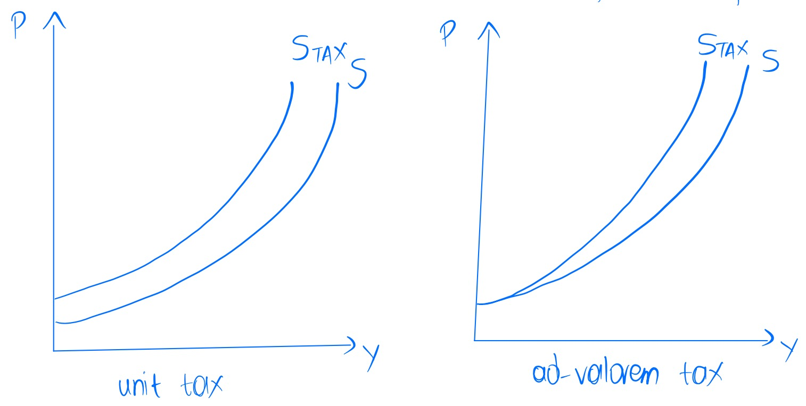
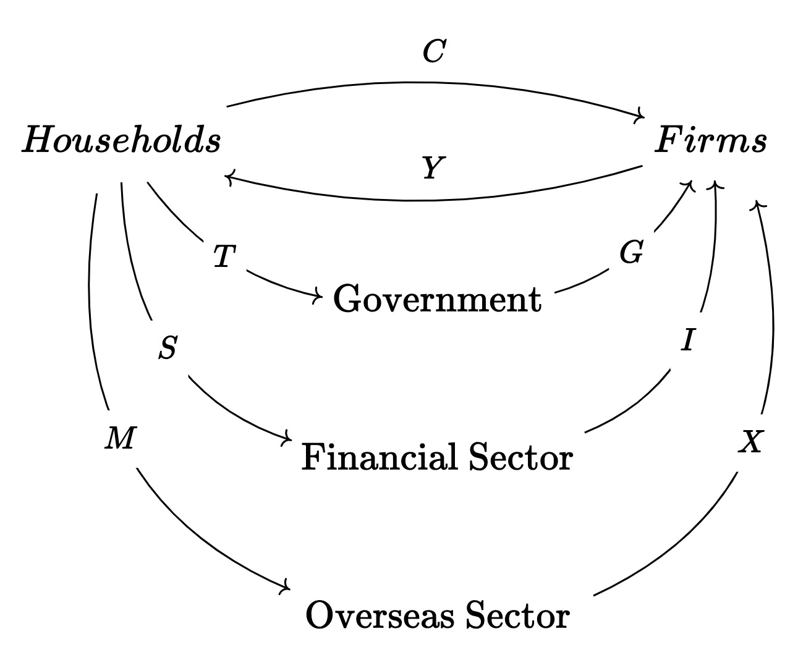

# Mathematics of Business and Economics
{: .no_toc }
## MATH60132
{: .no_toc}

  

    PDFs
  

  
- <a href="/notes/pdfs/year3/LecNotes/MBE-Concise.pdf" target="_blank" style="color:#801fff;">**Open Maths of Business + Econ Concise - INCOMPLETE**</a> - <a href="/notes/pdfs/year3/LecNotes/MBE-Concise.pdf" download>**Download**</a>
- <a href="/notes/pdfs/year3/LecNotes/MBE-LecNotes.pdf" target="_blank" style="color:#801fff;">**Open Maths of Business + Econ - Lecture Notes**</a> - <a href="/notes/pdfs/year3/LecNotes/MBE-LecNotes.pdf" download>**Download**</a>
- <a href="/notes/pdfs/year3/LecNotes/MBE-Annotated.pdf" target="_blank" style="color:#801fff;">**Open Maths of Business + Econ - Annotated Notes**</a> - <a href="/notes/pdfs/year3/LecNotes/MBE-Annotated.pdf" download>**Download**</a>

  

    Problem Sheets 
  

  
  - <a href="/notes/pdfs/year3/probSheets/mbe/MBE-PS1.pdf" target="_blank" style="color:#00ba47;">**Problem Sheet 1**</a> - <a href="/notes/pdfs/year3/probSheets/mbe/MBE-PS1-Sol.pdf" target="_blank">**Solutions**</a>

  - <a href="/notes/pdfs/year3/probSheets/mbe/MBE-PS2.pdf" target="_blank" style="color:#00ba47;">**Problem Sheet 2**</a> - <a href="/notes/pdfs/year3/probSheets/mbe/MBE-PS2-Sol.pdf" target="_blank">**Solutions**</a>

  - <a href="/notes/pdfs/year3/probSheets/mbe/MBE-PS3.pdf" target="_blank" style="color:#00ba47;">**Problem Sheet 3**</a> - <a href="/notes/pdfs/year3/probSheets/mbe/MBE-PS3-Sol.pdf" target="_blank">**Solutions**</a>

  - <a href="/notes/pdfs/year3/probSheets/mbe/MBE-PS4.pdf" target="_blank" style="color:#00ba47;">**Problem Sheet 4**</a> - <a href="/notes/pdfs/year3/probSheets/mbe/MBE-PS4-Sol.pdf" target="_blank">**Solutions**</a>

  - <a href="/notes/pdfs/year3/probSheets/mbe/MBE-PS5.pdf" target="_blank" style="color:#00ba47;">**Problem Sheet 5**</a> - <a href="/notes/pdfs/year3/probSheets/mbe/MBE-PS5-Sol.pdf" target="_blank">**Solutions**</a>

  

    Table of contents
  

<!--   {: .text-delta } -->
* TOC
{:toc}

# Microeconomics

### Supply and Demand - an introduction

**Definition 1**. ***Supply** refers to the quantity of a good that
vendors are willing and able to sell at a given price.*

**Definition 2**. ***Demand** refers to the quantity of a good that
consumers are willing and able to buy at a given price.*

**Theorem 3**. ***The Law of Demand** states that the quantity demanded
of a good is inversely related to its price. That is, as the price of a
good increases, the quantity demanded of that good decreases.*

**Theorem 4**. ***The Law of Supply** states that the quantity supplied
of a good is directly related to its price. That is, as the price of a
good increases, the quantity supplied of that good increases.*

#### Supply and Demand Curves

**Definition 5**. ***A supply curve** is a graph of the quantity
supplied of a good at different prices.*

**Definition 6**. ***(Price elasticity of supply/demand)** is the
percentage change in quantity supplied/demanded divided by the
percentage change in price.*

$$\begin{aligned}
        \epsilon_{D} &= \frac{\text{proportional change in quantity demanded} }{\text{proportional change in price} }\\
        % &= \frac{\frac{\partial D(p)}{\partial p} / D(p)}{1/p}
        &= \frac{\partial D(p)}{\partial p} \frac{p}{D(p)}
\end{aligned}$$ 
    
We have generally that $\epsilon_{D} < 0$ by the Law of demand, as demand is decreasing in $p$.

$$
\left\vert \epsilon_{D}(p) \right\vert =
        \begin{cases}
            >1, &\text{ elastic demand}  ;\\
            <1, &\text{ inelastic } ;\\
            =1, &\text{ unit elastic }.
        \end{cases}
$$ 
        
Determinants of elasticity include:*

-   *The availability of substitutes*

-   *The time period over which the price change occurs*

-   *The proportion of income spent on the good*

-   *The proportion of the good that is a necessity*

*Define the **price elasticity of supply** $\epsilon_{S}$ similarly.*

*Can also consider the following:*

-   ***income elasticity of demand** $\epsilon_{Y}$ - the percentage
    change in quantity demanded divided by the percentage change in
    income.*

-   ***cross-price elasticity of demand** $\epsilon_{X}$ - the
    percentage change in quantity demanded of good $X$ divided by the
    percentage change in the price of good $Y$.*

#### Demand, Price and Revenue

**Definition 7**. ***Revenue** generated by a given good is the price of
that good multiplied by the quantity demanded of that good.

$$R(p) = Q(p) \cdot p = D(p) \cdot p$$

**Theorem 8**. *An increase in price will lead to a increase in revenue
iff the demand for the good is inelastic\
When demand for a good is elastic, an increase in price will lead to a
decrease in revenue, and vice versa. $$\begin{aligned}
        \frac{\partial R(p)}{\partial p} &= \frac{\partial D(p)}{\partial p} \cdot p + D(p) > 0\ \iff \\
        &= -\frac{\partial D(p)}{\partial p} \cdot p < D(p)\ \iff \\
        &= -\frac{\partial D(p)}{\partial p} \cdot \frac{p}{D(p)} < 1\\
        &= -\epsilon_{D} < 1
    \end{aligned}$$

#### Theory of the Firm

##### Production Functions, Cost, Revnue and Profit

**Definition 9**. ***Factors of production** are the inputs used to
produce a good. These fall into 4 categories:*

-   *Land*

-   *Labour*

-   *Capital*

-   *Raw materials*

***Capital** is the those inputs to production that may be consumed now,
but will deliver greater overall value ot the firm if consumption is
delayed.\
**Capitol goods** are those inputs to production that are themselves
produced goods which are durable and used to produce other goods. i.e
machinery, equipment\
**Capitol finance** refers to the financial assets of a firm that are
used to generate wealth - differs from 'money' in general in that it is
not used to purchase consumable goods and services e.g shares, bonds,
patents*

**Definition 10**. ***Production set** - the set of all inputs and
outputs that satisfy a given restraint.\
$$\text{Vector of input factor quantities} = \vec{x} \in \mathbb{R}^{n}_{\geq 0}$$
$$\text{Vector of output factor quantities} = \vec{y} \in \mathbb{R}^{m}_{\geq 0}$$
$$\mathcal{P} = \left\{ (x,y) \in \mathbb{R}^{n} \times \mathbb{R}^{m} \mid \text{ s.t } y \leq  f(x) \right\} \quad \text{where} \quad f(x) \in \mathbb{R}^{m}_{\geq 0} \text{ a production function}$$
**The production function** $f$ also known as the technology of the
firm, prescribes the maximum level of output $\vec{y}$ for a given level
of input $\vec{x}$.*

**Definition 11**. ***Isoquant** - a curve that connects all points in
the production set that have the same output level.\
$$\text{For given } \vec{y} \in \mathbb{R}^{m}_{\geq 0} \text{, the isoquant is the set of all } \vec{x} \in \mathbb{R}^{n}_{\geq 0} \text{ such that } y = f(x)$$

**Definition 12**. *When $y \in \mathbb{R}_{\geq 0}$, the **input
requirement set** is the set of all vectors $\vec{x}$ that produce at
least $y$ that is $f^{-1} ([y,\infty ))$

**Leontief Technology**\
**Perfect substitutes**\
**Cobb-Douglas Technology**\

##### Properties of production functions/ input requirement sets

-   Monoticity - If some of the inputs is increased, the maximum will
    not decrease.
    $$\vec{x} \leq  \vec{x}^{\ast} \Rightarrow f(\vec{x}) \leq f(\vec{x}^{\ast})$$

-   Convexity
    $$% If \((x_1,x_2) \in f^{-1} (\{y,\infty \})\) \text{ and } \((x_1^{\ast},x_2^{\ast}) \in f^{-1} (\{y,\infty \})\) \text{ then } \((1-\lambda )(x_1,x_2) + \lambda (x_1^{\ast},x_2^{\ast}) \in f^{-1} (\{y,\infty \})\)
            x$$

##### The Marginal Product

**Definition 13**. ***Marginal product of factor $i$* defined as
$$\mu P_{i} (x_1,x_2) = \frac{\partial f(x_1,x_2)}{\partial x_i}, \quad i = 1,2$$

**Definition 14**. ***Output elasticity** with respect to factor $i$ is
defined as
$$\epsilon_{i}(x_1,x_2) = \frac{\partial f(x_1,x_2)}{\partial x_i} \cdot \frac{x_i}{f(x_1,x_2)}$$

##### Substitution

**Definition 15**. ***Marginal rate of technical substitution (MRTS)**
is defined as $$MRTS(x_1,x_2) = - \frac{MP_1(x_1,x_2)}{MP_2(x_1,x_2)}$$

**Theorem 16**. *(Law of diminishing marginal productivity)\
Increasing the quantity of a factor of production will increase the
output of the firm, but at a decreasing rate.\
*

##### Returns to Scale

Now consider the effect of increasing the quantity of all input factors
of production by the same constant.\
Consider behaviour of function

$$\mathbb{R}_{\geq 0} \ni t \mapsto f(t \vec{x} )$$ 

We have the
following scenarios:

-   **Constant returns to scale** - if $f(t \vec{x}) = t f(\vec{x})$

-   **Increasing returns to scale** - if $f(t \vec{x}) > t f(\vec{x})$

-   **Decreasing returns to scale** - if $f(t \vec{x}) < t f(\vec{x})$

Formalising the above quantitatively

Define the following function $$h_{x}(t) = f(t \vec{x} )$$ If $f$
differentiable function we define its elasticity of scale at
$\vec{x} \in \mathbb{R}_{\geq 0}^n$ as $$\begin{aligned}
    e( \vec{x} ) &= \frac{dh(t)}{dt} \cdot \frac{t}{h(t)} \mid_{t=1}\\
    &= \frac{h^\prime (1)}{h(1)}\\
    &= \frac{df(t \vec{x} )}{dt} \mid_{t = 1} \cdot \frac{1}{f(x)}\\
    &= \frac{\left< \nabla f( \vec{x} ), \vec{x}  \right> }{f(x)}\end{aligned}$$

With the following cases:

-   $e( \vec{x} ) \geq 1,\ \forall \vec{x} \in \mathbb{R}_{\geq 0}^n \iff f(t \vec{x} ) \geq t f(\vec{x} )\ \forall t \geq 1\ \forall \vec{x} \in \mathbb{R}_{\geq 0}^n$

-   $e( \vec{x} ) \leq 1,\ \forall \vec{x} \in \mathbb{R}_{\geq 0}^n \iff f(t \vec{x} ) \leq t f(\vec{x} )\ \forall t \geq 1\ \forall \vec{x} \in \mathbb{R}_{\geq 0}^n$

-   $e( \vec{x} ) = 1,\ \forall \vec{x} \in \mathbb{R}_{\geq 0}^n \iff f(t \vec{x} ) = t f(\vec{x} )\ \forall t > 0\ \forall \vec{x} \in \mathbb{R}_{\geq 0}^n$

##### Additional potential properties of the production function

-   **Homogeneity** $f: \mathbb{R}_{\geq 0}^n \to \mathbb{R}$ is
    positively homogeneous of degree $k \in \mathbb{R}$ if
    $f(\lambda \vec{x}) = \lambda^k f(\vec{x})\ \forall t > 0\ \forall \vec{x} \in \mathbb{R}_{\geq 0}^n$\
    This has obvious links to the returns to scale\
    If $f$ is positively homogeneous function of degree
    $k \in \mathbb{R}$

    -   it has IRTS if $k > 1$

    -   it has CRTS if $k = 1$

    -   it has DRTS if $k < 1$

-   **Homotheticity** $f: \mathbb{R}_{\geq 0}^n \to \mathbb{R}$ is
    homothetic if there is a positively homogeneous function
    $h: \mathbb{R}_{\geq 0}^n \to \mathbb{R}$ and a strictly increasing
    function $g: \mathbb{R} \to \mathbb{R}$ such that
    $$f(\vec{x}) = g(h(\vec{x})) \quad \forall \vec{x} \in \mathbb{R}_{\geq 0}^n$$
    Homogeneous and homothetic production functions are useful modelling
    scenarios as they prescribe isoquants that vary simply for differing
    levels of output.

##### Profit and profit maximisation

**Definition 17**. *(Profit function) $$\begin{aligned}
        \pi( \vec{x} , p , \vec{w} ) &= p f(\vec{x})^T - \vec{w} \vec{x}^T\\
        &= pf(\vec{x} ) - \vec{w} \vec{x}^T \quad \text{(single output case)} 
    \end{aligned}$$
$\vec{x}  \text{ - the input factors}, \vec{w} \text{ - price to buy input}, \vec{p} \text{ - price to sell at}$

***First order conditions for** $\pi$ (Fundamental condition of profit
maximisation)
$$\forall i = 1, \dots , n \quad \frac{\partial \pi}{\partial x_i} = 0 \iff \sum_{j=1}^{m} \frac{\partial f_j}{\partial x_i} p_j = w_i$$

-   *Profit is maximised if marginal revenue is equal to marginal cost*

-   *'The value of the marginal product of a factor of production is
    equal to the price of the product'*

*For fixed prices and wages, the profit function is a function of the
input factors only - can then be maximised by solving the first order
conditions for $x_i$
$$f''(x^{\ast} ) \leq  0 \text{ (necessary)}\quad \text{and} \quad f'(x^{\ast} ) < 0 \text{ (sufficient)} \quad \text{(single-input case)}$$
For $\vec{x} \in \mathbb{R}_{\geq 0}^n, n > 1$ corresponding condition
is that the Hessian of the profit function is negative semidefinite
(necessary) or negative definite (sufficient)*

**Drawbacks**

-   Production function may not be differentiable

-   Input variables may be discrete and not continuous

-   Might have boundary solutions (e.g. $x_i = 0$ ) meaning that it
    optimal to not use a certain factor at all

-   A best strategy might not exists e.g $\pi$ might not be bounded,
    $f(x) = x \text{ and } w < p$

-   The optimal strategy may exist but is not unique e.g
    $f(x)= x \text{ and } w = p$

**Definition 18**. ***Factor demand function**
$$\underline{x}^{\ast} \colon \mathbb{R}_{\geq 0}^m  \times  \mathbb{R}_{\geq 0}^n \to 2^{\mathbb{R_{\geq 0}^n}}$$
$$\underline{x}^{\ast}  (p, \vec{w}) = \arg \max_{\vec{x} \in \mathbb{R}_{\geq 0}^n} \pi(\vec{x}, p, \vec{w})$$
Gives the optimal specification of input quantities, given a price
vector $p$ and a wage vector $\vec{w}$

***Output supply** as the function
$$\underline{y}^{\ast} \colon \mathbb{R}_{\geq 0}^n  \times  \mathbb{R}_{\geq 0}^m \to \mathbb{R}_{\geq 0}^m$$
$$(\vec{p} ,\vec{w} ) \mapsto \underline{y}^{\ast} (\vec{p} ,\vec{w} ) = f(\underline{x}^{\ast} (\vec{p} ,\vec{w} ))$$
**Profit Function**
$$\pi^{\ast} : \mathbb{R}_{\geq 0}^m \times \mathbb{R}_{\geq 0}^{n} \times \mathbb{R}_{\geq 0}^n \to \mathbb{R}$$
$$(\vec{p} ,\vec{w}) \mapsto \pi^{\ast} (\vec{p} ,\vec{w}) = \pi(\underline{x}^{\ast} (\vec{p} ,\vec{w} ), \vec{p} ,\vec{w} ) = \mathop{\max}_{\vec{x} \in \mathbb{R}_{\geq 0}^n} \pi(\vec{x}, \vec{p} ,\vec{w} ) = \mathop{\max}_{\vec{x} \in \mathbb{R}_{\geq 0}^n} \left( \vec{p} f(\vec{x})^T - \vec{w} \vec{x}^T \right)$$
*Properties:**

-   *Factor demand function is positively homogeneous of degree 0
    $$\underline{x}^{\ast} (t \vec{p} , t \vec{w}) = \underline{x}^{\ast} (\vec{p} , \vec{w}) \quad \forall t > 0 
                \quad \forall (\vec{p} , \vec{w} ) \in \mathbb{R}_{\geq 0}^m \times \mathbb{R}_{\geq 0}^n$$

-   *Profit function is positively homogeneous of degree 1*

-   *Profit function is non-decreasing in $\vec{p}$ and non-increasing
    in $\vec{w}$

-   *Profit function is convex*

-   *Under regularity conditions, the profit function is continuous.*

**Theorem 19**. *(Hotelling's Lemma)*

*Output supply and factor demand functions can be obtained directly from
maximised profit function via partial differentiation w.r.t price vector
$$\pi^{\ast} (\vec{p} ,\vec{w}) = \vec{p} f(\underline{x}^{\ast} (\vec{p} ,\vec{w} ))^T - \vec{w} \underline{x}^{\ast} (\vec{p} ,\vec{w} )^T$$
$$\frac{\partial \pi^{\ast} (\vec{p} ,\vec{w} )}{\partial p_{j}} = f_{j}( \underline{x}^{\ast} (\vec{p} ,\vec{w} ))$$
$$\frac{\partial \pi^{\ast} (\vec{p} ,\vec{w} )}{\partial w_{i}} = - x_{i}^{\ast} (\vec{p} ,\vec{w} )$$

**Theorem 20**. *(The LeChatelier principle)*

*Long-run supply response to change in price is at least as large as the
short-run supply response
$$\frac{\partial y_{i}^{\ast} (\vec{p} ,\vec{w} )}{\partial p_{i}} \geq 0$$

##### Weak Axiom of Profit Maximisation (WAPM)

Suppose observe net output vectors $z^t = 
    (\underline{y}^t - \underline{x}^t) \in \mathbb{R}_{\geq 0}^m \times \mathbb{R}_{\geq 0}^n$\
And corresponding price vectors
$\underline{r}^t = (\underline{p}^t, \underline{w}^t) \in \mathbb{R}_{\geq 0}^m \times \mathbb{R}_{\geq 0}^n$
for a firm at discrete times $t = 1, 2, \dots$\
Assuming that the firm is profit maximising, then the following holds
$$\underline{r}^t(\underline{z}^t)^T \geq \underline{r}^{t}(\underline{z}^{s})^T \quad \forall s,t = 1, \ldots , T$$
$$\Rightarrow \underline{r}^t(\underline{z}^t - \underline{z}^s)^T \geq  0, \quad \underline{r}^s(\underline{z}^t - \underline{z}^s)^T \geq 0$$
$$(\underline{r}^t - \underline{r}^s)(\underline{z}^t - \underline{z}^s)^T \geq  0 \quad \forall s,t = 1, \ldots , T$$

##### Cost Minimisation

Aim to answer 2 questions

-   For fixed $\vec{w} \in \mathbb{R}_{\geq 0}^n$ what is the minimum
    total cost to the firm of producing level of output $y$

-   What is the most profitable level of output?

Want to solve, given $\vec{w} \in \mathbb{R}_{\geq 0}^n$ and
$\vec{x} \in \mathbb{R}_{\geq 0}^n$, the following problem
$$\underset{\vec{x} \in f^{-1} (\{y\})}{\mathop{\arg\ \min}} \vec{w} \vec{x}^T$$

**Definition 21**. *(Lagrangian)
$$\mathcal{L} (\vec{x}, \lambda) = \vec{w} \vec{x}^T - \lambda (f(\vec{x}) - \vec{y})$$
$$\begin{aligned}
            \frac{\partial  \mathcal{L} (x,\lambda )}{\partial  x_{i}} &= w_{i} - \lambda \partial_{i}f(x) = 0\quad i = 1, \ldots ,n  \\
            \frac{\partial  \mathcal{L} (x,\lambda )}{\partial  \lambda } &= f(x) - y = 0\\
            &\Rightarrow \text{ Must solve following } n+1 \text{ unknowns}\\
            \lambda \partial_{i}f(\vec{x} ) &= w_{i}, \quad i = 1, \ldots ,n \\
            f(\vec{x} ) &= y
        \end{aligned}$$

**Definition 22**. ***Conditional factor demand function***

*$$\underline{x}^{\ast}: \mathbb{R}_{\geq 0}^n \times \mathbb{R}_{\geq 0} \to \mathbb{R}_{\geq 0}^n, \quad (\vec{w} , y) \mapsto  \underset{\vec{x} \in f^{-1} (\{y\})}{\mathop{\arg\ \min}}\ \vec{w} \vec{x}^T$$
*Minimum total cost to firm of producing level of output $y$ given
factor prices $\vec{w}$
$$c^{\ast} : \mathbb{R}_{\geq 0}^n \times \mathbb{R}_{\geq 0} \to \mathbb{R}_{\geq 0}^n, \quad (\vec{w} , y) \mapsto  \underset{\vec{x} \in f^{-1} (\{y\})}{\mathop{\min}}\ \vec{w} \vec{x}^T = \vec{w} \underline{x}^{\ast} (\vec{w} , y)^T$$
First-order conditions restated as
$$MRTS(x_1^{\ast} ,x_2^{\ast} ) = - \frac{MP_1(x_1^{\ast} ,x_2^{\ast} )}{MP_2(x_1^{\ast} ,x_2^{\ast} )} = -\frac{w_1}{w_2}$$
We have MRTS coincides with the **economic rate of substitution***

**Drawbacks of finding conditional factor demand function**

-   Production function may not be differentiable

-   May have boundary solutions - meaning not optimal to use certain
    factor in production at all

-   If production function $f$ is continuous, surjective on $[0,\infty)$
    and $w \gg 0$ there is always a cost minimizing strategy

-   The optimal strategy may exist but may not be unique

##### Properties of the cost function

-   Non-decreasing in $\vec{w}$
    $$\vec{w}^\prime  \geq  \vec{w} \implies c^{\ast} (\vec{w}^\prime , y) \geq c^{\ast} (\vec{w} , y)$$

-   Homogeneous of degree 1 in $\vec{w}$
    $$c^{\ast} (t \vec{w} , y) = t c^{\ast} (\vec{w} , y) \quad \forall t > 0$$

-   Concave in $\vec{w}$
    $$c^{\ast} (t \vec{w} + (1-t)\vec{w}^\prime , y) \geq t c^{\ast} (\vec{w} , y) + (1-t)c^{\ast} (\vec{w}^\prime , y) \quad \forall t \in [0,1]$$

-   Continuous in $\vec{w}$ for $\vec{w} \gg 0$
    $$\forall \vec{w}_0 \gg 0 \quad c^{\ast}(\vec{w}_0, y) \text{ exists, and is equal to} \lim\limits_{\vec{w}  \to \vec{w}_0} c^{\ast} (\vec{w} , y)$$

**Theorem 23**. *(Shephard's Lemma) If $c^{\ast} (\vec{w} ,y)$ is
differentiable at $\vec{w} ,y$ and $w_{i}> 0$ for $i = 1, \ldots ,n$
then
$$x_{i}^{\ast}(\vec{w} ,y) = \frac{\partial c^{\ast} (\vec{w} ,y)}{\partial w_{i}}$$

##### Weak Axiom of Cost Minimisation (WACM)

Gives a necessary condition on data to stem from a cost minimising (and
thus rationally operating firm)

Given observations of prices $\vec{w}^t \in \mathbb{R}_{\geq 0}^n$,
inputs $\vec{x}^t \in \mathbb{R}_{\geq 0}^n$ and outputs $y^t \geq 0$ at
time points $t = 1, \ldots , T$. The WACM states that
$$\vec{w}^t(\vec{x}^t)^T \leq \vec{w}^t (\vec{x}^s )^T \quad \forall s,t = 1 , \ldots ,T \text{ such that } y^t \leq y^s$$
As a corollary
$$(\vec{w}^t - \vec{w}^s)(\vec{x}^t - \vec{x}^s)^T \leq  0 \quad \forall s,t = 1 , \ldots ,T \text{ such that } y^t \leq y^s$$

##### Long-run and short-run costs

Let $F,V \subseteq \{1, \ldots ,n \}$ be index sets such that
$F \cap V = \emptyset$ and $F \cup V = \{1, \ldots ,n \}$.

$V$ te indices of variable short-run factors and $F$ comprises the
indices of fixed long-run factors.

Take $\underline{x}\in \mathbb{R}_{\geq 0}^n$ and write
$\underline{x} = (\underline{x}_{F}, \underline{x}_{V}) \in \mathbb{R}_{\geq 0}^F \times \mathbb{R}_{\geq 0}^V$

**Definition 24**. *Level of the fixed factor will influence both the
minimised cost, given by the **Short-run cost function**

$$c_{s}^{\ast} : \mathbb{R}_{\geq 0}^n \times \mathbb{R}_{\geq 0}^F \times \mathbb{R}_{\geq 0} \to \mathbb{R}$$

$$\begin{aligned}
        c_{s}^{\ast} (\underline{w}, \underline{x}_{F},y) &= \mathop{\min}_{\underline{x}\in \mathbb{R}_{\geq 0}^V \text{ s.t } f(\underline{x}_{F},\underline{x}_{V}) = y } \underline{w} \underline{x}^T \\
        &= \underline{w}_{F} \underline{x}_{F}^T + \mathop{\min}_{\underline{x}_{V}\in \mathbb{R}_{\geq 0}^V \text{ s.t } f(\underline{x}_{F},\underline{x}_{V}) = y } \underline{w}_{V} \underline{x}_{V}^T
    \end{aligned}$$ 
    
and the cost-minimising choices of the variable
factors, given by the **short-run conditional factor demand functions**

$$x_{s}^{\ast} : \mathbb{R}_{\geq 0}^n \times \mathbb{R}_{\geq 0}^F \times \mathbb{R}_{\geq 0} \to \mathbb{R}^n$$

$$x_{s}^{\ast} (\underline{w},\underline{x}_{F},y) = \underset{\underline{x}_{V}\in \mathbb{R}_{\geq 0}^V \text{ s.t } f(\underline{x}_{F},\underline{x}_{V}) =y  }{\mathop{\arg\ \min}} \underline{w} \underline{x}^T = \underset{\underline{x}_{V}\in \mathbb{R}_{\geq 0}^V \text{ s.t } f(\underline{x}_{F},\underline{x}_{V}) =y  }{\mathop{\arg\ \min}} \underline{w}_{V} \underline{x}_{V}^T$$
Note that
$$c^{\ast} (\underline{w},y) \leq c_{s}^{\ast} (\underline{w},\underline{x}_{F},y)$$

##### Average and marginal costs

Assuming the costs
$\underline{w} = (\underline{w}_{F},\underline{w}_{V})$ to be fixed.

**Definition 25**. ***Short-run average cost** $SAC(y)$ to be the
per-unit cost of producing $y$ units of output:
$$SAC(y) = \frac{c_{s}^{\ast} (\underline{w},\underline{x}_{F},y)}{y}$$
Assume firm is cost-minimising
$\underline{x}_{V} = \underline{x}_{s}^{\ast} (\underline{w},\underline{x}_{F},y)$
$$SAC(y) = \underbrace{\frac{\underline{w}_{V} \underline{x}_{F}^T}{y}}_{SAFC(y)} = \underbrace{\frac{\underline{w}_{V} \underline{x}_{s}^{\ast} (\underline{w},\underline{x}_{F},y)^T}{y}}_{SACV(y)}$$
SAFC = **short-run average fixed costs** and SAVC = **short-run average
variable costs***

**Definition 26**. ***Short-run marginal cost** $SMC(y)$ to be the
change in the per-unit cost of producing $y$ units of output:
$$SMC(y) = \frac{\partial c_{s}^{\ast} (\underline{w},\underline{x}_{F},y)}{\partial y}$$

*In the long-run only have variable input factors i.e
$V = \{1, \ldots ,n \}, F = \varnothing$ leading to
$\underline{x}= \vec{x}_{V}$ so define the long-run average and marginal
costs accordingly $$LAC(y) = \frac{c^{\ast} (\underline{w},y)}{y}$$
$$LMC(y) = \frac{\partial c^{\ast} (\underline{w},y)}{\partial y}$$

##### Geometry of costs

$$FIGURES\ HERE$$

*Minimum of SAC*\
$$\frac{\partial}{\partial y} SAC(y) = 0 \iff \frac{\partial c_{s}^{\ast} (\underline{w},\underline{x}_{F},y)}{\partial y} = \frac{ c_{s}^{\ast} (\underline{w},\underline{x}_{F},y)}{y}$$
At its local minimum the marginal cost is equal to the average cost.

-   $SMC(y) < SAC(y) \iff$ short-run average costs are decreasing in $y$

-   $SMC(y) = SAC(y) \iff$ short-run average costs are increasing in $y$

As $y \to 0$, short-run average costs explodes in presence of fixed
costs, but short-run average variable costs and short-run marginal costs
are equal.

Note:

-   Area under marginal cost curve (MC) gives total variable costs

-   $SMC(y) = SAVC(y)$ at local minimum of $SAVC(y)$

-   $SMC(y) \gtrless SAVC(y) \iff SAVC(y)$ is increasing/decreasing in
    $y$

$$FINISH\ OFF\ THIS\ SECTION\ PROPERLY$$

##### Profit Maximisation given minimised costs

Profit maximisation problem: $$\begin{aligned}
    \underset{y>0}{\mathop{\arg\ \max}} &\{py - c_{s}^{\ast} (\underline{w},\underline{x}_{F},y)\}\\
    \underset{\mathop{\max} }{y>0} \{py - c_{s}^{\ast} (\underline{w},\underline{x}_{F},y)\}\end{aligned}$$
First and second-order conditions for optimal level of output given
minimised costs are given by $$\begin{aligned}
    \frac{\partial}{\partial y} \{py - c_{s}^{\ast} (\underline{w},\underline{x}_{F},y)\} = 0 &\implies p = SMC(y) \quad \text{(FOCs)} \\
    \frac{\partial^2}{\partial y^2} \{py - c_{s}^{\ast} (\underline{w},\underline{x}_{F},y)\} \leq  0 &\implies \frac{\partial^{2} c_{s}^{\ast} (\underline{w},\underline{x}_{F},y)}{\partial y^{2} } \geq 0 \quad \text{(SOCs)} \end{aligned}$$

**Definition 27** (Shutdown condition). ***Shutdown condition** is given
by
$$p < SAVC(y) = \frac{\underline{w}_{V}\underline{x}_{V}^{\ast} (\underline{w}_{V},y)^T}{y}$$
If $p < SAC(y)$ then the firm should shut down as it is making a loss.\
Long-run profit-maximising supply for a cost-minimising firm given by
$y$ s.t*

-   *$LMC(y) = p$

-   *$LMC(y)$ must be increasing in $y$

-   *$LAC(y) \leq  p$ - converse of the shutdown condition in the
    long-run*

*If sno such $y >0$ exists for given $p$ then firm should choose to go
out of business*

##### Profit maximisation for a noncompetitive firm

Now we seek
$$\underset{y \geq 0}{\mathop{\arg\ \max}} \{py - c_{s}^{\ast} (\underline{w},y)\}$$
Just dropping the $\underline{x}_{F}$ term\
First and second-order conditions for finding a profit-maximising
position for a monopolist facing an inverse demand function given by

$$\begin{aligned}
    \frac{\partial}{\partial y} \{p(y) y - c_{s}^{\ast} (\underline{w},y)\} = 0 &\implies \frac{\partial p(y)}{\partial y} + p(y) = SMC(y) \quad \text{(FOC)} \\
    \frac{\partial^2}{\partial y^2} \{p(y) y - c_{s}^{\ast} (\underline{w},y)\} \leq  0 &\implies \frac{\partial^{2} c_{s}^{\ast} (\underline{w},y)}{\partial y^{2} } \geq \frac{\partial^{2} p(y)}{(\partial y)^{2} }y + 2 \frac{\partial p(y)}{\partial y} \quad \text{(SOCs)}\end{aligned}$$

Rearrange the first-order condition as $$p(y)
    \underbrace{\left[ 
        1 + \frac{\partial p(y)}{\partial y} \frac{y}{p(y)}
    \right]}_{1  + \frac{1}{\epsilon_{D} (y)}}$$ where
$\epsilon_{D} (y) := \epsilon_{D} (p(y))$ is the price elasticity of
demand facing the monopolist

$$p^\prime (y) = \frac{1}{D^\prime (p(y))}$$ 

Must have that
$\left\vert \epsilon_{D} \right\vert \geq  1$\
Can have profit-maximising $y =0$ ; when the losses from setting output
according to the above conditions is greater than the fixed costs i.e.
when $$SAVC(y) > p(y)$$

### Theory of the consumer

#### Preferences & Utility

**Definition 28**. ***Consumption bundle** - vector of goods and
services an individual is willing to consume
$$\underline{x} = \begin{pmatrix} x_1, \ldots ,x_n \end{pmatrix} \in \mathbb{R}^{n}_{\geq  0}$$
Set of possible consumption bundles referred to as the **consumption
set** - usually taken to be some closed, convex set

$$X \subseteq \mathbb{R}^{n}_{\geq  0}$$

Consumers have preferences between bundles $\underline{x},\underline{x}^\prime  \in X$

-   *$\underline{x} \preccurlyeq \underline{x}^\prime$ means that the
    consumer has a preference for $\underline{x}^\prime$ over
    $\underline{x}$

-   *$\underline{x} \prec \underline{x}^\prime$ means that the consumer
    strictly prefers $\underline{x}^\prime$ over $\underline{x}$

-   *$\underline{x} \sim \underline{x}^\prime$ means that the consumer
    is indifferent between $\underline{x}$ and $\underline{x}^\prime$
    $$\underline{x} \sim \underline{x}^\prime \iff \underline{x} \preccurlyeq \underline{x}^\prime \text{ and } \underline{x}^\prime \preccurlyeq \underline{x}$$

*Preference relation satisfies the following properties*

-   ***Completeness**
    $$\forall \underline{x}, \underline{x}^\prime \in X, \underline{x} \preccurlyeq \underline{x}^\prime \text{ or } \underline{x}^\prime \preccurlyeq \underline{x}$$

-   ***Reflexivity** (follows from completeness)
    $$\forall \underline{x} \in X, \underline{x} \preccurlyeq \underline{x}$$

-   ***Transitivity**
    $$\forall \underline{x}, \underline{x}^\prime, \underline{x}^{\prime\prime} \in X, \underline{x} \preccurlyeq \underline{x}^\prime \text{ and } \underline{x}^\prime \preccurlyeq \underline{x}^{\prime\prime} \implies \underline{x} \preccurlyeq \underline{x}^{\prime\prime}$$

*Following assumptions *useful* but not necessary*

-   ***Continuity**
    $$\forall \underline{x} \in X, \text{ the sets } \{\underline{x}^\prime  : \underline{x}^\prime  \curlyeqprec x\} \text{ and } \{\underline{x}^\prime  : \underline{x}^\prime  \succcurlyeq x\} \text{ are closed}$$

-   ***Weak/ Strong Monoticity** $$\begin{aligned}
                \underline{x} \leq  \underline{x}^\prime &\implies \underline{x} \preccurlyeq \underline{x}^\prime \text{(weak)}\\ 
                \underline{x} \leq  \underline{x}^\prime \text{ and } \underline{x} \neq \underline{x}^\prime  &\implies \underline{x} \prec \underline{x}^\prime \text{(strong)}
            \end{aligned}$$

-   ***Local nonsatiation**
    $$\forall \underline{x} \in X, \forall \varepsilon >0, \exists \underline{x}^\prime \in X \text{ s.t. } \left\Vert \underline{x}^\prime - \underline{x} \right\Vert < \varepsilon \text{ and } \underline{x}^\prime \succ \underline{x}$$

-   ***(Strict) Convexity**
    $$\textit{Given } \underline{x},\underline{x}^\prime ,\underline{x}^\prime\prime \in X \text{ with } x \preccurlyeq \underline{x}^\prime \text{ and } \underline{x} \preccurlyeq \underline{x}^{\prime\prime} \text{ then } \forall \lambda \in [0,1], \underline{x} \preccurlyeq (\prec)\ \lambda \underline{x}^\prime + (1-\lambda) \underline{x}^{\prime\prime}\quad  \textit{(strict)}$$

*Can easily verify strong monotonicity implies local non-satiation*

**Definition 29**. ***Utility function** - real-valued function
$u: X \to \mathbb{R}$ such that
$$u(\underline{x}^\prime ) \leq u(\underline{x}) \iff \underline{x}^\prime  \preccurlyeq \underline{x}$$

**Proposition 30** (Properties of utility function). *If underlying
preferences are complete, transitive, continuous and (strictly)
monotone, the corresponding utility function will be continuous and
(strictly) monotone.\
If preferences are (strictly) convex, the utility function is (strictly)
quasi-concave.\
Note function $f:X \to \mathbb{R}$, where $X$ is a convex set, is
strictly quasi-concave if for all $x,y \in X, x \neq y$ and for all
$t \in (0,1)$ $$f(tx + (1-t)y) > \min\{f(x),f(y)\}$$

#### Substitution in demand

**Definition 31**. ***Marginal rate of substitution** - for goods $i$
and $j$
$$MRS_{i,j} (\underline{x}) = \frac{\partial u(\underline{x})/\partial x_i}{\partial u(\underline{x})/\partial x_j}$$
Also define **marginal utility** of good $i$ as
$$MU_i(\underline{x}) = \frac{\partial u(\underline{x})}{\partial x_i}$$

#### Budget Restraints, Utility Maximisation and Demand

**Definition 32**. ***Budget Set**
$$B = B_{\underline{p},m} = \{\underline{x} \in X: \underline{p} \cdot \underline{x}^T \leq m\} \subseteq X$$
for fixed budget $m$ with $\underline{p}$ the vector of prices.\
*

Want to find
$\underset{\underline{x} \in B}{\mathop{\arg\ \max}} u(\underline{x})$\
Guaranteed solution exists given $u$ continuous and $B$ closed and
bounded, and if $\underline{p} > 0$

**Theorem 33** (Walras' Law).
*$$\underset{\underline{x}\in X}{\mathop{\max}\ } u(\underline{x}) \quad \text{ such that }\quad \underline{p} \underline{x}^T = m$$
Call the budget line
$$\{\underline{x} \in X: \underline{p} \underline{x}^T = m\} \subseteq X$$

**Definition 34**. ***Marshallian demand**
$$\underline{x}^{\ast} : \mathbb{R}^n_+ \times \mathbb{R}_+ \to \mathbb{R}^n_+ \text{ s.t. } \underline{x}^{\ast}(\underline{p},m) = \underset{\underline{x} \in \partial B}{\mathop{\arg\ \max}} u(\underline{x})$$

**Definition 35**. ***Indirect utility function**
$$v: \mathbb{R}^n_{\geq 0} \times \mathbb{R}_{\geq 0} \to \mathbb{R} \text{ s.t. } v(\underline{p},m) = \underset{\underline{x} \in \partial B}{\mathop{\max}\ } u(\underline{x}) = u(\underline{x}^{\ast} (\underline{p},m))$$

**Definition 36**. ***Expenditure function**
$$e(\underline{p}, \cdot ) : U_{p} \to [0,\infty), \quad u \mapsto (\underline{p},u) \quad \text{s.t.} \quad u = v((\underline{p},e(\underline{p},u)))$$
Provides minimum level of income required to obtain given level of
utility at prices $\underline{p}$\
Solution to the optimisation problem
$$\text{Find} \quad \underset{\underline{x}}{\mathop{\min}\ } \underline{p}\underline{x}^T \text{ subject to constraints; } \quad u(x) \geq u$$

**Definition 37**. ***Hicksian demand** (Compensated demand)
$$\underline{x}_{H}^{\ast} : \mathbb{R}_{n\geq 0}^n \times \mathbb{R}_{\geq 0}^n, \quad (\underline{p},u) \mapsto \underline{x}_{H}^{\ast} (\underline{p},u) = \underset{\underline{x}\in u^{-1} ([u,\infty)}{\mathop{\arg\ \min}} \underline{p} \underline{x}^T$$
Expression for expenditure-minimising consumption bundle in terms of
prices and desired utility level.
$$x^{\ast}_{H,i} (\underline{p},u) = \frac{\partial e(\underline{p},u)}{\partial p_i}$$

##### Slutsky's Equation

**Theorem 38**. *Under usual regularity conditions
$$\underbrace{\frac{\partial x^{\ast}_{j} ( \underline{p},m)}{\partial p_{i}}}_{\text{Total effect} } = \underbrace{\frac{\partial x^{\ast}_{H,j} (\underline{p},v(\underline{p},m))}{\partial p_{i}}}_{\text{Substitution effect}} - \underbrace{x^{\ast}_{i} (\underline{p},m) \frac{\partial x^{\ast}_{j}(\underline{p},m)}{\partial m}}_{\text{Income effect}}$$
For all $p \gg 0, , m>0$ and $\forall i,j \in \{1, \ldots ,n \}$

**Lemma 39**. *Reaction to changes in consumer income*

-   *For **normal goods** - increased income leads to increased demand
    $$\frac{\partial x^{\ast}_{i}(\underline{p},m)}{\partial m} > 0$$

-   *For **inferior goods** - increased income leads to decreased demand
    $$\frac{\partial x^{\ast}_{i}(\underline{p},m)}{\partial m} < 0$$

-   *For **Luxury goods** - demand increases more than proportionally to
    income; income elasticity $>1$

-   *For **Necessity goods** - demand increases less than proportionally
    to income; income elasticity $<1$

-   *Say consumer has **homothetic preferences** for a set of goods if
    demand for each good is proportional to income; income elasticity =
    1*

-   *For **Ordinary goods**, a decrease in prce will lead to an increase
    in demand
    $$\frac{\partial x^{\ast}_{i}(\underline{p},m)}{\partial p_{i}} < 0$$

-   *For **Giffen goods**, a decrease in price will lead to a decrease
    in demand
    $$\frac{\partial x^{\ast}_{i}(\underline{p},m)}{\partial p_{i}} > 0$$
    A Giffen good is always an inferior good.*

# Markets and Competition

### Demand and Supply

**Definition 40**. ***Market demand** and **Market Supply**\
Given a market for a single good with $I$ consumers and $J$ firms

$$\begin{aligned}
        \text{Consumer } i \text{ demand: }& \quad x_{i}^{\ast} (\underline{p},m_{i}) \quad \text{ for } i = 1, \ldots , I\\
        \text{Supply curve for firm } j \text{: }& \quad y_{j}^{\ast} (\underline{p}) \quad \text{ for } j = 1, \ldots , J
    \end{aligned}$$ 
    
Then the market demand and supply are given by

$$\begin{aligned}
        X^{\ast} (\underline{p}, m_1, \ldots ,m_{I} ) &= \sum_{i=1}^{I} x_{i}^{\ast} (\underline{p},m_{i})\\
        Y^{\ast} (\underline{p}) &= \sum_{j=1}^{J} y_{j}^{\ast} (\underline{p})
    \end{aligned}$$

### Social Welfare

#### Consumers' and Producers' Surplus

Consider fixed income levels; $m_1, \ldots ,m_{I}$\
Price change from $p^{(1)} > 0 \to p^{(2) > 0}$, assuming WLOG
$p^{(1) < p^{(2)}}$\
Measure the effect of the price change
$$\sum_{j=1}^{J} \pi_{j}^{\ast} (p^{(2)}) - \pi_{j}^{\ast} (p^{(1)}) = \int_{p^{(1)}}^{p^{(2)}} Y(p) dp$$
Introduce the **producer's surplus at price $\hat{p}$* as one part of
the measure for social welfare measure

$$PS(\hat{p} ) = \int_0^{\hat{p} } Y(p) dp$$ 

Define the **compensating variation**

$$CV(p^{(1)},p^{(2)}, m_{i}) = \int_{p^{(1)}}^{p^{(2)}} x^{\ast}_{H,i}  (p, v_{i}(p^{(1)},m_{i})) dp$$

Define the **consumer surplus** at price $\hat{p}$ as

$$CS(\hat{p} ) = \int_{\hat{p}}^{\infty} \sum_{i=1}^{I} x_{i}^{\ast} (p,m_{i}) dp = \int_{\hat{p} }^{\infty} X(p, m_1, \ldots ,m_{I} ) dp$$

Take the sum of consumers' surplus and producers' surplus to get the
**commounity surplus** at price $\hat{p}$ - measure of social welfare

#### Indirect Taxes and Equilibrium

Indirect tax - one that can be passed on to another party\
Tax burden determined by relative price elasticity of supply and demand

-   If demand more price-elastic than supply - producer will bear more
    of the tax burden

-   If supply more price-elastic than demand - consumer will bear more
    of the tax burden having it passed on from the producer

Can impose indirect taxes on production of goods in one of 2 ways

-   The tax may be a fixed amount per unit sold - **unit/specific tax**

-   May be a percentage of the good's price - **ad valorem tax**

Imposing taxes reduces community surplus.\
Difference pre- and post-tax is the **deadweight loss** of the tax.\
$$\text{Community surplus = producers' surplus + consumers' surplus + tax revenue}$$

##### Abnormal profits, Long-run equilibrium and Productive Efficiency

**Definition 41**. ***Accounting costs** - include all financial costs
of production*

-   *All paid costs*

-   *Includes fixed and variable costs*

***Economic costs** - are accounting costs plus the **opportunity
costs***

-   *Opportunity costs measure the foregone benefit of employing the
    firm's resources elsewhere, in the best alternative manner*

-   *Unit costs for each factor can be defined as economic costs*

-   *In long run the opportunity costs should match the accounting
    profit*

*Firms that cover only the economic costs have zero economic profit -
but their accounting profit is equal to their opportunity costs; said ot
be earning a **normal profit**\
Firms making more than their economic costs are said to be making
**abnormal profits** - encourages entry to market by other firms\
Firms making normal profits are said to be **productively efficient** -
they produce at the minimum of the average costs curve - taking into
account opportunity costs.\
Firms in perfect competition can only make normal profit in the
long-run. Due to infinite price-take firms and absence of barriers to
entry or exit the market.*

# Macroeconomics

#### The circular flow of income

**Definition 42**. ***Circular flow of income** - the flow of money
between households and firms in a closed economy\
**2 sectors** - households and firms*

-   *Households supply factors of production to firms*

-   *Firms use factors of production to produce goods and services*

-   *Households consume goods and services*

-   *Firms pay wages, rent, interest and profits to households*

*Circular flow needs to be in equilibrium
$$\underbrace{C}_{\text{Consumption expenditure}} = \underbrace{Y}_{\text{Income}}$$

***5 sector model***

-   *Households*

-   *Firms*

-   *Financial sector*

-   *Government*

-   *Overseas sector*

1.  ***Leakages** - Not all of a household's income spent on domestic
    goods and services*

    -   *$S$ - Savings (Financial sector)*

    -   *$T$ - Taxes (Government)*

    -   *$M$ - Imports (Overseas sector)*

2.  ***Injections** - Money entering the circular flow of income*

    -   *$I$ - Investment (Firms)*

    -   *$G$ - Government spending (Government)*

    -   *$X$ - Exports (Overseas sector)*

*Leakages must equal injections for the circular flow to be in
equilibrium\
Leakages reduce the aggregate demand and injections boost it.\
Equilibrium when $$S + T + M = I + G + X$$ Can define **aggregate
demand** as follows $$\begin{aligned}
        AD &= C + I + G + (X - M)\\
        &= \text{Injections } + \text{ Domestic consumer spend} 
    \end{aligned}$$

*Pair the inflows and outflows for the equilibrium condition easily by
looking at figure $$I + G + X = S + T + M$$

-   *$S$ and $I$ - financial sector*

-   *$T$ and $G$ - government*

-   *$M$ and $X$ - overseas sector*

### Gross Domestic Product (GDP)

To note

-   GDP a monetary/nomial value not a real value

-   Measures only the gross value added in the course of production

-   Measure services provided by state sector at cost

-   GNP - gross national product - GDP plus gross output of all citizens
    abroad

##### Calculating GDP

1.  **Production approach** - Calculate the gross value added in the
    domestic production. This is gross value of output minus
    intermediate consumption

2.  **Expenditure approach** - \"Everything produced has to be bought\"
    $$Y = C + I + G + (X - M)$$

3.  **Income approach** - \"Someone has to earn the value that has been
    created\"

##### Critisism of GDP

1.  Since GDP is a nominal value - price changes (due to inflation) can
    cause an increase in GDP

2.  Many services ignored - e.g. housework

3.  Externalities often ignored - e.g. pollution

4.  Depreciation often ignored - e.g. wear and tear of
    machinery/infrastructure

5.  Ignores the benefits of leisure time

##### Problems with GDP as a measure of welfare

1.  Inflation increases GDP but not welfare

2.  Tendency to commercialise services - e.g. childcare/eldercare or
    voluntary work

3.  Increase of industry production despite adverse effects to the
    environment

4.  Might be incentives to cause depreciation in order to re-buil
    infrastructure. Also in business, might be incentives to produce low
    quality goods

5.  People may be pished into (dependent) work despite their Preferences

#### Allocation of income - connections to social welfare

How to describe distribution of income?

-   Mean

-   Median

-   Range

-   IQR

-   Some quantiles

-   Variance/Standard deviation

**Definition 43**. ***Gini coefficient**\
For population of $n$ persons with income $y_1, \ldots ,y_{n}$ defined
as
$$G = \frac{\sum_{i,j=1}^{n} \left\vert y_{i} - y_{j} \right\vert }{2n \sum_{i=1}^{n} y_{i}}$$
Can show that the Gini coefficient is*

-   *Positively homogeneous of degree $0$ in $y_1, \ldots ,y_{n}$

-   *Always between 0 and 1*

-   *0 if and only if everyone has the same income*

-   *1 if and only if one person has all the income*

##### Normative positions

-   **Equal distribution** - Asserts everyone should have the same
    income

-   **Minimax approach** - Suppose you were born into a society with
    uncertainty in which class you will be born. The most risk averse
    approach would then be to minimise the maximally adverse outcome
    (therefore the name). Equivalently, one would try to maximise the
    minimal utility in the population\
    Criticism: One needs to compare different utility functions.

-   **Pareto efficiency** - A Pareto improvement is a change that makes
    at least one person better off, without making any other person
    worse of. An allocation is Pareto efficient if no Pareto improvement
    is possible.\
    Even though this is a widely agreed criterion for income allocation,
    it is also a rather week notion of efficiency. E.g. if utilities are
    strictly increasing in income, also an allocation is Pareto
    efficient where one person owns the entire income and the rest does
    not have anything at all.

-   **Care about the outcome of the income allocation - but only about
    the underlying mechanism.** If the allocation mechanism is fair (if
    it works according to fair rules and laws), then any resulting
    allocation is fair. This position is probably most akin to a purely
    capitalistic approach.
